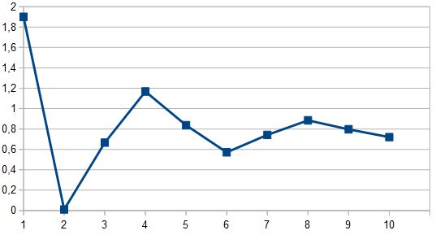

# Контрольный пример №1

## 1 Начальные данные

### 1.1 Легенда

Имеется нефтеняное поле в центре которого расположена добывающая скважина. Вокруг добывающей скважины имеются разведочные скважины.

В процессе добычи нефти может возникать ситуация, когда темпы выдачи превышают дебит скважины. Это может приводить как к остановке добычи, так и к поломкам добывающего оборудования. Скважины связаны между собой за счет пористости нефтеносного пласта. При помощи воздействия на скважины (например, закачкой балласта в виде воды) или связи между ними (например, применяя гидроразрыв пласта) имеется возможность влиять на переток нефти между скважинами.

Задача: с помощью воздействия на имеющиеся скважины и связи между ними, добиться бездефицитной добычи нефти в добывающей скважине.

### 1.2 Начальная когнитивная карта

Поле размером 4x4 (см. рис. 1), описано равномерно распределенными на плоскости вершинами К1—К16. Точка изъятия ресурса К17 (добывающая скважина) располагается в геометрическом центре поля. Связи между вершинами двунаправленные, имеют модуль веса равный 0,1 (положительные веса для точек К1—К16, разнознаковые для точки отбора ресурса).

_Рис. 1 — Начальный вид моделируемой системы_

В процессе моделирования осуществляется запуск сценария, который предусматривает импульсные воздействия величиной +0,1 на каждый из узлов, не являющихся очами изъятия ресурса (имитация возобновления ресурса) и импульсное воздействие -1,0 на узел К17 (имитация изъятия ресурса) на каждом из шагов моделирования.

Начальный вес (имитация объема доступного ресурса) на всех вершинах в начальный момент времени равна 1,9.

При запуске сценария моделирования получаются следующие результаты (см. рис. 2).

_Рис. 2 — Результат моделирования жизненного цикла начальной системы (объем ресурса в точке изъятия К17)_

В процессе моделирование объем ресурса в точке изъятия в течение первых 4-5 шагов моделирования стабилизируется в районе отметки +0,12. Это является хорошим результатом, так как показывает, что в долгосрочной перспективе не происходит исчерпания ресурса, что снижало бы эффективность рассматриваемой системы.

Негативным результатом моделирования представляется то, что на 2 шаге моделирования создается дефицит ресурса, что можно интерпретировать примерно как ситуацию вида «восполнение ресурса в точке его изъятия не успевает осуществляться за счет перетока ресурсов из соседних областей в силу большой интенсивности изъятия».
В реальности объем ресурса, естественно, не был бы отрицательным — это можно интерпретировать как локальное по времени уменьшение скорости  изъятия ресурса из рассматриваемого пространства, либо как временную приостановку изъятия ресурса. В любом случае такое развитие ситуации является недопустимым или, по крайней мере, нежелательным.

[Файл с начальной когнитивной картой](Control_example_1_Phase_1_init_4x4.cmj)

## 2 Решение, полученное человеком

Для того, чтобы избавиться от кратковременного дефицита ресурса, который возникает в процессе моделирования, необходимо внести в структуру системы изменения, которые повлияют на ее поведение.

Самым очевидным способом избавиться от дефицита ресурса, является снижение темпа его изъятия. Однако, это ведет к снижению эффективности, что, по своей сути, не сильно отличается от ситуации, когда система не меняется и мы смиряемся с ее неэффективностью. Данный способ рассматриваться далее не будет.

Рассмотрим еще два способа повышения эффективности изъятия ресурса в моделируемой системе:
1 создание дополнительной вершины,
2 модификация связей у точки изъятия.

Если рядом с точкой изъятия ресурса создать дополнительную вершину, связанную с ней связями с достаточно высокой пропускной способностью, то есть вероятность того, что переток ресурса из такого дополнительного источника сможет компенсировать дефицит, вызываемый излишне интенсивным изъятием.

Это достаточно очевидное утверждение. Поэтому, собственно задачей является определение того, на сколько «широкой» должна быть такая связь между вершинами.

Как показывает моделирование, введение дополнительной вершины (К18) (см. рис. 3) со связью, которая обеспечивает очень быстрый переток ресурса (0,7 вместо 0,1), действительно может исправить ситуацию (см. рис. 4).

_Рис. 3 — Модифицированная система с дополнительной вершиной (К18)_

_Рис. 4 — Результат моделирования жизненного цикла модифицированной системы с одной дополнительной вершиной_

В процессе моделирования не наблюдается образования дефицита ресурса, его объем стабилизируется с течением времени на отметке около +0,78.

[Файл с когнитивной картой, составленной человеком](Control_example_1_Phase_2_human_4x4.cmj)

## 3 Решение, полученное ИИ

В процессе обработки начальной когнитивной карты при помощи алгоритмов адаптивной оптимизации выполнения производственных процессов на основе интеллектуальных технологий с использованием когнитивного анализа параметров производственной среды и тенденций в производственных процессах в нефтегазовой отрасли был получен набор вариантов воздействия на систему с целью решения задачи избежания достижения дефицитного состояния точки изъятия ресурса из поля рассматриваемого пространства.

Указанные варианты можно разделить на три условных класса:

1 изменение системы методом введения дополнительных вершин,

2 изменение системы методом модификации существующих между вершинами связей,

3 гибридные варианты, объединяющие в себе два предыдущих класса.

Указанные варианты воздействия на систему показали свою работоспособность в процессе моделирования систем «пространство-ресурс».

Рассмотрим наиболее эффективный из них (см. рис. 5).

_Рис. 5 — Решение задачи с помощью алгоритма адаптивной оптимизации выполнения производственных процессов на основе когнитивного анализа параметров производственной среды_

Как видно на представленном изображении в систему не вводились дополнительные вершины - ИИ обошелся модификацией уже существующих и созданием несколькизх новых дуг на графе.

Предложенное ИИ решение можно интепретировать следующим образом. Модификация существующих связей между вершинами (скважинами) представляет собой либо увеличение пористости нефтеносного пласта (гидроразрыв), либо ее уменьшение (закачка цементных тампонажных растворов). Наличие новой связи (V10-V7), как бы это не было парадоксально, можно рассматривать даже как прокладку трубопровода, перекачивающего нефтяную эмульсию из одной скважину в другую (в том случае, если проведение гидроразрыва не представляется возможным).

В итоге применения рекомендуемого ИИ решения получается эффективное решение поставленной задачи (см. рис. 6) —  значение веса для вершины К17 стабилизируется с течением времени в районе отметки 1,8 (то есть не намного ниже, чем начальные значения), дефицит ресурса ни на одном из шагов моделирования так же не наблюдается.

_Рис. 6 — Результат моделирования жизненного цикла модифицированной по рекомендации ИИ  системы_

[Файл с когнитивной картой, составленной ИИ](Control_example_1_Phase_3_robo_4x4.cmj)

## 4 Сравнение решений

Сравнивая решения, предложенные человеком и ИИ (рис. 4 и рис. 6), можно убедиться в том, что решение ИИ более эффективно. Во-первых, в отличие от варианта человека, отстствует "провал" на 2-м шаге моделирования. Во-вторых, процесс стабилизируется гораздо быстрее, чем у человека.

## 5 Экспериментальные исследования

С целью проведения экспериментальных исследований разработанных алгоритмов и проверки их программной реализации были разработаны смасштабированные версии контрольного примера:

- версия большего масштаба ([поле размером 6x4](Control_example_1_Phase_1_init_6x4.cmj)),
- версия меньшего масштаба ([поле размером 2x2](Control_example_1_Phase_1_init_2x2.cmj)).

Сравнивая [решения, предложенные человеком и ИИ для масштабированных вариантов контрольного примера](Control_example_1_Phase_2-3_human-robo_2x2-6x4.zip), можно убедиться в том, что решение ИИ так же более эффективно.
