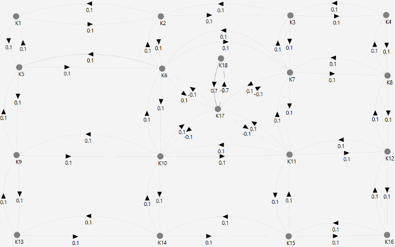

# Control example #1

## 1 Initial data

### 1.1 Legend

There is an oilfield in the center of which there is a producing well. There are exploration wells around the producing well.

In the process of oil production, a situation may arise when the rate of output exceeds the flow rate of the well. This can lead to both production stoppage and breakdowns of mining equipment. The wells are interconnected due to the porosity of the oil reservoir. By influencing wells (for example, by pumping ballast in the form of water) or the connection between them (for example, by using hydraulic fracturing), it is possible to influence the flow of oil between wells.

Task: with the help of the impact on the existing wells and the connection between them, to achieve a deficit-free oil production in the producing well.

### 1.2 Initial cognitive map 

A 4x4 field (see Fig. 1), is described by vertices K1—K16 uniformly distributed on the plane. The point of withdrawal of the resource K17 (producing well) is located in the geometric center of the field. The connections between the vertices are bidirectional, have a weight modulus equal to 0.1 (positive weights for points K1—K16, different for the resource selection point).

_Fig. 1 — Initial view of the simulated system_

In the process of modeling, a scenario is launched that provides for pulse effects of +0.1 on each of the nodes that are not the eyes of resource withdrawal (imitation of resource renewal) and a pulse effect of -1.0 on node K17 (imitation of resource withdrawal) at each of the simulation steps.

The initial weight (imitation of the volume of the available resource) on all vertices at the initial moment of time is equal to 1.9.

When running the simulation script, the following results are obtained (see Fig. 2).

_Fig. 2 — The result of modeling the life cycle of the initial system (the volume of the resource at the point of withdrawal K17)_

During the simulation, the volume of the resource at the withdrawal point during the first 4-5 steps of the simulation stabilizes around the +0.12 mark. This is a good result, as it shows that in the long term there is no resource exhaustion, which would reduce the efficiency of the system in question.

The negative result of modeling is that at the 2nd step of modeling, a resource deficit is created, which can be interpreted roughly as a situation of the form "replenishment of a resource at the point of its withdrawal does not have time to be carried out due to the flow of resources from neighboring areas due to the high intensity of withdrawal."
In reality, the volume of the resource, of course, would not be negative — this can be interpreted as a time-local decrease in the rate of resource withdrawal from the considered space, or as a temporary suspension of resource withdrawal. In any case, such a development of the situation is unacceptable or, at least, undesirable.
[File with initial cognitive maps] (Control_example_1_Phase_1_init_4x4.cmj)

## 2 The solution generated by a person

In order to get rid of the short-term resource shortage that occurs during the modeling process, it is necessary to make changes to the system structure that will affect its behavior.

The most obvious way to get rid of a resource shortage is to reduce the rate of its withdrawal. However, this leads to a decrease in efficiency, which, in essence, is not much different from the situation when the system does not change and we accept its inefficiency. This method will not be considered further.

Let's consider two more ways to increase the efficiency of resource withdrawal in the simulated system:
1 creating an additional vertex,
2 modification of the connections at the withdrawal point.

If an additional vertex is created next to the resource withdrawal point, connected to it by connections with a sufficiently high bandwidth, then there is a possibility that the resource flow from such an additional source will be able to compensate for the deficit caused by an excessively intensive withdrawal.

This is a fairly obvious statement. Therefore, the actual task is to determine how "wide" such a connection between the vertices should be.

As the simulation shows, the introduction of an additional vertex (K18) (see Fig. 3) with a connection that provides a very fast resource flow (0.7 instead of 0.1), it can really fix the situation (see Figure 4).

_Fig. 3 — Modified system with an additional vertex (К18)_

_Fig. 4 — The result of modeling the life cycle of a modified system with one additional vertex_

In the process of modeling, there is no formation of a resource deficit, its volume stabilizes over time at around +0.78.

[A file with a cognitive map generated by a person](Control_example_1_Phase_2_human_4x4.cmj)

## 3 The solution obtained by AI

In the process of processing the initial cognitive map using adaptive optimization algorithms for the implementation of production processes based on intelligent technologies using cognitive analysis of the parameters of the production environment and trends in production processes in the oil and gas industry, a set of options for influencing the system was obtained in order to solve the problem of avoiding the achievement of a scarce state of the point of withdrawal of the resource from the field of the considered space.

These options can be divided into three conditional classes:

1 changing the system by introducing additional vertices,

2 changing the system by modifying the existing links between the vertices,

3 hybrid variants combining the two previous classes.

These options for influencing the system have shown their efficiency in the process of modeling "space-resource" systems.

Let's consider the most effective of them (see Fig. 5).

_Fig. 5 — Solving the problem using an adaptive optimization algorithm for the execution of production processes based on cognitive analysis of the parameters of the production environment_

As can be seen in the presented image, no additional vertices were introduced into the system - the AI managed to modify existing ones and create several new arcs on the graph.

The solution proposed by AI can be interpreted as follows. Modification of the existing connections between the vertices (wells) is either an increase in the porosity of the oil reservoir (hydraulic fracturing), or its decrease (injection of cement grouting solutions). The presence of a new connection (V10-V7), paradoxical as it may be, can even be considered as laying a pipeline pumping oil emulsion from one well to another (in the event that hydraulic fracturing is not possible).

As a result of applying the recommended AI solution, an effective solution to the problem is obtained (see Figure 6) — the weight value for the K17 vertex stabilizes over time around the 1.8 mark (that is, not much lower than the initial values), resource shortage is also not observed at any of the modeling steps.

_Fig. 6 —The result of modeling the life cycle of a modified AI system_

[A file with a cognitive map compiled by AI](Control_example_1_Phase_3_robo_4x4.cmj)

## 4 Comparison of solutions

СрComparing solutions proposed by humans and AI (Fig. 4 and Fig. 6), you can make sure that the AI solution is more efficient. Firstly, unlike the human variant, there is no "failure" at the 2nd step of modeling. Secondly, the process stabilizes much faster than in humans.

## 5 Experimental studies

In order to conduct experimental studies of the developed algorithms and verify their software implementation, scaled versions of the control example were developed:

- larger scale version([6x4 size field](Control_example_1_Phase_1_init_6x4.cmj)),
- smaller scale version([2x2 size field](Control_example_1_Phase_1_init_2x2.cmj)).

Comparing [solutions proposed by humans and AI for scaled variants of the control example](Control_example_1_Phase_2-3_human-robo_2x2-6x4.zip), you can make sure that the AI solution is also more efficient.