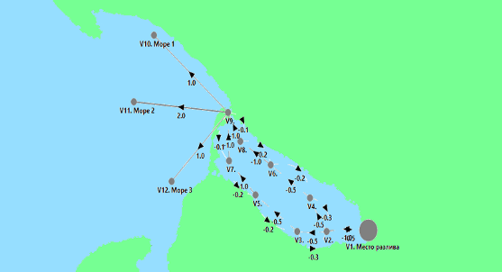
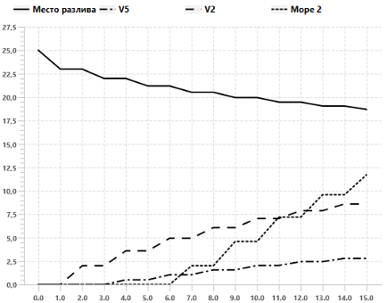
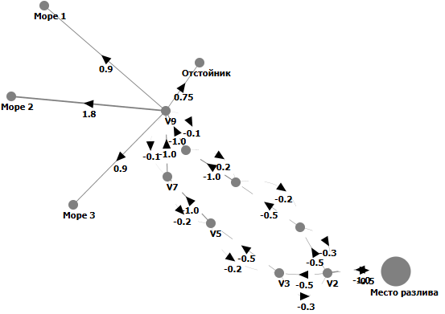
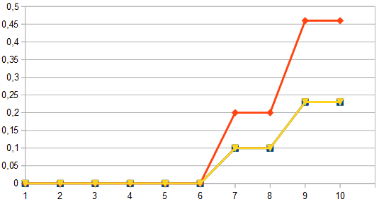
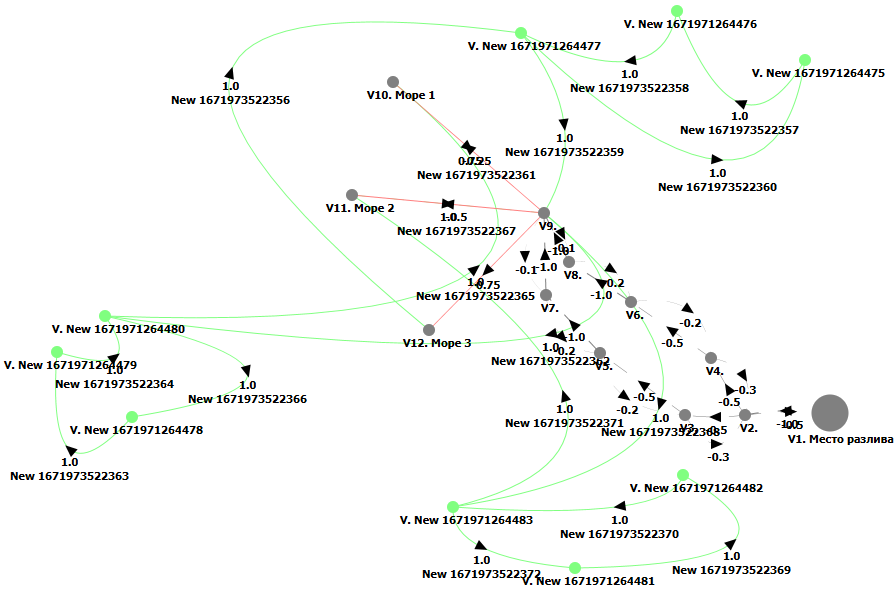
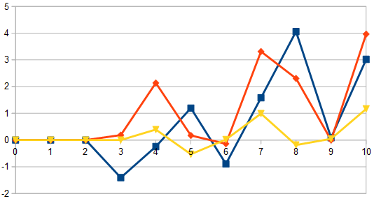

# Контрольный пример №1

## 1 Начальные данные

### 1.1 Легенда

Ситуация: разлив нефти из поврежденного трубопровода с загрязнением акватории прилежащих водоемов (рис. 1).

Задача: минимизация вреда, наносимого окружающей среде.

_Рис. 1 — Схема разлива нефтепродуктов_

### 1.2 Начальная когнитивная карта

Создадим когнитивную карту, описывающую ситуацию (рис. 2).

_Рис. 2 — Когнитивная карта с описанием рассматриваемой ситуации_

На указанном изображении имеется следующие вершины:
- V1 (место разлива), 
- V2 (место попадания нефтепродуктов в морской залив),
- V3-V8 (точки в акватории залива),
- V9 (пролив, соединяющий залив с морем),
- V10-V12 (открытое море).

В ходе моделирования виден процесс распространения нефтепродуктов при разливе, который отображается на графиках (см. рис. 3), как лаг между ненулевыми значениям в разных рассматриваемых точках.

_Рис. 3 — Моделирование рассматриваемой ситуации_

Для предотвращения загрязнения моря проводится комплекс мер связанных, во-первых, с уменьшением скорости загрязнения, и, во-вторых, с очисткой загрязненных территорий. В первом случае это, например, постановка боновых заграждений или сооружение насыпей, препятствующих растеканию нефтепродуктов, во втором — изъятие из природной среды загрязненной воды и почвы с их дальнейшей очисткой или утилизацией.

[Файл с начальной когнитивной картой](Control_example_2_Phase_1_init.cmj)

## 2 Решение, полученное человеком

Модернизируем когнитивную карту, имитируя вышеперечисленные методы (см. рис. 4):
- связи от вершины V9 к вершинам Море 1, Море 2, Море 3 получают меньшие весовые коэффициенты (имитация постановки боновых заграждений на выходе из залива, уменьшающая влияние V9 на перечисленные вершины графа когнитивной карты),
- вводится новая вершина V13 с мощной связью к ней от V9 (имитация откачки нефтепродуктов в отстойник с целью последующей очистки).

_Рис. 4 — Когнитивная карта для моделирования решения поставленной задачи_

Как видно в процессе моделирования, уровни загрязнения в корнтрольных точках (море) значительно снижаются (см. рис. 5).

_Рис. 5 — Результаты моделирования в процессе решения поставленной задачи_

[Файл с когнитивной картой, составленной человеком](Control_example_2_Phase_1_human.cmj)

## 3 Решение, полученное ИИ

В процессе обработки начальной когнитивной карты при помощи алгоритмов адаптивной оптимизации выполнения производственных процессов на основе интеллектуальных технологий с использованием когнитивного анализа параметров производственной среды и тенденций в производственных процессах в нефтегазовой отрасли был получен набор вариантов воздействия на систему с целью решения задачи минимизации ущерба, наносимого окружающей среде в случае разлива нефтепродуктов из поврежденного трубопровода.

Рассмотрим наиболее эффективный из них (см. рис. 6).

_Рис. 6 — Решение задачи с помощью алгоритма адаптивной оптимизации выполнения производственных процессов на основе когнитивного анализа параметров производственной среды_

Как видно на представленном изображении в систему были введены дополнительные вершины и дуги. Помимо это подверглись модификации веса ряда существующих дуг между вершинами.

Попробуем интерпретировать предложенное ИИ решение, переложив его на реальную ситуацию.

Кластера дополнительных вершин между точками "Море 1" и V9, "Море 2" и V9, а так же между "Море 3" и V9 представляют собой, фактически, циклы, функциональное назначение которых - задержать распрпространение нефтепродуктов, т.е. стать буферами-накопителями. Задержка осуществляется на  3 шага моделирования (по числу дополнительных дуг графа в указанных кластерах), что позволяет временно снизить нагрузку на вершины "в море". Это же обуславливает "пилообразный" характер графиков.

Не смотря на парадоксальность решения, предложенного ИИ, в итоге применения рекомендуемого ИИ решения получается более эффективное решение поставленной задачи (см. рис. 7) - значение весов для вершин "в море" меньше, чем в варианте, предложенном человеком).

_Рис. 7 — Результат моделирования жизненного цикла модифицированной по рекомендации ИИ системы_

[Файл с когнитивной картой, составленной ИИ](Control_example_2_Phase_1_robo.cmj)

## 4 Сравнение решений

Сравнивая решения, предложенные человеком и ИИ (рис. 5 и рис. 7), можно убедиться в том, что решение ИИ более эффективно. Во-первых, в отличие от варианта человека, используются менее производительные (а значит - более дешевые) трубопроводы и насосы для откачки нефтепродуктов. Во-вторых, уровни загрязнений в контрольных точках ("в море") значительно ниже, чем у варианта человека.
