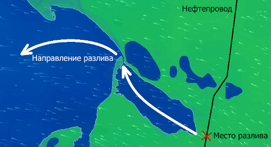

# Control example #2

## 1 Initial data

### 1.1 Legend

Situation: oil spill from a damaged pipeline with contamination of the water area of adjacent reservoirs (Fig. 1).

Task: minimization of harm caused to the environment.

_Fig. 1 — Oil spill scheme_

### 1.2 Initial cognitive map

Let's create a cognitive map describing the situation (Fig. 2).

_Fig. 2 — A cognitive map with a description of the situation under consideration_

The specified image has the following vertices:
- V1 (spill location),
- V2 (the place where oil products enter the sea bay),
- V3-V8 (points in the bay area),
- V9 (the strait connecting the bay to the sea),
- V10-V12 (open sea).

During the simulation, the process of spreading oil products during a spill is visible, which is displayed on the graphs (see Fig. 3), as a lag between non-zero values at different points under consideration.

_Fig. 3 — Modeling of the situation under consideration_

To prevent marine pollution, a set of measures is being carried out, firstly, to reduce the rate of pollution, and, secondly, to clean up contaminated areas. In the first case, this is, for example, the installation of booms or the construction of embankments that prevent the spread of petroleum products, in the second — the removal of contaminated water and soil from the natural environment with their further purification or disposal.

[Initial cognitive map file](Control_example_2_Phase_1_init_12.cmj)

## 2 The solution generated by a person

We modernize the cognitive map by imitating the above methods (see Fig. 4):
- connections from vertex V9 to vertices Sea 1, Sea 2, Sea 3 receive smaller weighting coefficients (imitation of setting booms at the exit from the bay, reducing the influence of V9 on the listed vertices of the cognitive map graph),
- a new vertex V13 is introduced with a powerful connection to it from V9 (imitation of pumping oil products into the sump in order to subsequent cleaning).

_Fig. 4 — Cognitive map for modeling the solution of the task_

As can be seen in the modeling process, pollution levels at control points (sea) are significantly reduced (see Fig. 5).

_Fig. 5 — Simulation results in the process of solving the problem_

[A file with a cognitive map compiled by a person](Control_example_2_Phase_2_human_12.cmj)

## 3 Решение, полученное ИИ

In the process of processing the initial cognitive map using adaptive optimization algorithms for the implementation of production processes based on intelligent technologies using cognitive analysis of the parameters of the production environment and trends in production processes in the oil and gas industry, a set of options for influencing the system was obtained in order to solve the problem of minimizing damage to the environment in the event of a spill of petroleum products from a damaged pipeline.

Let's consider the most effective of them (see Fig. 6).

_Fig. 6 — Solving the problem using an adaptive optimization algorithm for the execution of production processes based on cognitive analysis of the parameters of the production environment_

As can be seen in the presented image, additional vertices and edges were introduced into the system. In addition, the weights of a number of existing edges between the vertices have been modified.

Let's try to interpret the solution proposed by AI, shifting it to a real situation.

Clusters of additional vertices between the points "Sea 1" and V9, "Sea 2" and V9, as well as between "Sea 3" and V9 are, in fact, cycles whose functional purpose is to delay the spread of petroleum products, i.e. to become storage buffers. The delay is carried out for 3 modeling steps (according to the number of additional arcs of the graph in the specified clusters), which allows temporarily reducing the load on the vertices "in the sea". This also causes the "sawtooth" nature of the graphs.

Despite the paradoxical nature of the solution proposed by AI, as a result of applying the recommended AI solution, a more effective solution to the task is obtained (see Figure 7) - the value of the weights for the vertices "in the sea" is less than in the version proposed by man).

_Fig. 7 — The result of modeling the life cycle of a modified AI system_

[A file with a cognitive map compiled by AI](Control_example_2_Phase_3_robo_12.cmj)

## 4 Comparison of solutions

Comparing the solutions proposed by humans and AI (Fig. 5 and Fig. 7), you can make sure that the AI solution is more efficient. Firstly, unlike the human variant, less productive (and therefore cheaper) pipelines and pumps for pumping petroleum products are used. Secondly, the pollution levels at the control points ("in the sea") are significantly lower than that of the human variant.

## 5 Experimental studies

In order to conduct experimental studies of the developed algorithms and verify their software implementation, scaled versions of the control example were developed:

- larger scale version ([15 points](Control_example_2_Phase_1_init_15.cmj)),
- smaller scale version ([8 points](Control_example_2_Phase_1_init_8.cmj)).

Comparing [solutions proposed by humans and AI for scaled variants of the control example](Control_example_2_Phase_2-3_human-robo_8-15.zip ), you can make sure that the AI solution is also more efficient.
