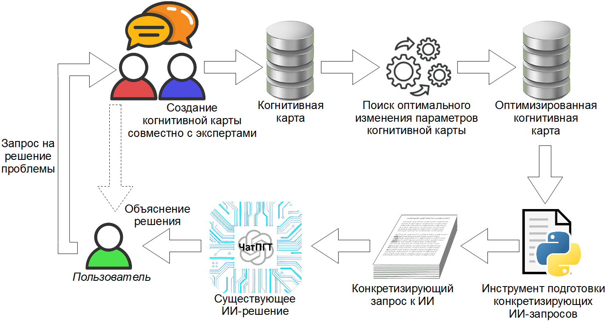
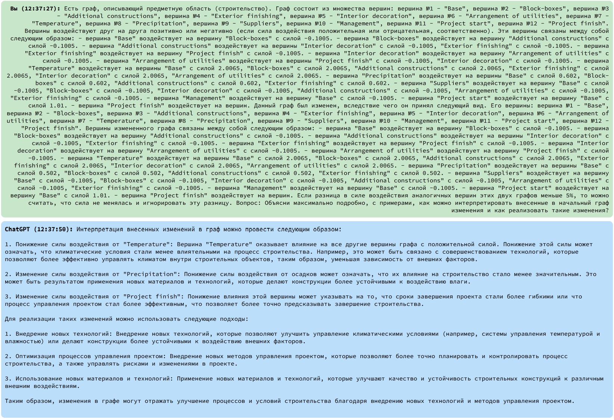

# Инструментарий подготовки конкретизирующих ИИ-запросов для когнитивных карт. Описание программы

# ОБЩИЕ СВЕДЕНИЯ

Наименование компонента: Инструментарий подготовки конкретизирующих ИИ-запросов для когнитивных карт.

Обозначение: RU.СНАБ.00853-02 ВВ.

Компонент разработан на языке программирования Python (версия Python 3.11).

Компонент размещен по адресу https://gitlab.actcognitive.org/itmo-sai-code/cogmapoptimizer.

# ФУНКЦИОНАЛЬНОЕ НАЗНАЧЕНИЕ

Компонент "Инструментарий подготовки конкретизирующих ИИ-запросов для когнитивных карт" (далее компонент) предназначен для применения совместно с компонентом адаптивной оптимизации выполнения производственных процессов с использованием вероятностных моделей и динамически изменяемой среды.

Компонент генерирует файл-описание, содержащий описание когнитивной карты, её изменений, получаемых при работе компонента адаптивной оптимизации выполнения производственных процессов с использованием вероятностных моделей и динамически изменяемой среды, а также запрос на интерпретацию этих изменений. Сгенерированный файл может использоваться в качестве запроса к большой языковой модели для интерпретации изменений когнитивной карты.

# ОПИСАНИЕ ЛОГИЧЕСКОЙ СТРУКТУРЫ

Компонент выполняет разбор когнитивных карт используемых при работе компонента адаптивной оптимизации выполнения производственных процессов с использованием вероятностных моделей и динамически изменяемой среды:

- начальной когнитивной карты;
- выходной, полученная в результате оптимизации.  

В ходе разбора компонент формирует описание отношений между сущностями начальной и выходной когнитивных карт.

В результате полного разбора когнитивных карт получается файл конкретизирующего запроса для использования с большой языковой моделью.

Обобщенная схема использования компонента приведена на рис. 1.



# ИСПОЛЬЗУЕМЫЕ ТЕХНИЧЕСКИЕ СРЕДСТВА

Для работы компонента вычислительный узел должен обеспечивать запуск и выполнение кода Python 3.11.

Для получения интерпретации необходим доступ к ИИ-решению, реализующему большую языковую модель.

# ВЫЗОВ И ЗАГРУЗКА

Запуск и использование компонента осуществляется следующим образом.

1. Запустить `Interpreter.py` с параметрами командной строки: `Interpreter.py original_cognitive_map.cmj <processed_cognitive_map.cmj`.
2. Получить в качестве результата работы скрипта файл с расширением `.AI_description.txt`, содержащий конкретизирующий ИИ-запрос.
3. Отправить запрос на обработку любым доступным ИИ-решением (ChatGPT, GigaChat, YandexGPT и т.п.)
4. Получить объяснение ИИ для полученных в ходе оптимизации когнитивной карты результатов

На рис. 2 приведен пример использование результата работы компонента с ChatGPT.



# ВХОДНЫЕ ДАННЫЕ

Входными данными компонента являются файлы когнитивных карт с расширением `cmj`:

- `original_cognitive_map.cmj` - начальная когнитивная карта;
- `processed_cognitive_map.cmj` - когнитивная карта, полученная в результате оптимизации.

# ВЫХОДНЫЕ ДАННЫЕ

Выходными данными компонента является файл с расширением `.AI_description.txt`, содержащий сформированный конкретизирующих ИИ-запрос.

Ниже приведен пример выходного файла.

```
Есть граф, описывающий предметную область (строительство).
Граф состоит из множества вершин: вершина №1 - "Base", вершина №2 - "Block-boxes", вершина №3 - "Additional constructions", вершина №4 - "Exterior finishing", вершина №5 - "Interior decoration", вершина №6 - "Arrangement of utilities", вершина №7 - "Temperature", вершина №8 - "Precipitation", вершина №9 - "Suppliers", вершина №10 - "Management", вершина №11 - "Project start", вершина №12 - "Project finish".
Вершины воздействуют друг на друга позитивно или негативно (если сила воздействия положительная или отрицательная, соответственно). Эти вершины связаны между собой следующим образом:
- вершина "Base" воздействует на вершину "Block-boxes" с силой -0.1005.
- вершина "Block-boxes" воздействует на вершину "Additional constructions" с силой -0.1005.
- вершина "Additional constructions" воздействует на вершины "Interior decoration" с силой -0.1005, "Exterior finishing" с силой -0.1005.
- вершина "Exterior finishing" воздействует на вершину "Project finish" с силой -0.1005.
- вершина "Interior decoration" воздействует на вершину "Arrangement of utilities" с силой -0.1005.
- вершина "Arrangement of utilities" воздействует на вершины "Project finish" с силой -0.1005, "Interior decoration" с силой -0.1005.
- вершина "Temperature" воздействует на вершины "Base" с силой 2.0065, "Block-boxes" с силой 2.0065, "Additional constructions" с силой 2.0065, "Exterior finishing" с силой 2.0065, "Interior decoration" с силой 2.0065, "Arrangement of utilities" с силой 2.0065.
- вершина "Precipitation" воздействует на вершины "Base" с силой 0.602, "Block-boxes" с силой 0.602, "Additional constructions" с силой 0.602, "Exterior finishing" с силой 0.602.
- вершина "Suppliers" воздействует на вершину "Base" с силой -0.1005, "Block-boxes" с силой -0.1005, "Interior decoration" с силой -0.1005, "Additional constructions" с силой -0.1005, "Arrangement of utilities" с силой -0.1005, "Exterior finishing" с силой -0.1005.
- вершина "Management" воздействует на вершину "Base" с силой -0.1005.
- вершина "Project start" воздействует на вершину "Base" с силой 1.01.
- вершина "Project finish" воздействует на вершин.
Данный граф был изменен, вследствие чего он принял следующий вид.
Его вершины: вершина №1 - "Base", вершина №2 - "Block-boxes", вершина №3 - "Additional constructions", вершина №4 - "Exterior finishing", вершина №5 - "Interior decoration", вершина №6 - "Arrangement of utilities", вершина №7 - "Temperature", вершина №8 - "Precipitation", вершина №9 - "Suppliers", вершина №10 - "Management", вершина №11 - "Project start", вершина №12 - "Project finish".
Вершины измененного графа связаны между собой следующим образом:
- вершина "Base" воздействует на вершину "Block-boxes" с силой -0.1005.
- вершина "Block-boxes" воздействует на вершину "Additional constructions" с силой -0.1005.
- вершина "Additional constructions" воздействует на вершины "Interior decoration" с силой -0.1005, "Exterior finishing" с силой -0.1005.
- вершина "Exterior finishing" воздействует на вершину "Project finish" с силой -0.1005.
- вершина "Interior decoration" воздействует на вершину "Arrangement of utilities" с силой -0.1005.
- вершина "Arrangement of utilities" воздействует на вершину "Project finish" с силой -0.1005.
- вершина "Temperature" воздействует на вершины "Base" с силой 2.0065, "Block-boxes" с силой 2.0065, "Additional constructions" с силой 2.0065, "Exterior finishing" с силой 2.0065, "Interior decoration" с силой 2.0065, "Arrangement of utilities" с силой 2.0065.
- вершина "Precipitation" воздействует на вершины "Base" с силой 0.502, "Block-boxes" с силой 0.502, "Additional constructions" с силой 0.502, "Exterior finishing" с силой 0.502.
- вершина "Suppliers" воздействует на вершину "Base" с силой -0.1005, "Block-boxes" с силой -0.1005, "Interior decoration" с силой -0.1005, "Additional constructions" с силой -0.1005, "Arrangement of utilities" с силой -0.1005, "Exterior finishing" с силой -0.1005.
- вершина "Management" воздействует на вершину "Base" с силой -0.1005.
- вершина "Project start" воздействует на вершину "Base" с силой 1.01.
- вершина "Project finish" воздействует на вершин.
Если разница в силе воздействия аналогичных вершин этих двух графов меньше 5%, то можно считать, что сила не менялась и игнорировать эту разницу.
Вопрос: Объясни максимально подробно, с примерами, как можно интерпретировать внесенные в начальный граф изменения и как реализовать такие изменения?
```
