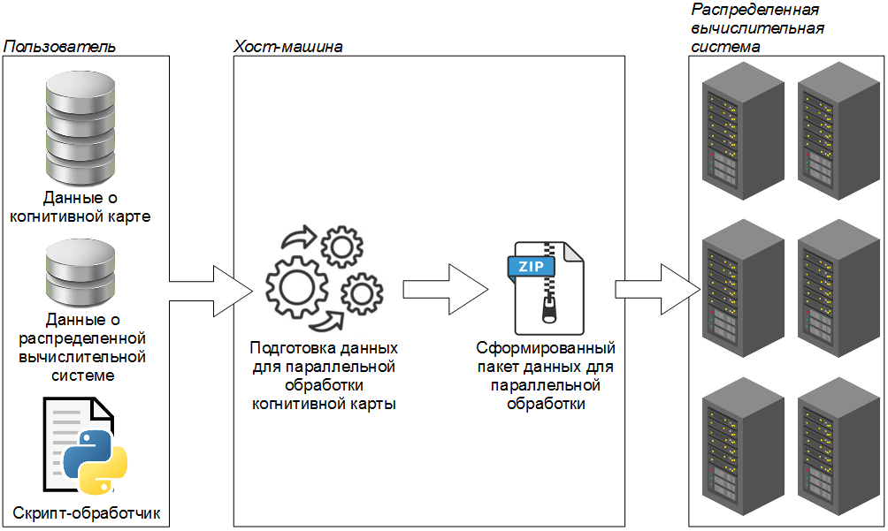
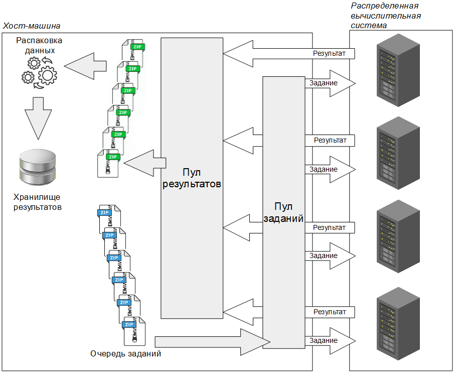

# Инструментарий параллельной обработки когнитивных карт. Описание программы

# ОБЩИЕ СВЕДЕНИЯ

Наименование компонента: Инструментарий параллельной обработки когнитивных карт.

Обозначение: RU.СНАБ.00853-02 ББ.

Компонент разработан на языке программирования Python (версия Python 3.11) с использованием следующих библиотек:

- numpy 1.24.2;
- scipy 1.10.1;
- keras 2.13.1;
- pandas 2.0.3;
- paramiko 3.4.0;
- cryptography 3.3.2;
- bcrypt 3.2.0.

Компонент размещен по адресу https://gitlab.actcognitive.org/itmo-sai-code/cogmapoptimizer.

# ФУНКЦИОНАЛЬНОЕ НАЗНАЧЕНИЕ

Компонент "Инструментарий параллельной обработки когнитивных карт" (далее компонент) предназначен для применения совместно с компонентом адаптивной оптимизации выполнения производственных процессов с использованием вероятностных моделей и динамически изменяемой среды.

Компонент обеспечивает параллельное выполнение компонента адаптивной оптимизации выполнения производственных процессов с использованием вероятностных моделей и динамически изменяемой среды на узлах вычислительной сети за счет распределения вычислительных заданий на узлах вычислительной сети (см. рис. 1).



Рисунок 1.

# ОПИСАНИЕ ЛОГИЧЕСКОЙ СТРУКТУРЫ

Поиск оптимального изменения параметров множественной вероятностной нечеткой когнитивной карты предполагает последовательную композицию простых структур из их предопределенного набора с указанной картой. Поскольку данные композиции являются независимыми друг от друга, их обработка может быть организована в параллельном режиме с использованием распределенной вычислительной системы.

Компонент реализует параллельную обработку данных когнитивной карты следующим образом (см. рис. 2):

1. Производится подготовка данных для параллельной обработки (создание конфигурационного файла `deploy.json` с описанием распределенной системы).
2. Запускается процесс распределенного решения, начинающийся с распределения параллельных задач на выделенные для этого вычислительные узлы.
3. Скрипт распределения параллельных задач `deploy.py` передает на каждый доступный для работы вычислительный узел подготовленный для получения частного решения (для одной простой структуры) пакет с данными и указание, какую из простых фигур необходимо обсчитать (фигуры нумеруются от 0 до 6).
4. Периодически проводится проверка готовности результатов на имеющихся узлах. Если результат есть, то результат передается с вычислительного узла и сохраняется на хост-машине.
5. После получения частного результата от вычислительного узла проверяется, есть ли еще необработанные данные. При их наличии, они передаются на высвободившийся узел и система продолжает ожидать результаты от оставшихся вычислительных узлов. Если все данные обработаны, пользователь получает сообщение о завершении обработки данных.

{#fig:img02 width=16cm}

Рисунок 2.

# ИСПОЛЬЗУЕМЫЕ ТЕХНИЧЕСКИЕ СРЕДСТВА

Для работы компонента узлы вычислительной сети должны удовлетворять следующим требованиям:

- обеспечивать запуск и выполнение кода Python 3.11;
- запущенный SSH-сервер с доступом по логину/паролю;
- доступные для записи и чтения сетевые папки.

# ВЫЗОВ И ЗАГРУЗКА

Запуск компонента осуществляется с помощью команды `python deploy.py`.

Для успешной работы компонента в одной папке с файлом компонента `deploy.py` должен располагаться конфигурационный файл `deploy.json`.

Описание конфигурационного файла `deploy.json` приведено ниже (см. раздел "ВХОДНЫЕ ДАННЫЕ").

# ВХОДНЫЕ ДАННЫЕ

Входными данными компонента является конфигурационный файл `deploy.json`, содержащий описание когнитивной карты и вычислительной среды. Ниже приведен пример конфигурационного файла.  

```json
{
    "local_storage_folder": "c:\\share\\Deploy\\Results\\",
    "cog_map": "CogMapOptimizer_test.cmj",
    "cog_map_xyz": "CogMapOptimizer_test.cmj_xyz",
    "pulse_model_steps": 5,
    "nodes": [
        {
            "net_path": "\\\\192.168.1.57\\share\\PyPy\\",
            "local_path": "c:\\share\\PyPy\\",
            "user": "user",
            "pass": "user"
        },
        {
            "net_path": "\\\\192.168.1.55\\share\\py55\\",
            "local_path": "c:\\share\\py55\\",
            "user": "root",
            "pass": "root"
        }
    ]
}
```

Описание полей файла `deploy.json` приведено ниже:

- `local_storage_folder` - папка на хост-машине для сохранения полученных результатов;
- `cog_map` и `cog_map_xyz` - файлы с описанием когнитивной карты;
- `pulse_model_steps` - число шагов импульсного моделирования;
- `nodes` - описание узлов распределенной системы:
    - `net_path` - сетевая папка на узле, открытая на запись для копирования исполняемых файлов и файлов когнитивной карты;
    - `local_path` - та же папка (указание в формате, понятном локально запускаемому скрипту-вычислителю);
    - `user` и `pass` - логин и пароль для доступа к удаленной машине по SSH.

# ВЫХОДНЫЕ ДАННЫЕ

Выходными данными компонента являются cmj-файлы отчетов в формате JSON. Описание данных файла отчета приведено в табл. 1.

Т а б л и ц а  1 - Описание формата данных файла отчета.

| Наименование данных  |                                    Описание данных                                    |        Ограничения        |
| -------------------- | ------------------------------------------------------------------------------------- | ------------------------- |
| `ModelingResults`    | резюме по результатам моделирования                                                   |                           |
| `added_new_vertices` | число добавленные вершин                                                              | целое число               |
| `bad_vertices`       | список идентификаторов, оставшихся после применения этой композиции проблемных вершин | список                    |
| `y_max_er`           | отклонение оставшихся проблемных вершин от номинальных значений                       | вещественное число        |
| `target_vertices`    | список целевых вершин                                                                 | список                    |
| `id`                 | идентификатор целевой вершины                                                         | целое число               |
| `fullName`           | имя целевой вершины                                                                   | строка                    |
| `Vertices`           | список вершин полученной когнитивной карты                                            | аналогично входным данным |
| `Edges`              | список ребер полученной когнитивной карты                                             | аналогично входным данным |
| `Scenarios`          | список сценариев моделирования                                                        | список                    |
| `impulses`           | список импульсов (воздействий)                                                        | список                    |
| `val`                | значение импульса                                                                     | вещественное число        |
| `v`                  | идентификатор вершины                                                                 | целое число               |
| `step`               | шаг моделирования, на котором применяется импульс                                     | целое число               |
