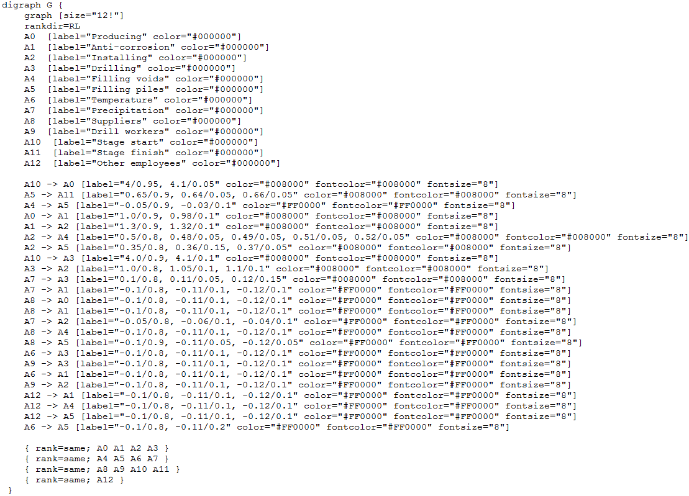
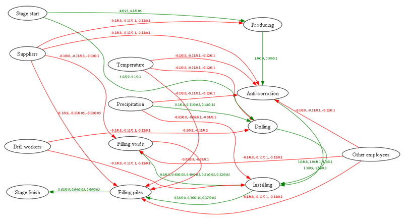

# Инструментарий параллельной обработки когнитивных карт. Описание программы

# ОБЩИЕ СВЕДЕНИЯ

Наименование компонента: Инструментарий параллельной обработки когнитивных карт.

Обозначение: RU.СНАБ.00853-02 ГГ.

Компонент разработан на языке программирования Python (версия Python 3.11).

Для работы компонента необходима утилита `dot` из пакета Graphviz. Разработка и тестирование компонента осуществлялось с использованием Graphviz версии 10.0.1.

Интерфейс компонента реализован с использованием [WxPython](https://ru.wikipedia.org/wiki/WxPython) -  кросплатформенной обертки библиотек графического интерфейса пользователя для языка программирования Python.

Компонент размещен по адресу https://gitlab.actcognitive.org/itmo-sai-code/cogmapoptimizer.

# ФУНКЦИОНАЛЬНОЕ НАЗНАЧЕНИЕ

Компонент "Инструментарий параллельной обработки когнитивных карт" (далее компонент) предназначен для применения совместно с компонентом адаптивной оптимизации выполнения производственных процессов с использованием вероятностных моделей и динамически изменяемой среды.

Компонент обеспечивает визуализацию когнитивных карт, используемых при работе компонента адаптивной оптимизации выполнения производственных процессов с использованием вероятностных моделей и динамически изменяемой среды.

Компонент позволяет сократить трудозатраты на создание описаний предметной области за счет быстрого редактирования когнитивных карт, а также за счет снижения числа ошибок, появляющихся из-за отсутствия эффективного способа отображения модели предметной области.

# ОПИСАНИЕ ЛОГИЧЕСКОЙ СТРУКТУРЫ

Компонент выполняет трансляцию описания когнитивной карты из формата `json` в формат `DOT` с последующей визуализаций. Компонент периодически выполняет чтение файла когнитивной карты и обновляет визуализацию.

[DOT](https://ru.wikipedia.org/wiki/DOT_(язык)) представляет собой язык описания графов. Граф, описанный на языке DOT, представляет собой текстовый файл (с расширением .gv или .dot), представленный в понятном для человека виде.

Пример описания графа на языке DOT приведено на рис. 1.

Рисунок 1.

Исходя из описанного выше, компонент позволяет реализовать следующий алгоритм работы с когнитивными картами:

1. запустить `CogDrawer.py`;
2. загрузить файл когнитивной карты во внешний редактор;
3. выполнить редактирование редактирование когнитивной карты;
4. сохранить результат и наблюдать изменения в редактируемой когнитивной карте в окне компонента;
5. выполнить шаги 3-4 до получения требуемого результата.

# ИСПОЛЬЗУЕМЫЕ ТЕХНИЧЕСКИЕ СРЕДСТВА

Для работы компонента вычислительный узел должен обеспечивать запуск и выполнение кода Python 3.11.

# ВЫЗОВ И ЗАГРУЗКА

Запуск и использование компонента осуществляется следующим образом.

1. Подготовить среду исполнения (установить Python версии 3.8 и выше, а также все необходимые библиотеки).
2. Установить для файлов `*.cmj` редактор по умолчанию.
3. Запустить `CogDrawer.py` с помощью команды `python CogDrawer.py`.
4. В меню *File - Open file* выбрать файл когнитивной карты (с расширением `cmj`).
5. Производить редактирование выбранного файла, периодически сохраняя внесенные изменения
6. Оценивать внесенные в когнитивную карту изменения в графическом виде в окне инструмента визуализации вероятностных когнитивных карт.
7. Завершить работу.

# ВХОДНЫЕ ДАННЫЕ

Входными данными компонента являются файлы когнитивных карт с расширением `cmj`.  

# ВЫХОДНЫЕ ДАННЫЕ

Выходными данными компонента является файл рисунка в формате `png`, содержащий визуализацию когнитивной карты. Пример визуализации когнитивной карты приведен на рис. 2.

{#fig:img02 width=18cm}

Рисунок 2.
