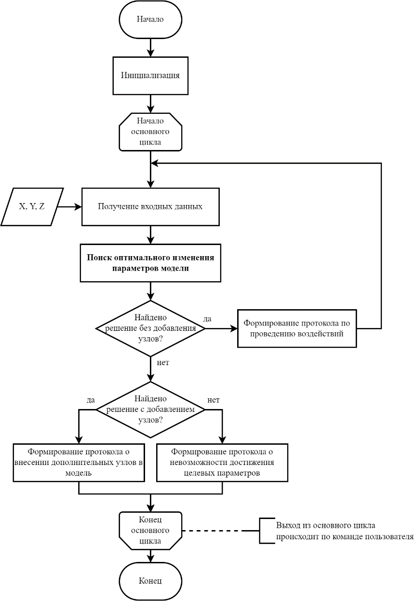
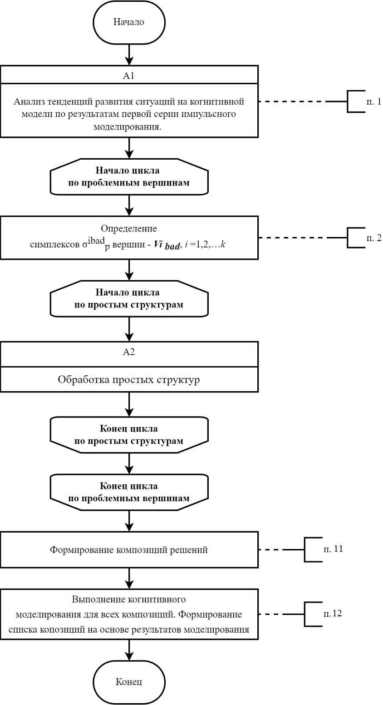
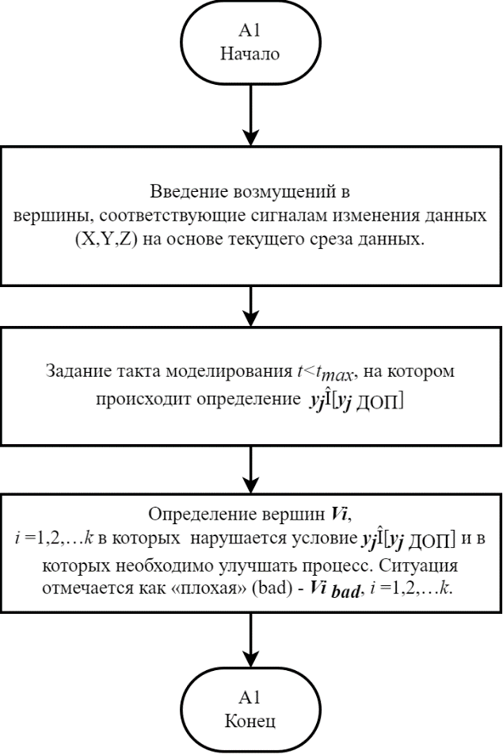
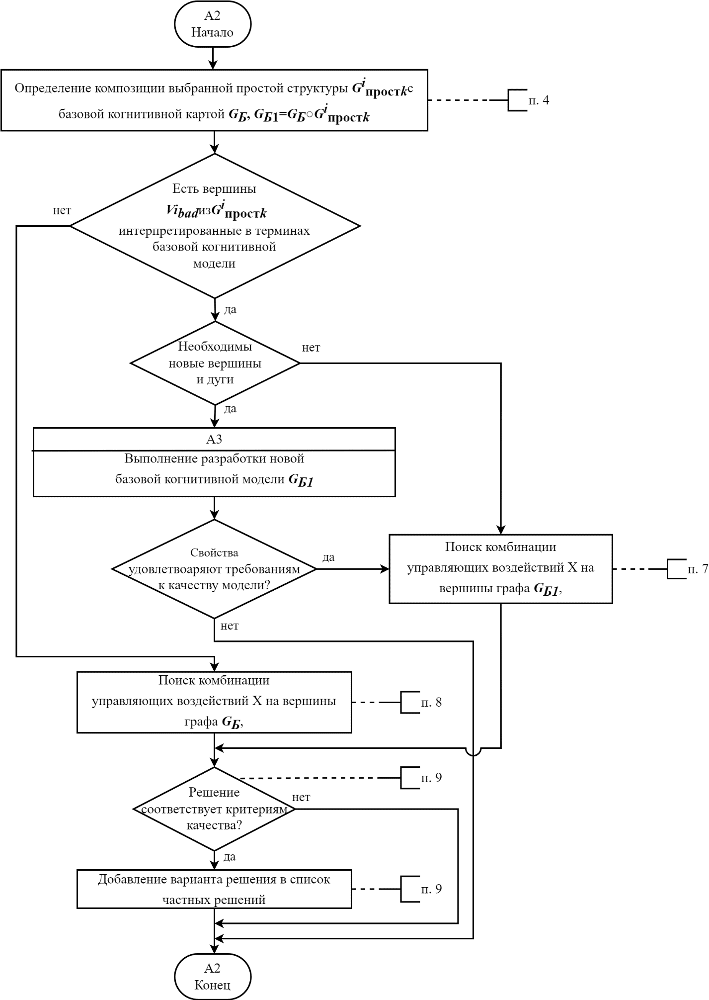
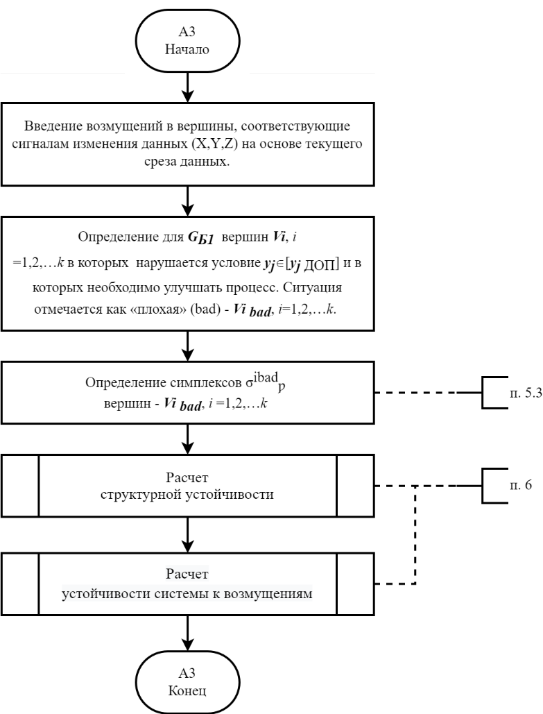
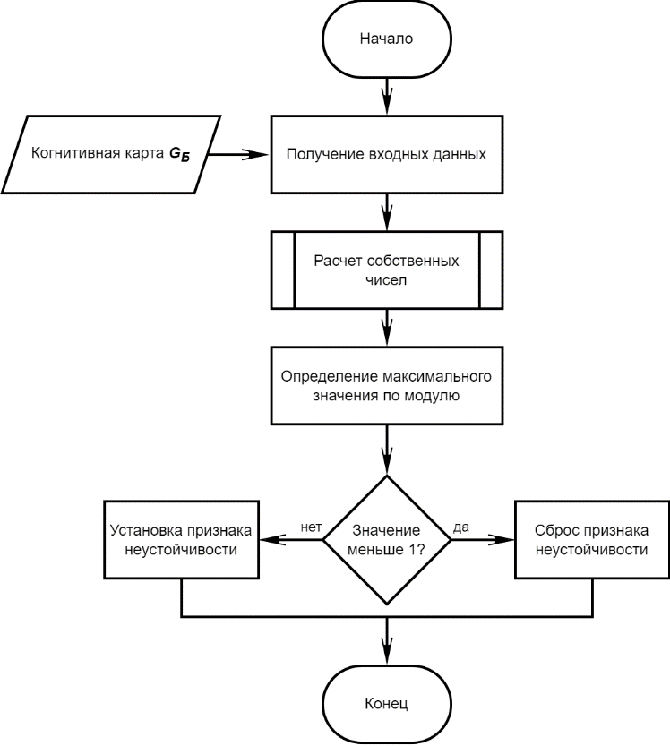
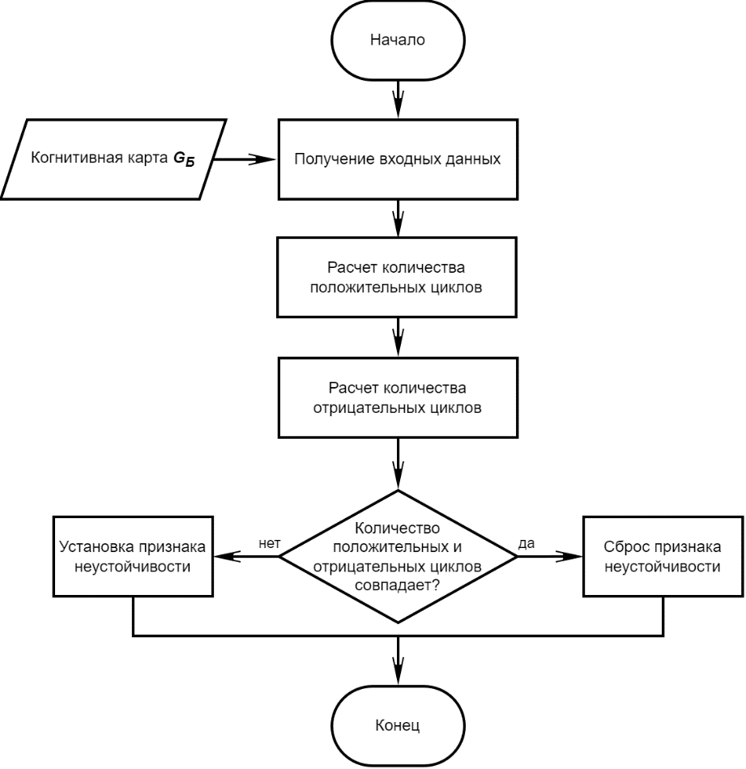
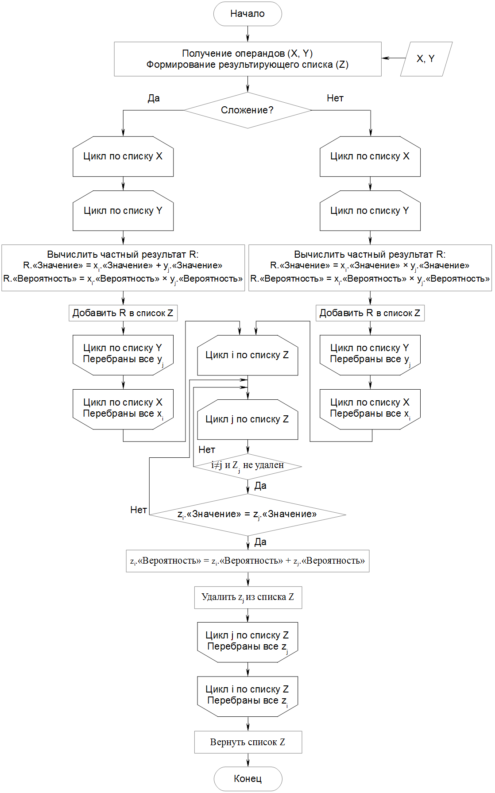
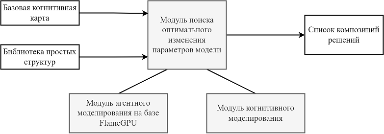
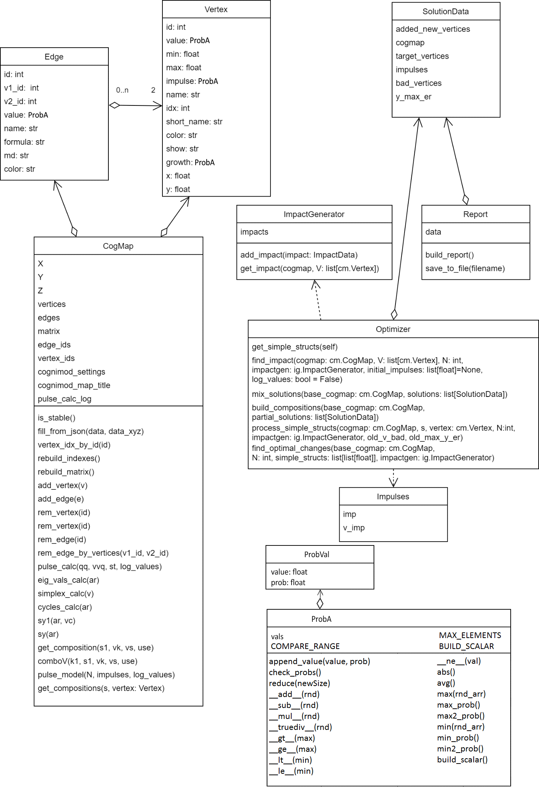

# ОПИСАНИЕ ПРОГРАММЫ

# ОБЩИЕ СВЕДЕНИЯ

Компонент адаптивной оптимизации выполнения производственных процессов с использованием вероятностных моделей и динамически изменяемой среды библиотеки алгоритмов сильного ИИ (далее компонент) разработан в соответствии с мероприятием М1 "Разработка и испытания экспериментального образца библиотеки алгоритмов сильного ИИ в части оптимизации выполнения производственных процессов на основе интеллектуальных технологий с использованием вероятностных моделей и динамически изменяемой среды" программы ИЦИИ «Сильный ИИ в промышленности» в рамках федерального проекта «Искусственный интеллект».

Компонент предназначен для адаптивной оптимизации выполнения производственных процессов на основе интеллектуальных технологий и мультиагентной имитационной среды в части обеспечения адаптации
имитационной среды к различным уровням абстракции и детализации выполнения алгоритмов за счет сочетания когнитивного анализа параметров производственной среды и тенденций в производственных процессах.

Модуль когнитивного моделирования и поиска оптимального изменения параметров модели разработан на языке программирования Python (поддерживаемая версия 3.11) с использованием следующих библиотек:

- numpy;
- itertools;
- keras.models;
- scipy;
- sys;
- json;
- pathlib;
- time;
- copy;
- pandas.

Модуль агентного моделирования разработан на языке программирования С++.

Компонент размещен по адресу [cogmapoptimizer](../).

Для использования компонента необходимы:

- интерпретатор языка программирования Python (версия 3.11 и выше);
- среда разработки PyCharm (желательна, не обязательна);
- комплект разработки программного обеспечения CUDA SDK (версия 10.0 и выше);
- среда агентного моделирования FLAME GPU (версия 2.0.0).

# ФУНКЦИОНАЛЬНОЕ НАЗНАЧЕНИЕ

## Назначение программного компонента

Компонент реализует функции сильного ИИ в части алгоритмов адаптивной оптимизации выполнения производственных процессов с использованием вероятностных моделей и динамически изменяемой среды на основе интеллектуальных технологий и мультиагентной имитационной среды в части обеспечения адаптации имитационной среды к различным уровням абстракции и детализации выполнения алгоритмов за счет сочетания когнитивного анализа параметров производственной среды и тенденций в производственных процессах, поддающихся описанию с помощью нечетких вероятностных когнитивных карт (НВКК).

Необходимая функциональность реализуется в виде следующих алгоритмов:

- алгоритм поиска оптимального изменения параметров НВКК;
- алгоритм мультиагентного моделирования.

## Классы решаемых задач

Компонент решает следующие технические задачи:

1. моделирование импульсного процесса в НВКК загрузка когнитивной карты;
2. формирование композиций (смешивание) НВКК и подбор импульсных воздействий для достижения заданных показателей в наблюдаемых вершинах;
3. формирование композиций частных решений, включающих в себя модифицированные нечеткие когнитивные карты и импульсные воздействия;
4. агентное моделирование композиций частных решений для уточнения результатов импульсного моделирования.

## Функциональные ограничения на применение

Функциональные ограничения на применение компонента:

- входные данные - только в формате JSON;
- число вершин графа когнитивной карты - $N ≤ 32$;
- число дуг графа когнитивной карты - $M ≤ 992 (M ≤ N(N-1))$.

В исходной НВКК обрабатывается только первый сценарий, описанный во входном файле, общее число сценариев не ограничено (в пределах ограничений объема файла входных данных).

## Область применения

Компонент предназначен для применения в СППР при работе со сложными техническими системами, процесс работы которых может быть описан при помощи НВКК.

# ОПИСАНИЕ ЛОГИЧЕСКОЙ СТРУКТУРЫ

## Используемые методы

При разработке компонента библиотеки алгоритмов сильного ИИ использовались:

- методы когнитивного моделирования, подробно рассмотренные в \[1\]-\[8\];
- методы мультиагентного моделирования, подробно рассмотренные в \[9\], \[10\];
- метод оптимизации Нелдера-Мида, подробно описанный в \[11\];
- нейросетевые методы, подробно описанные в \[12\], \[13\].

## Алгоритмы компонента

Основным алгоритмом является алгоритм поиска оптимального изменения параметров когнитивной карты. При помощи алгоритма решается задача определения необходимости и возможности корректировки когнитивной модели в зависимости от изменений внутренней и внешней среды сложной системы (производственной). В основе алгоритма лежит использование композиции когнитивной карты, отражающей работу и взаимовлияние оборудования сложного технического объекта (СТО), и простых устойчивых когнитивных структур. Это позволяет реализовать автономную адаптацию структуры модели и автономный поиск и синтез решений.

Вспомогательными алгоритмами, применяемыми в составе вышеописанного алгоритма, являются:

- алгоритм расчета устойчивости системы к возмущениям;
- алгоритм расчета структурной устойчивости;
- алгоритм работы с параметрами НВКК, выраженными в виде дискретных случайных величин (ДСВ).

Алгоритм «Поиск оптимального изменения параметров когнитивной карты» предназначен для формирования рекомендаций по управляющим воздействиям ($X$) и добавления дополнительных ресурсов (оборудования, рабочей силы и т.п.) в случае потенциальной возможности выхода параметров ($Y$) за пределы допустимого диапазона значений, где:

- $X = {x_i},\ i = 1,2,\ldots,k$ - множество входных, управляющих воздействий, автономно задаваемых СППР или лицом, принимающим решение (ЛПР), или во взаимодействии с ЛПР;
- $Z = {z_h},\ h = 1,2,\ldots,H$ - множество наблюдаемых, но неуправляемых возмущающих воздействий внешней и внутренней среды;
- $Y = {y_u},\ u = 1,2,\ldots,U$ - множество оптимизируемых выходных показателей. 

На рис. 1 представлена блок-схема обобщенного алгоритма работы компонента, отражающая его место в схеме, предполагающей сочетание когнитивного и агентного моделирования с целью снижения требований к вычислительным ресурсам, адаптацию указанных моделей и выработку рекомендаций в случае потенциальной возможности выхода параметров работы элементов СТО за допустимые пределы.



Рисунок 1

Применение искусственных нейронных сетей (с предварительным обучением) используется для ускорения подбора импульсов перед алгоритмом оптимизации по методу Нелдура-Мида. Нейросеть позволяет получить начальный список воздействий (массив значений импульсов для каждой из интересующих вершин когнитивной карты), что позволяет алгоритму оптимизации быстрее дойти до искомого оптимального значения.

Агентное моделирование выполняется на основе конфигурации, формируемой на основе когнитивной карты, каждая вершина которой интерпретируется как один агент или совокупность агентов. Для работы модели генератор подготавливает входные данные - матрицу смежности, значения в вершинах и предыдущее значение в вершине. Матрица смежности представляет собой массив данных для каждой из вершин, значение в массиве  соответствует коэффициенту влияния импульса от смежной вершины, а позиция номер этой смежной вершины. Если вершины не связанны значение будет равно нулю.

Все вершины представляют собой агентов в рамках моделирования. Агент хранит значение в вершине на текущем шаге моделирования и на предыдущем шаге. Импульс - это разница между этими двумя значениями. Если он не нулевой, то формируется отправка сообщения (добавления данных об импульсе в очередь сообщений от текущей вершины-агента). При обработке данных из очереди сообщений далее агенты проверяют из какой вершины отправлен импульс, и, если это две смежные вершины, формируется влияющий на данную вершину импульс с учетом коэффициента из матрицы смежности.

После обработки очереди сообщений и формировании итогового значения вершины, каждый агент проверяет попадание значения данной вершины в заданный диапазон. И, при необходимости контроля этого значения, формирует соответствующий признак - есть попадание в диапазон или нет.

Для повышения эффективности реализации и уменьшения времени агентного моделирования предполагается использование среды FLAME GPU, позволяющей выполнять вычисления на графическом процессоре и, в случае необходимости, масштабировать ресурсы, применяя несколько графических процессоров.

Алгоритм «Поиск оптимального изменения параметров когнитивной карты» реализует функции сильного ИИ (автономная адаптация структуры модели и автономный синтез решений) т.к. позволяет автономно вырабатывать рекомендации по модификации когнитивной модели и адаптации ее к изменяющимся условиям производственной среды, включая изменения
количества вершин и связей. Это необходимо для обоснования решений по изменению состава оборудования производственной среды.

В целом, алгоритм может быть описан следующим образом (определение терминологии дано в разделе [8](#перечень-терминов)):

1.  Анализ тенденций развития ситуаций на когнитивной модели по результатам первой серии импульсного моделирования.
    - Введение возмущений в вершины, соответствующие сигналам изменения данных $(X,Y,Z)$ на основе текущего среза данных.
    - Задание такта моделирования $t < t_{max}$, на котором происходит определение $y_i\  \in [y_{iДОП}]$.
    - Определение вершин $V_i,\ i = 1,2,\ldots,k$, в которых нарушается условие $y_i\  \in [y_{iДОП}]$ и в которых необходимо улучшать процесс. Ситуация отмечается как «плохая» ($bad$) - $V_{ibad},\ i = 1,2,\ldots,k$.
2.  Определение симплексов ${sigma^{ibad}}_p$ вершин - $V_{ibad},\ i = 1,2,\ldots,k$. Симплекс составляют вершины с наибольшим влиянием на $V_{ibad}$. Симплициальный анализ производится на основе работ британского физика Р. Эткина.
3.  Из набора $G = \{G_{прост}\}$ устойчивых простых структур когнитивных карт, последовательно берутся варианты ${G^i}_{прост} = \{V,E\}$, начиная с когнитивных карт с меньшим числом вершин, $l \leq 5,{G^i}_{прост\ k} \in {G^i}_{прост},\ l = 1,2,\ldots,5$.
4.  Определение композиции выбранной простой структуры ${G^i}_{прост\ k}$ с базовой когнитивной картой $G_Б,\ G_{Б1} = G_Б\ {\circ}\ {G^i}_{прост\ k}$. Если несколько вершин из ${G^i}_{прост\ k}$ и отношения их (дуги) не удалось поставить в соответствие с вершинами базовой когнитивной модели $G_Б$, то оставшиеся вершины и дуги являются «новыми». Если нет «новых» вершин, то к переход к п. 8.
5.  Выполнить разработку новой базовой когнитивной модели $G_{Б1}$:
    - Введение возмущений в вершины, соответствующие сигналам изменения данных $(X,Y,Z)$ на основе текущего среза данных.
    - Определение для $G_{Б1}$ вершин $V_i,\ i = 1,2,\ldots,k$ в которых нарушается условие $y_i\  \in [y_{iДОП}]$ и в которых необходимо улучшать процесс. Ситуация отмечается как «плохая» ($bad$) - $V_{ibad},\ i = 1,2,\ldots,k$.
    - Определение симплексов ${\sigma^{ibad}}_p$ вершин - $V_{ibad},\ i = 1,2,\ldots,k$. Симплекс составляют вершины с наибольшим влиянием на $V_{ibad}$.
6.  Проверка структурных свойств и устойчивости новой когнитивной модели. Если свойства удовлетворяют требованиям к качеству когнитивной модели, то переход к п. 7, в противном случае - к п. 4 со следующей ${G^i}_{прост\ k}$.
7.  Поиск комбинации управляющих воздействий $X$ на вершины графа $G_{Б1}$, включающие вершины симплекса ${\sigma^{ibad}}_p$ и вершины простой структуры, обеспечивающей выполнение условия $y_i\  \in [y_{iДОП}]$ для заданного числа тактов моделирования $t < t_{\max}$. Далее процесс поиска комбинации воздействий, позволяющей избежать выхода состояния вершины $V_i$ за допустимые пределы выполняется по методу Нелдера-Мида. Переход к п. 9.
8.  Поиск комбинации управляющих воздействий $X$ на вершины графа $G_{Б1}$, на вершины графа $G_Б$, включающие вершины симплекса ${\sigma^{{ibad}}}_p$ и вершины простой структуры, обеспечивающей выполнение условия $y_i\ \in [y_{iДОП}]$ для заданного     числа тактов моделирования $t < t_{\max}$. Далее процесс поиска комбинации воздействий, позволяющей избежать выхода состояния вершины $V_i$ за допустимые пределы выполняется по методу Нелдера-Мида.
9.  При удовлетворении условия $y_i\  \in [y_{iДОП}]$ и отсутствии перехода вершин из числа благополучных в проблемные, а также ухудшения состояния проблемных добавление варианта решения в список частных решений (направленных на исправление ситуации с одной проблемной точкой).
10. Повтор действий для всех проблемных вершин $V_{ibad}$.
11. На основе списка частных решений формирование композиций решений $Cs$. Каждая композиция включает по одному частному решению для всех проблемных вершин. Композиции формируются для всех сочетаний.
12. Выполнение когнитивного моделирования для всех композиций. Формирование списка композиций частных решений по мере возрастания числа проблемных вершин $V_{ibad}$, для которых не удалось найти управляющих воздействий и «новых» вершин или ребер.
13. Конец.

На рис. 2-5 приведена блок-схема алгоритма.



Рисунок 2



Рисунок 3



Рисунок 4



Рисунок 5

Блок-схема алгоритма расчета устойчивости системы к возмущениям приведена на рис. 6.



Рисунок 6

Блок-схема алгоритма расчета структурной устойчивости приведена на рис. 7.



Рисунок 7

Блок-схема алгоритма работы с параметрами НВКК, выраженными в виде ДСВ приведена на рис. 8.



Рисунок 8

## Структура компонента

Структура компонента показана на рис. 9.



Рисунок 9

Диаграмма классов компонента приведена на рис. 10.



Рисунок 10

Ниже приведено описание классов.

**Класс Impulses** - описывает серию импульсов (воздействий) на когнитивную карту.

Поля:

`imp` - массив значений импульсов.

`v_imp` - массив индексов вершин для подачи импульсов.

**Класс Vertex** - описывает вершину когнитивной карты.

Поля:

`id` - идентификатор вершины.

`value` - значение вершины.

`min` - минимальное допустимое значение.

`max` - максимальное допустимое значение.

`impulse` - импульс вершины.

`name` - название.

`idx` - индекс вершины (в матрице смежности).

`short_name` - краткое название (для совместимости со средствами визуализации).

`color` - цвет вершины (для совместимости со средствами визуализации).

`show` - признак отображения вершины (для совместимости со средствами визуализации).

`growth` - доп. импульс вершины (для совместимости со средствами визуализации).

`x, y` - координаты вершины (для совместимости со средствами визуализации).

**Класс Edge** - описывает ребро когнитивной карты

Поля:

`id` - идентификатор ребра.

`v1_id` - идентификатор начальной вершины.

`v2_id` - идентификатор конечной вершины.

`value` - значение (вес) ребра.

`name` - название ребра.

`formula` - формула пересчета импульса (для совместимости со средствами визуализации).

`md` - координаты средней точки дуги (для совместимости со средствами визуализации).

`color` - цвет дуги (для совместимости со средствами визуализации).


**Класс CogMap** - описывает когнитивную карту.

Функции:

`__init__(self, vertices=[], edges=[])` - конструктор. Аргументы функции:

- `vertices` - массив вершин;
- `edged` - массив ребер;

`is_stable(self)` - возвращает `True`, если когнитивная карта стабильна (объединяет проверку структурной устройчивости и устойчивости к возмущениям).

`fill_from_json(self, data, data_xyz)` - заполняет данные когнитивной карты из данных в формате JSON. Аргументы функции:

- `data` - описание когнитивной карты;
- `data_xyz` - описание групп вершин когнитивной карты.

`vertex_idx_by_id(self, id)` - возвращает индекс вершины по ее идентификатору `id`.

`rebuild_indexes(self)` - перестраивает таблицы индексов вершины и ребер когнитивной карты.

`rebuild_matrix(self)` - перестраивает матрицу смежности согласно массивам вершин и ребер.

`add_vertex(self, v)` - добавляет вершину `v`.

`add_edge(self, e)` - добавляет ребро `e`.

`rem_vertex(self, id)` - удаляет вершину c идентификатором `id`.

`rem_edge(self, id)` - удаляет ребро с идентификатором `id`.

`rem_edge_by_vertices(self, v1_id, v2_id)` - удаляет ребро. Аргументы функции:

- `v1_id` - идентификатор вершины `1`;
- `v2_id` - идентификатор вершины `2`.

`pulse_calc(self, qq, vvq, st, log_values: bool = False)` - анализ тенденций развития ситуаций на когнитивной модели - импульсное моделирование. Аргументы функции:

- `qq` - величины импульсов;
- `vvq` - индексы вершин импульсов;
- `st` - число шагов моделирования;
- `log_values` - если `True`, то при импульсном моделировании будет формироваться лог со значениями вершин на каждом шаге.

`eig_vals_calc(self, ar)` - определение устойчивости системы к возмущениям, аргумент функции - матрица смежности `ar`.

`simplex_calc(self, v), cycles_calc(self, ar)` - определение структурной устойчивости.

`sy1(self, ar, vc)` - расчет симплекса для одной вершины. Аргументы функции:

- `ar` - матрица смежности;
- `vc` - индекс вершины.

`sy(self, ar)` - выдает симплициальные комплексы соответствующего порядка и q-связность между ними, размерность q-связности - это количество вершин с которыми она связана минус 1 т.к. наличие всего одной связи говорит о нулевом порядке связности.

`get_composition(self, s1, vk, vs, use)` - определение композиции выбранной простой структуры. Возвращает экземпляр `CogMap` с обновленными списками вершин и ребер. Аргументы функции:

- `s1` - матрица кусочка который мы добавляем в систему, отрезок, треугольник, квадрат, часы и т.п.;
- `vk` - это список вершин исходной матрицы `k1` на которые присоединяется дополнение;
- `vs` - это список вершин исходной матрицы кусочка `s1` которые используются для присоединения;
- `use` - флаг метода дополнения исходной матрицы (`0` или `1`) - регулирует поведение объединения ребер при их наличии.

`comboV(self, k1, s1, vk, vs, use)` - определение композиции выбранной простой структуры; возвращает матрицу смежности. Аргументы функции:

- `k1` - это исходная матрица графа, текущее состояние системы;
- `s1` - матрица кусочка который мы добавляем в систему, отрезок, треугольник, квадрат, часы и т.п.;
- `vk` - это список вершин исходной матрицы `k1` на которые присоединяется дополнение;
- `vs` - это список вершин исходной матрицы кусочка `s1` которые для присоединения;
- `use` - флаг метода дополнения исходной матрицы (`0` или `1`) - регулирует поведение объединения ребер при их наличии.

`pulse_model(self, N, impulses=None, log_values: bool = False)` - анализ тенденций развития ситуаций на когнитивной модели - импульсное моделирование. Возвращает значения вершин. Аргументы функции:

- `N` - число шагов моделирования;
- `impulses` - импульсы (если не указаны - заполняются исходя из данных когнитивной карты, полученных из файла при загрузке);
- `log_values` - если `True`, то при импульсном моделировании будет формироваться лог со значениями вершин на каждом шаге.

`get_compositions(self, s, vertex: Vertex)` - возвращает список всех композиций заданной вершины и ее окружения с простой структурой. Аргументы функции:

- `vertex` - исходная вершина;
- `s` - матрица смежности простой структуры.

**Класс SolutionData** - описывает данные решения.

Поля:

`added_new_vertices` - число добавленных вершин в когнитивную карту.

`cogmap` - модифицированная когнитивная карта.

`target_vertices` - целевые вершины (на исправление которых направлено решение).

`impulses` - импульсы воздействия.

`bad_vertices` - список «плохих» вершин, остающихся при применении решения.

`y_max_er` - отклонение значений оптимизируемых вершин (`Yi`) от средних значений разрешенных диапазонов (между `min` и `max`).

**Класс Optimizer** - оптимизатор.

Функции:

`get_simple_structs(self)`  - возвращает список доступных простых структур.

`find_impact(self, cogmap: cm.CogMap, V: list[cm.Vertex], N: int, impactgen: ig.ImpactGenerator, initial_impulses: list[float]=None, log_values: bool = False)` - подбирает воздействие для исправления состояния. Аргументы функции:

- `cogmap` - когнитивная карта,
- `V` - список вершин для воздействия;
- `N` - число шагов импульсного моделирования;
- `impactgen` - генератор воздействий;
- `initial_impulses` - начальные воздействия (для поиска);
- `log_values` - если `True`, то при импульсном моделировании будет формироваться лог со значениями вершин на каждом шаге.

`mix_solutions(self, base_cogmap: cm.CogMap, solutions: list[SolutionData])` - формирует композицию решений. Аргументы функции:

- `base_cogmap` - базовая когнитивная карта;
- `solutions` - список решений.

`build_compositions(self, base_cogmap: cm.CogMap, partial_solutions: list[SolutionData])` - формирует список композиций решений. Аргументы функции:

- `base_cogmap` - базовая когнитивная карта;
- `partial_solutions` - список частных решений.
 
`process_simple_structs(self, cogmap: cm.CogMap, s, vertex: cm.Vertex, N: int, impactgen: ig.ImpactGenerator, old_v_bad, old_max_y_er)` - формирует решения на основе композиций с заданной простой структурой. Аргументы функции:

- `cogmap` - когнитивная карта;
- `s` - простая структура;
- `vertex` - целевая вершина;
- `N` - число шагов импульсного моделирования;
- `impactgen` - генератор воздействий;
- `old_v_bad` - начальный список "плохих" вершин;
- `old_max_y_er` - начальной значение отклонения "плохих" вершин.
 
`find_optimal_changes(self, base_cogmap: cm.CogMap, N: int, simple_structs: list[list[float]], impactgen: ig.ImpactGenerator)` - ищет оптимальное изменение когнитивной карты для приведения значений целевых вершин в заданные пределы. Аргументы функции:

- `base_cogmap` - базовая когнитивная карта;
- `N` - число шагов импульсного моделирования;
- `simple_structs` - список простых структур;
- `impactgen` - генератор воздействий.

**Класс ImpactData** - данные воздействия.

Поля:

`cogmap` - когнитивная карта, к которой относится воздействие.

`impulses` - импульсы воздействия.

`y_max_er` - отклонение значений оптимизируемых вершин (`Yi`) от средних значений разрешенных диапазонов (между `min` и `max`).

**Класс ImpactGenerator** - генератор воздействий.

Функции:

`add_impact(self, impact: ImpactData)` - добавляет воздействие в ретроспективу воздействий, аргумент - данные о воздействии `impact`.

`get_impact(self, cogmap, V: list[cm.Vertex])` - возвращает воздействие для заданной когнитивной карты и вершин. Аргументы функции:

- `cogmap` - когнитивная карта;
- `V` - список вершин.

**Класс Report** - генератор отчетов.

Функции:

`__init__(self, data)` - конструктор, аргумент - данные для отчета `data`.

`build_report(self)` - формирует отчет в формате JSON.

`save_to_file(self, filename)` - записывает отчет в файл, аргумент - имя файла `filename`.

**Класс ProbVal** - класс описания элемента (единичного значения) ДСВ.

Функции:

`__init__(self, val=0.0, prob=0.0)` - конструктор. Аргументы функции:

- `val`- значение;
- `prob` - вероятность.

**Класс ProbA** - класс для работы с вероятностной арифметикой.

Функции:

`__init__(self)` - конструктор.

`__str__(self)` - строковое представление ДСВ.

`append_value(self, value=0.0, prob=0.0)` - добавить элемент ДСВ.

`check_probs(self)` - проверка элементов ДСВ на корректность.

`reduce(self, newSize = -1)` - уменьшить число элементов ДСВ до заданного.

`__add__(self, rnd)` - сложение двух ДСВ.

`__sub__(self, rnd)` - вычитание двух ДСВ.

`__mul__(self, rnd)` - перемножение двух ДСВ.

`__truediv__(self, rnd)` - деление двух ДСВ.

`__gt__(self, max)` - сравнение ДСВ с числом («больше»).

`__ge__(self, max)` - сравнение ДСВ с числом («больше или равно»).

`__lt__(self, min)` - сравнение ДСВ с числом («меньше»).

`__le__(self, min)` - сравнение ДСВ с числом («меньше или равно»).

`__ne__(self, val)` - сравнение ДСВ с числом («не равно»).

`abs(self)` - модуль ДСВ.

`avg(self)` - средневзвешенное значение ДСВ.

`max(self, rnd_arr)` - максимум из списка ДСВ.

`min(self, rnd_arr)` - минимум из списка ДСВ.

`COMPARE_RANGE` - диапазон сравнения ДСВ.

`MAX_ELEMENTS` - максимальное число элементов в описании ДСВ.

`build_scalar(self)` - получение скалярной величины из ДСВ.

`max_prob(self)` - получение значения ДСВ с максимальной вероятностью.

`min_prob(self)` - получение значения ДСВ с минимальной вероятностью.

`max2_prob(self)` - получение второго по величине значения ДСВ с максимальной вероятностью.

`min2_prob(self)` - получение второго по величине значения ДСВ с минимальной вероятностью.

`BUILD_SCALAR` - режим получения скалярной величины из ДСВ.


## Связи программы с другими программами.

Для обеспечения работы модуля агентного моделирования в системе должен быть установлен драйвер CUDA.

# ИСПОЛЬЗУЕМЫЕ ТЕХНИЧЕСКИЕ СРЕДСТВА

Минимально необходимые характеристики компьютера для использования компонента должны удовлетворять следующим условиям:

1. микропроцессор с количеством ядер не менее 8 и тактовой частотой не менее 2,8 ГГц;
2. графический процессор от NVidia со следующими характеристиками:
    - количество ядер - не менее 4352;
    - тактовая частота 1,6 ГГц;
    - объем видеопамяти - 8 Гб;
3. оперативная память - не менее 32 Гб;
4. дисковая память - не менее 1Тб.

# ВЫЗОВ И ЗАГРУЗКА

## Базовые функции модуля когнитивного моделирования

Загрузка когнитивной карты:

```python
with open(cogmap_json_path, "r") as config_file:
    cogmap_json = config_file.read()
with open(cogmap_xyz_json_path, "r") as config_xyz_file:
    cogmap_xyz_json = config_xyz_file.read()
base_cogmap = cm.CogMap()
base_cogmap.fill_from_json(cogmap_json, cogmap_xyz_json)
```

Вызов функции поиска оптимальных изменений когнитивной карты:

```python
optimizer = Optimizer()
res, data = optimizer.find_optimal_changes(base_cogmap, N, simple_structs, impactgen)
```
где:

- `base_cogmap` - базовая когнитивная карта;
- `N` - число шагов импульсного моделирования;
- `simple_structs` - список простых структур (массив матриц смежности);
- `impactgen` - экземпляр `ImpactGenerator`.

Вызов функции генерации отчетов:

```python
if res == -1:
    print("Problems not found")
    exit(0)
if res == 0:
    print("Solutions not found")
    exit(0)
i = 0
print("Built %d composition(s)" % len(data))
print("Building reports...")
for d in data:
    r = report.Report(d)
    result_filename = cogmap_json_path + ".out%d.cmj"% i
    i = i + 1
    r.save_to_file(result_filename)
```
Если необходимо разделить задачу поиска оптимального решения на несколько процессов (с целью распараллеливания процесса решения задачи), то для этого можно использовать разные поднаборы простых структур для разных экземпляров: 

```python
cogmap_json_path = sys.argv[1]
cogmap_xyz_json_path = sys.argv[2]
N = int(sys.argv[3])
instance_no = int(sys.argv[4]) # номер экземпляра 0...x`
instance_count = int(sys.argv[5]) # число экземпляров`
optimizer = Optimizer()
simple_structs = optimizer.get_simple_structs()
impactgen = ig.ImpactGenerator()
res, data = optimizer.find_optimal_changes(base_cogmap, N, simple_structs[instance_no::instance_count], impactgen)
```

## Базовые функции модуля агентного моделирования

Генерация исходного кода модели:

`./cognitive --project test.cmj group.cmj_xyz`

Генерация нулевой итерации модели:

`./cognitive --generate test.cmj group.cmj_xyz`

Cборка модели в среде FLAME GPU:

`./cognitive --make test.cmj group.cmj_xyz`

Запуск модели в среде FLAME GPU:

`./cognitive --run test.cmj group.cmj_xyz`

Анализ полученных итерационных данных:

`./cognitive --analize test.cmj group.cmj_xyz`

Если необходимо разделить задачу поиска оптимального решения на несколько процессов, то для этого можно использовать следующий скрипт, позволяющий проводить параллельную обработку данных, полученных в
результате работы модуля когнитивного моделирования:

```bash
#!/bin/bash
for dir in `find $1 -type d `
do
    if [[ $dir != $1 ]]
    then
        ls $dir | while read name ;
        do
            ./cognitive --project "$dir"/"$name" $2
            ./cognitive --generate "$dir"/"$name" $2
            ./cognitive --make "$dir"/"$name" $2
            ./cognitive --run "$dir"/"$name" $2
            ./cognitive --analize "$dir"/"$name" $2
            cp -a $4"result.txt" $3"$name""result.txt\"
        done
    fi
done
```

Входные данные скрипта: 

- путь к каталогу с подкаталогами;
- путь к файлу группы;
- путь к каталогу с результатом;
- путь к папке с итерациями моделирования.

# ВХОДНЫЕ ДАННЫЕ

В качестве входных данных модулю когнитивного моделирования передается число `N` - число шагов когнитивного моделирования (аргумент командной строки при запуске приложения, являющийся аргументом метода `Optimizer::find_optimal_changes)`. `N` является целым положительным числом.

Когнитивная карта описывается с помощью файлов `*.cmj` в формате JSON. В когнитивной карте приводится описание массива рёбер (`Edges`) когнитивной карты и массива вершин (`Vertices`) когнитивной карты. Формат описания массива рёбер приведен в табл. 1, формат описания массива вершин - в табл. 2.

Т а б л и ц а  1 - Формат описания массива рёбер (`Edges`) когнитивной карты

|   Свойство   |                         Описание                          |                   Ограничения                    |
| ------------ | --------------------------------------------------------- | ------------------------------------------------ |
| `weight-[i]` | весовой коэффициент, значение, нумерация `i` - с нуля)    | вещественное число                               |
| `prob-[i]`   | весовой коэффициент, вероятность, нумерация `i` - с нуля) | вещественное число, суммарно по всем `i` - 1.000 |
| `id`         | идентификатор ребра                                       | уникальное целое положительное число             |
| `v1, v2`     | вершины, которые соединяет ребро                          | идентификаторы существующих (описанных) вершин   |
| `shortName`  | наименование ребра                                        | строка                                           |

Т а б л и ц а  2 - Формат описания массива вершин (`Vertices`) когнитивной карты

|  Свойство   |                     Описание                     |                   Ограничения                    |
| ----------- | ------------------------------------------------ | ------------------------------------------------ |
| `fullName`  | полное имя вершины                               | строка                                           |
| `value-[i]` | вес вершины, значение, нумерация `i` - с нуля    | вещественное число                               |
| `prob-[i]`  | вес вершины, вероятность, нумерация `i` - с нуля | вещественное число, суммарно по всем `i` - 1.000 |
| `growth`    | начальный импульс вершины)                       | вещественное число                               |


Примеры файлов когнитивных карт находятся в репозитории в папке `examples`.

Каждая вершина когнитивной карты относится к одной из групп - $X$, $Y$ или $Z$ (см. п. [3.1](#31-используемые-методы)). Отнесение
вершины когнитивной карты к соответствующей группе описывается с помощью файлов групп `*.cmj_xyz` в формате JSON. Описание формата групп (`Groups`) приведено в табл. 3.

Примеры файлов групп находятся в репозитории в папке `examples`.

Т а б л и ц а  3 - Формат описания групп (`Groups`) когнитивной карты

| Свойство |                 Описание                  |            Ограничения            |
| -------- | ----------------------------------------- | --------------------------------- |
| `id`     | идентификатор вершины                     | идентификатор существующих вершин |
| `type`   | тип группы вершины                        | символ «X», «Y» или «Z»           |
| `min`    | минимальное значение для вершин группы Y  | вещественное число                |
| `max`    | максимальное значение для вершин группы Y | вещественное число                |

Входными данными модуля агентного моделирования являются файл когнитивной карты и файл групп, описанные выше, а также файл начальной итерации в xml-формате `0.xml`. Общая структура файла начальной итерации представлена ниже:

```xml
<states>
<itno>0</itno>
<xagent>
    <id>1</id>
    .....
</xagent>
<xagent>
    <id>2</id>
    .....
</xagent>
.....
</states>
```

Файл итерации представляет собой xml-файл, содержащий номер итерации (тег `itno`) и описания состояний агентов (теги `xagent`). Состояние агента описывается с помощью свойств, приведенных в табл. 4.

Т а б л и ц а  4 - Описание свойства агента (`xagent`) в файле начальной итерации модуля агентного моделирования

|  Свойство   |                                   Описание                                   |                                        Ограничения                                        |
| ----------- | ---------------------------------------------------------------------------- | ----------------------------------------------------------------------------------------- |
| `id`        | идентификатор агента                                                         | уникальное целое положительное число и ноль                                               |
| `token`     | уникальное имя вершины                                                       | уникальное целое число                                                                    |
| `value`     | значение в вершине                                                           | вещественное число                                                                        |
| `previuos`  | значение в вершине на предыдущем шаге итерации                               | вещественное число                                                                        |
| `max_lags`  | максимальная задержка                                                        | положительное целое число                                                                 |
| `edges`     | коэффициенты смежных вершин                                                  | массив отношений между вершинами, 0 - нет смежности, вещественное значение - коэффициент  |
| `min`       | минимальное допустимое значение                                              | вещественное число                                                                        |
| `max`       | максимально допустимое значение                                              | вещественное число                                                                        |
| `need_test` | необходимость отслеживание значения вершины                                  | 0 - вершина не отслеживается, 1 - вершина отслеживается                                   |
| `correct`   | корректность вершины; формируется системой моделирования на следующих этапах | 0 - значение в вершине не попадает в заданный диапазон,  1 - значение попадает в диапазон |

# ВЫХОДНЫЕ ДАННЫЕ

Выходными данными модуля когнитивного моделирования являются cmj-файлы отчетов в формате JSON. Описание данных файла отчета в целом аналогично описанию данных когнитивной карты и приведено в табл. 5).


Т а б л и ц а  5 - Описание формата данных файла отчета.

| Наименование данных  |                                    Описание данных                                    |        Ограничения        |
| -------------------- | ------------------------------------------------------------------------------------- | ------------------------- |
| `ModelingResults`    | резюме по результатам моделирования                                                   |                           |
| `added_new_vertices` | число добавленные вершин                                                              | целое число               |
| `bad_vertices`       | список идентификаторов, оставшихся после применения этой композиции проблемных вершин | список                    |
| `y_max_er`           | отклонение оставшихся проблемных вершин от номинальных значений                       | вещественное число        |
| `target_vertices`    | список целевых вершин                                                                 | список                    |
| `id`                 | идентификатор целевой вершины                                                         | целое число               |
| `fullName`           | имя целевой вершины                                                                   | строка                    |
| `Vertices`           | список вершин полученной когнитивной карты                                            | аналогично входным данным |
| `Edges`              | список ребер полученной когнитивной карты                                             | аналогично входным данным |
| `Scenarios`          | список сценариев моделирования                                                        | список                    |
| `impulses`           | список импульсов (воздействий)                                                        | список                    |
| `val`                | значение импульса                                                                     | вещественное число        |
| `v`                  | идентификатор вершины                                                                 | целое число               |
| `step`               | шаг моделирования, на котором применяется импульс                                     | целое число               |


Примеры файлов отчетов находятся в репозитории в папке `examples`.

Выходные данные модуля агентного моделирования представляют собой xml-файлы, в целом аналогичные файлу начальной итерации (см. раздел [6](#входные-данные), табл. 3). В ходе агентного моделирования после каждой итерации моделирования формируется соответствующий файл итерации: после итерации1 - файл `1.xml`, после итерации 2 - файл `2.xml` и т.д. Единственное отличие заключается в отсутствии поля `<token>`, обеспечивающего привязку вершины когнитивной карты к идентификатору агента.

# ПЕРЕЧЕНЬ ТЕРМИНОВ

*Вершины когнитивной модели* - производственных систем с учетом взаимовлияния с внешней средой могут отражать физические, статистические и другие величины, а также заданные экспертами интегральные величины на основании их знаний, теоретической и практической информации.

*Дуги когнитивной модели* - отображают причинно-следственные отношения (связи, взаимосвязи, взаимоотношения) между концептами-вершинами.

*Когнитивная модель* (модель познания) - это модель причинно-следственных связей (отношений) между вершинами-концептами (понятиями, объектами, субъектами, параметрами, факторами, показателями
и т. п.) сложной системы. Когнитивные модели разрабатываются для моделирования сложных систем (в том числе производственных) с помощью когнитивной интеллектуальной технологии в зависимости от системы и цели ее исследования. Математически когнитивная модель может быть представлена разного вида графами (также матрицами их отношений), такими как: когнитивная карта - знаковый ориентированный граф, взвешенный знаковый ориентированный граф [2 - 7], параметрический знаковый ориентированный граф, функциональный ориентированный граф [8] и др.

*Тенденция развития сложных систем* - это «сравнительно устойчивое направление развития» процессов в сложных системах, которое может быть
стабильным, возрастающим, убывающим, экспоненциальным, колебательным и др. При имитационном когнитивном моделировании тенденции развития
определяются методом импульсного моделирования сценариев развития ситуаций при возможных изменениях параметров внутренней и внешней среды
производственной системы [9].

# СПИСОК ИНФОРМАЦИОННЫХ ИСТОЧНИКОВ

1. Горелова Г.В., Мельник Э.В. Когнитивные модули интеллектуальной поддержки решений в информационных управляющих системах \/ Системный
анализ в экономике. Материалы научно-практической конференции. - М.: ЦЭМИ РАН, 2010. - 183 с. - С. 45-49
2. Axelrod, R. The Structure of Decision: Cognitive Maps of Political Elites \/ R.Axelrod. -Princeton. University Press, 1976; Roberts F.Graph Theory and its Applications to Problems of Society, Society for Industrial and Applied Mathematics, Philadelphia, 1978.
3. Горелова, Г.В. Исследование слабоструктурированных проблем социально-экономических систем: когнитивный подход. \/ Г.В. Горелова,
Е.Н.Захарова, С.А. Радченко - Ростов н/Д: Изд-во РГУ, 2006. - 332c; ISBN 5-7507-0220-0
4. Galina V. Gorelova. Cognitive Modeling of Complex Systems: State and Prospects\/ System Analysis in Engineering and Control.Lecture Notes in Networks and Systems. Volume 442. Springer Nature Switzerland AG 2022. - Р. 212-224.
5. Абрамова, Н.А. Когнитивный анализ и управление развитием ситуаций: проблемы методологии, теории и практики \/ Н.А. Абрамова, З.К. Авдеева \/\/Проблемы управления. 2008. № 3. С. 85-87.
6. Максимов В.И. Когнитивные технологии - от незнания к пониманию \/Cб. трудов 1-й Международной конференции «Когнитивный анализ и управление развитием ситуаций», (САSC'2001). - М.: ИПУ РАН, 2001. - т.1, С. 4-18.
7. Коврига С.В., Максимов В.И.. Когнитивная технология стратегического управления развитием сложных социально-экономических объектов в
нестабильной внешней среде \/\/ Cб. 1-й трудов «Когнитивный анализ и управление ситуациями» (CASC'2001). Тр. Межд. конф., 2001.-Т.1.
8. Кульба В.В., Ковалевский С.С., Кононов Д.А., Чернов И.В., Шелков А.Б. Проблемы обеспечения экономической безопасности сложных социально-экономических систем. \/ Препринт. - М.: ИПУ РАН, 2000. - 126с.
9. Мельник, Э.В. Имитационное моделирование вариантов резервирования в распределенных информационно-управляющих системах с децентрализованной организацией/Э.В.Мельник, Г.В.Горелова\/\/ Известия ЮФУ. Сер. Технические науки. - 2013. - №3. - С.184-193.
10. Мельник Э.В. Децентрализованные системы компьютерного управления: монография \/ И.А.Каляев, Э.В. Мельник. - Ростов н/Д: Изд-во ЮНЦ РАН, 2011.-196 с.
11. J. A. Nelder and R. Mead, Computer Journal, 1965, vol. 7, p. 308-313.
12. Ерёмин Д. М., Гарцеев И. Б. Искусственные нейронные сети в интеллектуальных системах управления. - М.: МИРЭА, 2004. - 75 с. - ISBN 5-7339-0423-2.
13. Тадеусевич Рышард, Боровик Барбара, Гончаж Томаш, Леппер Бартош. Элементарное введение в технологию нейронных сетей с примерами программ \/ Перевод И. Д. Рудинского. - М.: Горячая линия - Телеком, 2011. - 408 с. - ISBN 978-5-9912-0163-6.
