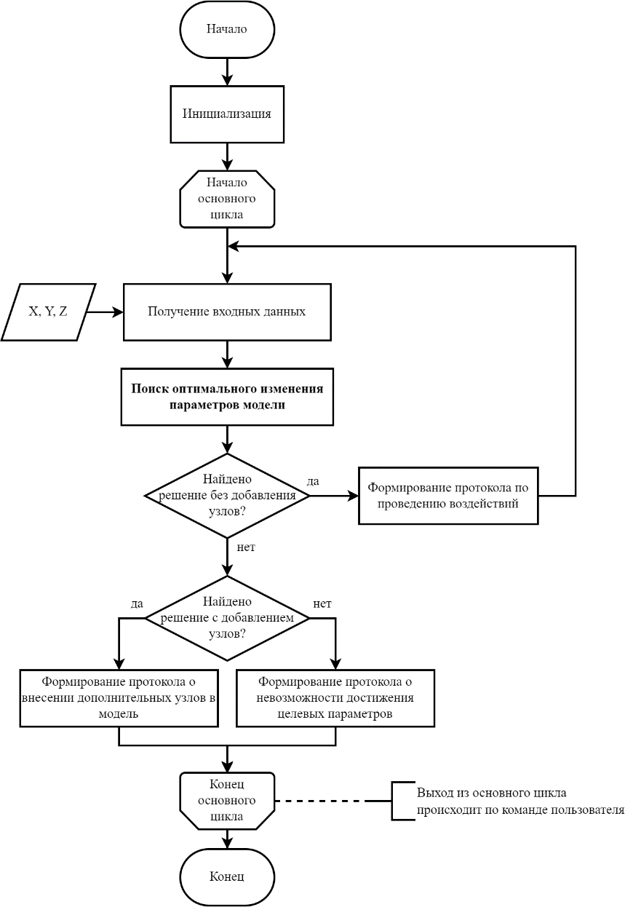
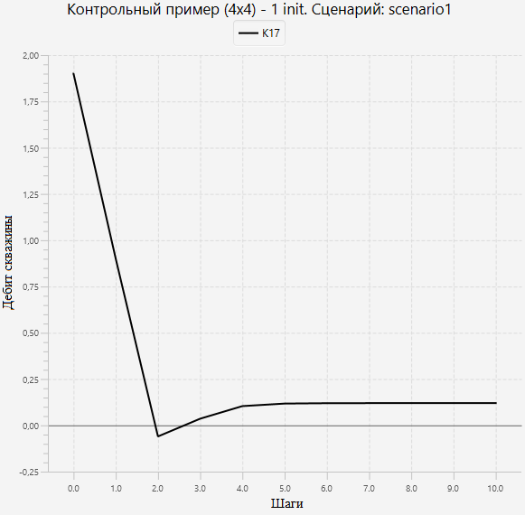
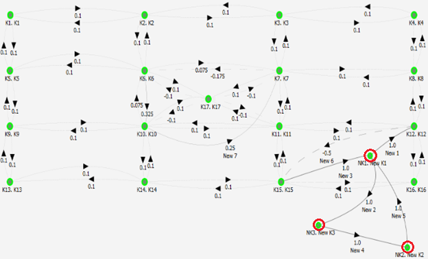
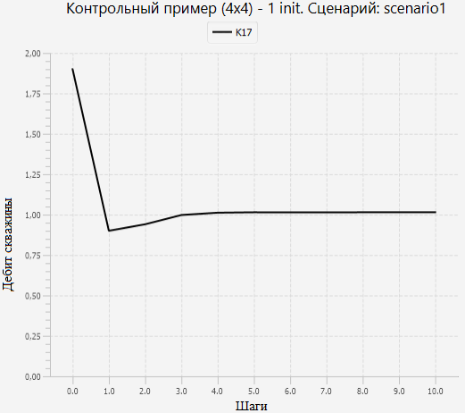
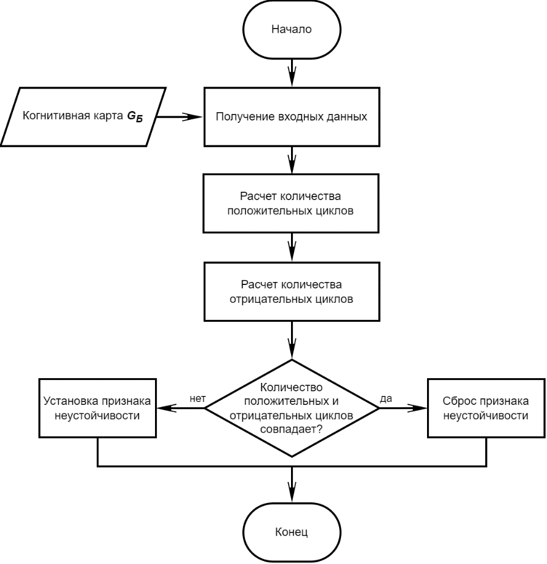
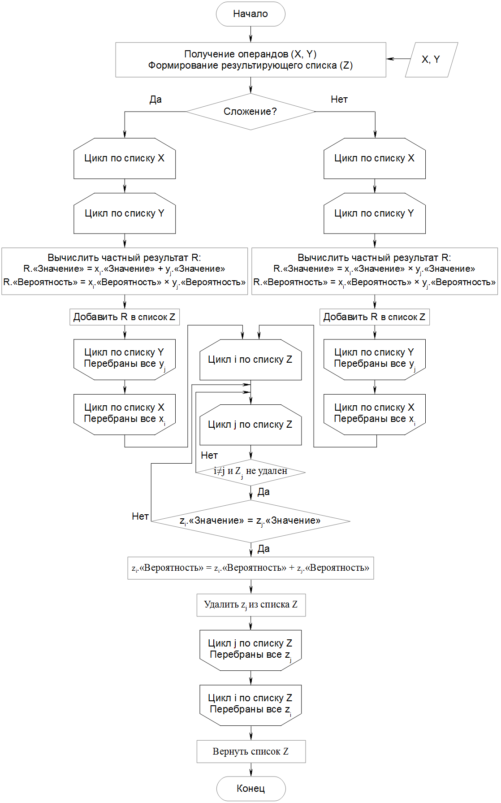
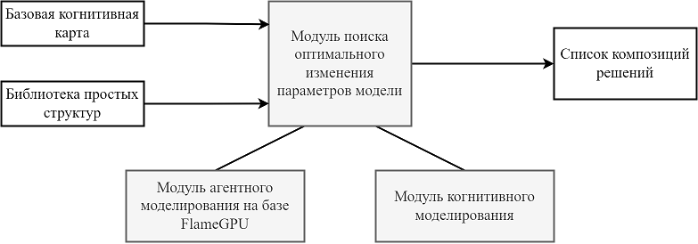

# ОБЩИЕ СВЕДЕНИЯ

Компонент адаптивной оптимизации выполнения производственных процессов с использованием вероятностных моделей и динамически изменяемой среды библиотеки алгоритмов сильного ИИ (далее компонент) разработан в соответствии с мероприятием М2 \"Разработка и испытания экспериментального образца библиотеки алгоритмов сильного ИИ в части оптимизации выполнения производственных процессов на основе интеллектуальных технологий с использованием вероятностных моделей и динамически изменяемой среды\" программы ИЦИИ «Сильный ИИ в промышленности» в рамках федерального проекта «Искусственный интеллект».

Компонент предназначен для адаптивной оптимизации выполнения производственных процессов на основе интеллектуальных технологий и
мультиагентной имитационной среды в части обеспечения адаптации имитационной среды к различным уровням абстракции и детализации
выполнения алгоритмов за счет сочетания когнитивного анализа параметров производственной среды и тенденций в производственных процессах.

Модуль когнитивного моделирования и поиска оптимального изменения параметров модели разработан на языке программирования Python
(поддерживаемая версия 3.11) с использованием следующих библиотек:

- numpy;
- itertools;
- keras.models;
- scipy;
- sys;
- json;
- pathlib;
- time;
- copy;
- pandas.

Модуль агентного моделирования разработан на языке программирования С++.

Компонент размещен по адресу [https://gitlab.actcognitive.org/itmo-sai-code/cogmapoptimizer](https://gitlab.actcognitive.org/itmo-sai-code/cogmapoptimizer).

Для использования компонента необходимы:

- интерпретатор языка программирования Python (версия 3.11 и выше);
- среда разработки PyCharm (желательна, не обязательна);
- CUDA SDK;
- среда агентного моделирования FLAME GPU.

# ФУНКЦИОНАЛЬНОЕ НАЗНАЧЕНИЕ

## Назначение программного компонента

Компонент реализует функции сильного ИИ в части алгоритмов адаптивной оптимизации выполнения производственных процессов с использованием вероятностных моделей и динамически изменяемой среды на основе интеллектуальных технологий и мультиагентной
имитационной среды в части обеспечения адаптации имитационной среды к различным уровням абстракции и детализации выполнения алгоритмов за счет сочетания когнитивного анализа параметров производственной среды и тенденций в производственных процессах.

Необходимая функциональность реализуется в виде следующих алгоритмов:

- алгоритм поиска оптимального изменения параметров нечеткой вероятностной когнитивной карты (НВКК);
- алгоритм мультиагентного моделирования.

## Область применения

Компонент предназначен для применения в СППР при работе со сложными техническими системами, процесс работы которых может быть описан при помощи НВКК.

Функциональные условия применения
---------------------------------

[]{#_Toc124759293 .anchor}Функциональные ограничения на применение
компонента:

-   входные данные --- только в формате JSON,

-   число вершин графа когнитивной карты --- N ≤ 32,

-   число дуг графа когнитивной карты --- M ≤ 992 (M ≤ N(N-1)).

Во исходной НВКК обрабатывается только первый сценарий, описанный во
входном файле, общее число сценариев не ограничено (в пределах
ограничений объема файла входных данных).

Технические условия применения
------------------------------

Для применения компонента должны быть соблюдены следующие условия:

-   ОС Ubuntu 18.04 (при применении только когнитивного моделирования --
    возможно иcпользование ОС Windows 10),

-   Python (версия не ниже 3.11),

-   PyCharm (желательно, не обязательно),

-   FLAME GPU,

-   CUDA SDK (версии не ниже 10.0).

Требования к техническим средствам **приведены в табл. 1**.

Т а б л и ц а 1 -- Минимальные требования к техническим средствам.

+---------+---------+---------+---------+---------+---------+---------+
| Тип     | Кол-во  | Т       | Кол-во  | Т       | Память, | Д       |
| ком     | CPU х   | актовая | GPU x   | актовая | Гб      | исковая |
| пьютера |         | частота |         | частота |         | память, |
|         | кол-во  | CPU,    | кол-во  | GPU,    |         | Тб      |
|         | ядер    | ГГц     | ядер    | ГГц     |         |         |
+=========+=========+=========+=========+=========+=========+=========+
| Рабочая | 1х8     | 2,8     | 1 х     | 1,6     | ОЗУ --  | Не      |
| станция |         |         | 4352    |         | не      | менее 1 |
|         |         |         |         |         | менее   |         |
|         |         |         |         |         | 32,     |         |
|         |         |         |         |         | видео   |         |
|         |         |         |         |         | па-мять |         |
|         |         |         |         |         | -- не   |         |
|         |         |         |         |         | менее 8 |         |
+---------+---------+---------+---------+---------+---------+---------+

ОПИСАНИЕ ПРИКЛАДНЫХ ЗАДАЧ
=========================

Классы решаемых задач
---------------------

Компонент предназначен для решения задачи адаптивной оптимизации
выполнения производственных процессов на основе интеллектуальных
технологий с использованием когнитивного анализа параметров
производственной среды и тенденций в производственных процессах,
поддающихся описанию с помощью НВКК.

Целью адаптивной оптимизации является достижение состояния, в котором
весовые коэффициенты целевых вершин когнитивной карты будут находиться в
допустимых диапазонах. Под целевыми вершинами когнитивной карты могут
подразумеваться различные объекты производственной среды, это зависит от
характера решаемой прикладной задачи.

Для обеспечения этого возможны следующие варианты воздействия на
систему:

1) изменение системы методом введения дополнительных вершин,

2) изменение системы методом модификации существующих между вершинами
связей,

3) гибридные варианты, объединяющие в себе два предыдущих варианта.

Первые два варианта воздействия не столь эффективны как третий и
подходят для проверки работы компонента (см. раздел 6). Третий
(гибридный) вариант дает больше степеней свободы манипулировании
когнитивной картой. Поэтому в качестве решения прикладной задачи будет
рассматриваться именно он.

Пример решения практической задачи в области нефтедобычи ВСЕ ПЕРЕДЕЛАТЬ?!
-------------------------------------------------------------------------

### Постановка задачи

Имеется нефтеносное поле (участок) с добывающей скважиной, которая
окружена технологическими скважинами, позволяющими влиять на состояние
нефтеносного пласта за счет, например, изменения пластового давления
(заводнением или закачкой газа в пласт). Общая задача состоит в том,
чтобы поддерживать уровень нефтедобычи (изъятия ресурса) на указанной
скважине на экономически выгодном уровне за счет изменения параметров
воздействия на нефтеносный пласт через технологические скважины. Частная
задача заключается в подборе параметров воздействия.

### Исходные данные

В качестве исходных данных примера рассматривается поле размером 4x4
(см. рис. 1), описанное равномерно распределенными на плоскости
вершинами (скважинами) К1---К16. Точка изъятия ресурса (добывающая
скважина) К17 располагается в геометрическом центре поля. Связи между
вершинами двунаправленные, имеют модуль веса равный 0,1 (положительные
веса для точек К1---К16, разнознаковые для точки изъятия ресурса).

В процессе моделирования осуществляется запуск сценария, который
предусматривает импульсные воздействия величиной +0,1 на каждый из
узлов, не являющихся точками изъятия ресурса (имитация возобновления
ресурса, т. е. переток нефти в пределах пласта) и импульсное воздействие
-1,0 на узел К17 (имитация изъятия ресурса, т. е. процесса нефтедобычи)
на каждом из шагов моделирования.

Начальный вес (имитация объема доступного ресурса) на всех вершинах в
начальный момент времени равна 1,9.

### Решение задачи

При запуске сценария моделирования получаются следующие результаты (см.
рис. 2).

В процессе моделирование объем ресурса в точке изъятия в течение первых
4-5 шагов моделирования стабилизируется в районе отметки +0,12. Это
является хорошим результатом, так как показывает, что в долгосрочной
перспективе не происходит исчерпания ресурса, что снижало бы
эффективность рассматриваемой системы.

Негативным результатом моделирования представляется то, что на втором
шаге моделирования создается дефицит ресурса, что можно интерпретировать
примерно, как ситуацию вида «дебит скважины в точке нефтедобычи не
является достаточным из-за низкого уровня перетока нефти из соседних
областей пласта и в силу высокой скорости нефтедобычи».

{width="6.696850393700787in"
height="4.2795275590551185in"}

Рис. 1 --- Начальный вид моделируемой системы

В реальности объем ресурса, естественно, не был бы отрицательным --- это
можно интерпретировать как локальное по времени уменьшение скорости
изъятия ресурса из рассматриваемого пространства, либо как временную
приостановку изъятия ресурса. В любом случае такое развитие ситуации
является недопустимым или, по крайней мере, нежелательным.

{width="6.052083333333333in" height="5.9375in"}

Рис. 2 --- Результат моделирования жизненного цикла начальной системы\
(объем ресурса в точке изъятия К17)

{width="6.5in" height="3.9375in"}

Рис. 3 --- Решение задачи с помощью алгоритма адаптивной оптимизации
выполнения производственных процессов на основе когнитивного анализа
параметров производственной среды

### Результаты и их содержательная интерпретация

Рассмотрим применение гибридного варианта для оптимизации подобной
структуры (см. рис. 3). Как видно на представленном изображении в
систему были введены дополнительные вершины NK1, NK2, NK3 (юго-восточный
сектор рассматриваемого поля; выделено красным) и дуги (K10‑K7, K12‑K15,
K15‑NK1, NK1‑K12, NK1‑NK3, NK3‑NK2, NK2‑NK1). Помимо это подверглись
модификации веса дуг между парами вершин K6‑K10 и K6‑K7.

Интерпретируем предложенное ИИ решение, переложив его на реальную
ситуацию. Очевидно, что дополнительные вершины представляют собой
дополнительные скважины соответствующего типа (добывающие или
нагнетающие), а их связанность «в кольцо» является своего рода
«задержкой» (буфером) в процессе распространения взаимовлияния между
скважинами в рассматриваемом примере. Для связи такого своеобразного
буфера с остальной системой вводятся связи между скважинами K12, K15 и
NK1.

С другой стороны (северо-западный квадрант, относительно регулируемой
скважины K17) ИИ, по всей видимости, предлагает аналогичное решение,
приводящее к увеличению дебита на регулируемой скважине K17, достигаемое
другим способом --- за счет перераспределения перетока между
непосредственными соседями скважины K17. В реальности это может быть
достигнуто за счет изменения пластового давления (закачка воды) или
увеличения пористости породы (гидроразрыв).

В итоге применения разработанного алгоритма получается эффективное
решение поставленной задачи (см. рис. 4), так как значение веса для
вершины К17 (добывающей скважины) стабилизируется с течением времени в
районе отметки 1,014 и дефицит добываемого ресурса (нефти) ни на одном
из шагов моделирования не наблюдается.

{width="5.4in" height="4.8in"}

Рис. 4 --- Результат моделирования жизненного цикла модифицированной по
рекомендации ИИ системы

Пример решения практической задачи в области экологического мониторинга в нефтегазовой отрасли
----------------------------------------------------------------------------------------------

### Постановка задачи

Пусть в качестве исходных данных примера рассматривается ситуация с
разливом нефти или нефтепродуктов из поврежденного трубопровода с
загрязнением акватории прилежащих водоемов (см. рис. 5). Задача, которую
необходимо решить -- минимизация вреда, наносимого окружающей среде.

{width="6.496527777777778in"
height="3.5795122484689412in"}

Рис. 5 --- Схема разлива нефтепродуктов для рассматриваемого примера

### Исходные данные

В результате формализации заданной ситуации была создана когнитивная
карта следующего вида (см. рис. 6):

-   вершина V1 (место разлива),

-   вершина V2 (место попадания нефтепродуктов в морской залив),

-   вершины V3-V8 (точки в акватории залива),

-   вершина V9 (пролив, соединяющий залив с морем),

-   вершины V10-V12 (открытое море).

{width="6.496527777777778in"
height="3.5795122484689412in"}

Рис. 6 --- Когнитивная карта с описанием рассматриваемой в примере
ситуации

### Решение задачи

В ходе моделирования виден процесс распространения нефтепродуктов при
разливе, который отображается на графиках (см. рис. 7), как лаг между
ненулевыми значениям в разных рассматриваемых точках.

В процессе обработки начальной когнитивной карты при помощи алгоритмов
адаптивной оптимизации выполнения производственных процессов на основе
интеллектуальных технологий с использованием когнитивного анализа
параметров производственной среды и тенденций в производственных
процессах в нефтегазовой отрасли был получен набор вариантов воздействия
на систему с целью решения задачи минимизации ущерба, наносимого
окружающей среде в случае разлива нефтепродуктов из поврежденного
трубопровода. Рассмотрим наиболее эффективный из них (см. рис. 8).

Как видно на представленном изображении в систему были введены
дополнительные вершины и дуги. Помимо это подверглись модификации веса
ряда существующих дуг между вершинами.

### Результаты и их содержательная интерпретация

Попробуем интерпретировать предложенное ИИ решение, переложив его на
реальную ситуацию.

Кластеры дополнительных вершин между точками \"Море 1\" и V9, \"Море 2\"
и V9, а также между \"Море 3\" и V9 представляют собой, фактически,
циклы, функциональное назначение которых - задержать распространение
нефтепродуктов, т.е. стать буферами-накопителями. Задержка
осуществляется на 3 шага моделирования (по числу дополнительных дуг
графа в указанных кластерах), что позволяет временно снизить нагрузку на
вершины \"в море\". Это же обуславливает \"пилообразный\" характер
графиков (см. рис. 9).

{width="6.0625in" height="5.708333333333333in"}

Рис. 7 --- Моделирование рассматриваемой ситуации (динамика уровней
загрязнения с течением времени в точках мониторинга)

В итоге применения разработанного алгоритма получается эффективное
решение поставленной задачи, так как значение весов для вершин \"в
море\" (т. е. уровней загрязнения) меньше, чем в варианте, предложенном
человеком.

{width="5.833333333333333in"
height="3.885767716535433in"}

Рис. 8 --- Решение задачи с помощью алгоритма адаптивной оптимизации
(модифицированная когнитивная карта)

{width="6.0625in" height="5.708333333333333in"}

Рис. 9 --- Решение задачи с помощью алгоритма адаптивной оптимизации
(уровни загрязнения в точках мониторинга)

ХАРАКТЕРИСТИКИ ПРОГРАММЫ
========================

Режимы работы ключевых алгоритмов
---------------------------------

Особые режимы работы алгоритмов не предусмотрены.

В качестве варьируемых параметров алгоритмов могут использоваться:
количество отслеживаемых вершины, масштаб когнитивной карты (число
вершин и ребер графа), количество простых структуры, количество шагов
моделирования и др.

Влияние параметров на работу алгоритма описано в табл. 2.

Т а б л и ц а 2 - Влияние параметров на работу алгоритма

  Параметр                                                                   Зависимость времени от параметра                                          Влияние на общее время обработки
  -------------------------------------------------------------------------- ------------------------------------------------------------------------- ----------------------------------
  Количество шагов моделирования                                             Линейная в части непосредственно импульсного моделирования.               Значительное
  Количество вершин когнитивной карты + количество ребер когнитивной карты   Линейная в части определения структурной устойчивости когнитивной карты   Значительное
  Количество простых структур                                                Линейная, при одинаковой сложности структур                               Среднее
  Количество отслеживаемых вершин                                            Линейная в части поиска проблемных вершин.                                Незначительное
  Количество проблемных вершин (из отслеживаемых)                            Линейная в части обработки простых структур.                              Среднее

Порядок оценки качества алгоритмов
----------------------------------

Процедура априорной оценки качества работы алгоритмов сильного ИИ
выполняется следующим образом:

1) создается оценочная группа для проведения априорной оценки качества
работы алгоритмов сильного ИИ, состоящая из разработчиков алгоритмов и
сторонних оценщиков,

2) проводится проверка алгоритмов на предмет обнаружения логических
ошибок, несоответствий с декларируемым математическим базисом
алгоритмов, неоднозначностей в описании алгоритмов и т. п.; оценка
проводится по шкале от 1 («множественные ошибки/несоответствия») до 5
(«ошибок/несоответствий нет»), допустимым значением является отметка
«5»; результат проверки по данному пункту --- подтверждение (или
опровержение) работоспособности алгоритмов в принципе,

3) проводится теоретическая огрубленная проверка математического
аппарата алгоритмов с целью определения уровня устойчивости алгоритмов;
оценка проводится по шкале от 1 до 5, допустимым значением являются
отметки «4» («незначительная зависимость от изменений входных данных») и
«5» («отсутствие зависимости от изменений входных данных»); результат
проверки по данному пункту --- предварительная оценка устойчивости
оцениваемых алгоритмов,

4) проводится теоретический огрубленный анализ математического аппарата
алгоритмов с целью определения вычислительной сложности и,
соответственно, скорость работы алгоритмов; оценка проводится по шкале
от 1 («очень высокая сложность») до 5 («очень низкая сложность»),
допустимых значений нет, однако, более желательны отметки максимально
приближенные к отметке «5»; результат проверки по данному пункту ---
предварительная оценка скорости работы оцениваемых алгоритмов,

5) проводится теоретическая огрубленная проверка алгоритмов,
моделирующая их работу на заранее созданном контрольном примере, в
результате которой полученный результат сравнивается с результатом,
ожидаемым в контрольном примере; оценка проводится по шкале от 1 до 5,
допустимым значением являются отметки «3» (результат незначительно
уступает результату контрольного примера), «4» (результат соответствует
результату контрольного примера) или «5» (результат превосходит
результат контрольного примера); результат проверки по данному пункту
--- предварительная оценка качества получаемого при помощи алгоритмов
решения,

6) проводится расчет интегральной оценки алгоритмов по формуле
P =∑ ((∑P~ij~) × w~i~), где P~ij~ --- оценка i-го члена оценочной группы
по j‑ой оцениваемой характеристике алгоритмов из пп. 2-5, w~i~ ---
весовой коэффициент оценки i‑го члена оценочной группы из диапазона
0\<w~i~≤1 (коэффициенты подбираются таким образом, чтобы общий эффект от
их применения делал суммарное мнение разработчиков и сторонних оценщиков
равнозначным независимо от числа оценщиков в каждой из этих групп, что
позволит нивелировать эффект личных и/или групповых симпатий/антипатий,
т. е. ∑w~разработчиков~ = ∑w~оценщиков~ = 0,5; при этом внутри группы
коэффициенты не обязательно должны быть равными --- они могут разниться,
например, в зависимости от вклада разработчика в процесс разработки
алгоритмов или же квалификации стороннего оценщика); интегральная оценка
может лежать в диапазоне 4-20 баллов, допустимым значением является
интегральная оценка ≥13 баллов (с учетом допустимых минимумов по каждому
из пунктов оценки).

В случае если хотя бы по одной из оценочных характеристик (пп. 2-5)
получается неудовлетворительная оценка, интегральная оценка (п. 6) не
рассчитывается и принимается равной 0, то есть величине, заведомо
меньшей, чем заявленный допустимый диапазон от 4 до 20 баллов. В этом
случае алгоритмы должны быть отправлены на доработку/переработку с целью
исправления обнаруженных ошибок, неточностей и упущений.

Процедура проведения апостериорной оценки качества работы алгоритмов
сильного ИИ выполняется следующим образом:

1) создается оценочная группа для проведения апостериорной оценки
качества работы алгоритмов, состоящая из сторонних оценщиков, при
участии разработчиков алгоритмов, выступающих в роли консультантов,
обеспечивающих процесс,

2) проводится практическая проверка алгоритмов с целью определения
уровня устойчивости алгоритмов; оценка проводится по шкале от 1 до 5,
допустимым значением являются отметки «4» («незначительная зависимость
от изменений входных данных») и «5» («отсутствие зависимости от
изменений входных данных»); результат проверки по данному пункту ---
практическая оценка устойчивости оцениваемых алгоритмов,

3) проводится практическая оценка скорости работы алгоритмов; оценка
проводится по шкале от 1 до 5, допустимых значений нет, однако, более
желательны отметки максимально приближенные к отметке «5» (чем выше
скорость выработки решения --- тем лучше); результат проверки по данному
пункту --- практическая оценка скорости работы оцениваемых алгоритмов,

4) проводится практическая проверка алгоритмов, в результате которой
полученные результаты сравнивается с результатами, ожидаемыми в
контрольном примере (примерах); оценка проводится по шкале от 1 до 5,
допустимым значением являются отметки «3» («результат незначительно
уступает результату контрольного примера»), «4» («результат
соответствует результату контрольного примера») или «5» («результат
превосходит результат контрольного примера»); результат проверки по
данному пункту --- практическая оценка качества получаемого при помощи
алгоритмов решения,

5) проводится расчет агрегированной оценки алгоритмов по формуле
P = ∑P~i~, где P~i~ --- оценка алгоритмов по i‑ой оцениваемой
характеристике алгоритмов из пп. 2-4; интегральная оценка может лежать в
диапазоне 3-15 баллов, допустимым значением является интегральная оценка
≥8 баллов (с учетом допустимых минимумов по каждому из пунктов оценки).

Для каждого из пунктов оценки (пп. 2-4) процедуры апостериорной оценки
работы алгоритмов сильного ИИ допускается как единичные испытания, так и
серии испытаний. В последнем случае для каждой из оцениваемых
характеристик работы алгоритмов проводится N испытаний (N≥2), после чего
за оценку по рассматриваемой характеристике принимается среднее
арифметическое полученных по всем испытаниям серии значений. В случае
необходимости дополнительно проводится вычисление статистических
величин, характеризующих серию испытаний (математическое ожидание,
дисперсия, среднеквадратичное отклонение, размах и т. п.).

Для автоматизации проверки работы алгоритма было разработано приложение
на основе библиотеки сильного ИИ (находится в репозитории проекта:
cogmap/main.py). На вход этого приложения подается когнитивная карта и
файл групп вершин (согласно подраздела 7.1 «Входные данные»). Команда
для выполнения:

main.py \<input.cmj\> \<input.xyz\_cmj\> \<N\>,

где \<input.cmj\> - входной файл когнитивной карты, \<input.xyz\_cmj\> -
входной файл групп вершин \<N\> - число шагов когнитивного
моделирования.

После выполнения программы результирующие файлы когнитивных карт
помещаются в директорию с входной когнитивной картой в поддиректории с
именем «added\_%d», где %d -- число добавленных в исходную когнитивную
карту вершин. Файлы именуются на основе названия исходного файла
когнитивной карты: \<базовая\_часть\_имени\>.out%d.cmj, где %d --
порядковый номер решения согласно качеству решения (в соответствии с п.
12 алгоритма; см. подраздел 3.2 документа RU.СНАБ.00853-01 13
16 «Описание программы»).

Для проверки результатов, полученных на этапе когнитивного
моделирования, запускается модуль агентного моделирования с полученными
файлами в качестве входных данных. Запуск выполняется следующим образом:

./complete.sh \<директория\_с\_результатами\> \<путь\_к\_файлу\_групп\_вершин\> \<директория\_с\_отчетов\_по\_агентному\_моделированию\> \<директория\_с\_итерациями\>

Соответствующий скрипт автоматизации расположен в репозитории:
cognitive/complete.sh.

Результаты агентного моделирования представляются согласно подразделу
7.2 «Выходные данные».

Для N шагов моделирования, для каждой из наблюдаемых вершин (попавших
изначально в проблемные), если среди итераций на которых значение
попадает в допустимый диапазон есть N+1, это означает, что когнитивная
карта корректно модифицирована и воздействия подобраны правильно.

ОБРАЩЕНИЕ К ПРОГРАММЕ
=====================

Точки входа в программу
-----------------------

Ниже приведено описание ключевых классов компонента.

**Класс CogMap -** описывает когнитивную карту.

Функции:

\_\_init\_\_(self, vertices=\[\], edges=\[\]) -- конструктор,

vertices -- массив вершин,

edged -- массив ребер,

is\_stable(self) -- возвращает True, если когнитивная карта стабильна
(объединяет проверку структурной устройчивости и устойчивости к
возмущениям),

fill\_from\_json(self, data, data\_xyz) -- заполняет данные когнитивной
карты из данных в формате JSON,

data -- описание когнитивной карты,

data\_xyz -- описание групп вершин когнитивной карты,

vertex\_idx\_by\_id(self, id) -- возвращает индекс вершины по ее
идентификатору id,

rebuild\_indexes(self) -- перестраивает таблицы индексов вершины и ребер
когнитивной карты,

rebuild\_matrix(self) -- перестраивает матрицу смежности согласно
массивам вершин и ребер,

add\_vertex(self, v) -- добавляет вершину v,

add\_edge(self, e) -- добавляет ребро e,

rem\_vertex(self, id) -- удаляет вершину c идентификатором id,

rem\_edge(self, id) -- удаляет ребро с идентификатором id,

rem\_edge\_by\_vertices(self, v1\_id, v2\_id) -- удаляет ребро,

v1\_id -- идентификатор вершины 1,

v2\_id -- идентификатор вершины 2,

pulse\_calc(self, qq, vvq, st, log\_values: bool = False) -- анализ
тенденций развития ситуаций на когнитивной модели -- импульсное
моделирование,

qq -- величины импульсов,

vvq -- индексы вершин импульсов,

st -- число шагов моделирования,

log\_values -- если True, то при импульсном моделировании будет
формироваться лог со значениями вершин на каждом шаге,

eig\_vals\_calc(self, ar) -- определения устойчивости системы к
возмущениям,

ar -- матрица смежности,

def simplex\_calc(self, v), def cycles\_calc(self, ar) -- определения
структурной устойчивости,

ar -- матрица смежности,

sy1(self, ar, vc) -- расчет симплекса для одной вершины,

ar -- матрица смежности,

vc -- индекс вершины,

sy(self, ar) -- выдает симплициальные комплексы соответствующего порядка
и q‑связность между ними, размерность q-связности -- это количество
вершин с которыми она связана минус 1 т.к. наличие всего одной связи
говорит о нулевом порядке связности,

get\_composition(self, s1, vk, vs, use) -- определение композиции
выбранной простой структуры; возвращает экземпляр CogMap с обновленными
списками вершин и ребер,

s1 -- матрица кусочка который мы добавляем в систему, отрезок,
треугольник, квадрат, часы и т.п.,

vk -- это список вершин исходной матрицы k1 на которые присоединяется
дополнение,

vs -- это список вершин исходной матрицы кусочка s1 которые используются
для присоединения,

use -- флаг метода дополнения исходной матрицы, 0 или 1 -- регулирует
поведение объединения ребер при их наличии,

comboV(self, k1, s1, vk, vs, use) -- определение композиции выбранной
простой структуры; возвращает матрицу смежности,

k1 -- это исходная матрица графа, текущее состояние системы,

s1 -- матрица кусочка который мы добавляем в систему, отрезок,
треугольник, квадрат, часы и т.п.,

vk -- это список вершин исходной матрицы k1 на которые присоединяется
дополнение,

vs -- это список вершин исходной матрицы кусочка s1 которые для
присоединения,

use -- флаг метода дополнения исходной матрицы, 0 или 1 -- регулирует
поведение объединения ребер при их наличии,

pulse\_model(self, N, impulses=None, log\_values: bool = False) --
анализ тенденций развития ситуаций на когнитивной модели -- импульсное
моделирование; возвращает значения вершин,

N -- число шагов моделирования,

impulses -- импульсы (если не указаны -- заполняются исходя из данных
когнитивной карты, полученных их файла при загрузке),

log\_values -- если True, то при импульсном моделировании будет
формироваться лог со значениями вершин на каждом шаге,

get\_compositions(self, s, vertex: Vertex) -- возвращает список всех
композиций заданной вершины и ее окружения с простой структурой,

vertex -- исходная вершина,

s -- матрица смежности простой структуры.

**Класс Optimizer** -- оптимизатор.

get\_simple\_structs(self) -- возвращает список доступных простых
структур,

find\_impact(self, cogmap: cm.CogMap, V: list\[cm.Vertex\], N: int,
impactgen: ig.ImpactGenerator, initial\_impulses: list\[float\]=None,
log\_values: bool = False) -- подбирает воздействие для исправления
состояния,

cogmap -- когнитивная карта,

V -- список вершин для воздействия,

N -- число шагов импульсного моделирования,

impactgen -- генератор воздействий,

initial\_impulses -- начальные воздействия (для поиска),

log\_values -- если True, то при импульсном моделировании будет
формироваться лог со значениями вершин на каждом шаге,

mix\_solutions(self, base\_cogmap: cm.CogMap, solutions:
list\[SolutionData\]) -- формирует композицию решений,

base\_cogmap -- базовая когнитивная карта,

solutions -- список решений,

build\_compositions(self, base\_cogmap: cm.CogMap, partial\_solutions:
list\[SolutionData\]) -- формирует список композиций решений,

base\_cogmap -- базовая когнитивная карта,

partial\_solutions -- список частных решений,

process\_simple\_structs(self, cogmap: cm.CogMap, s, vertex: cm.Vertex,
N: int, impactgen: ig.ImpactGenerator, old\_v\_bad, old\_max\_y\_er) --
формирует решения на основе композиций с заданной простой структурой,

cogmap -- когнитивная карта,

s -- простая структура,

vertex -- целевая вершина,

N -- число шагов импульсного моделирования,

impactgen -- генератор воздействий,

old\_v\_bad -- начальный список \"плохих\" вершин,

old\_max\_y\_er -- начальной значение отклонения \"плохих\" вершин,

find\_optimal\_changes(self, base\_cogmap: cm.CogMap, N: int,
simple\_structs: list\[list\[float\]\], impactgen: ig.ImpactGenerator)
-- ищет оптимальное изменение когнитивной карты для приведения значений
целевых вершин в заданные пределы,

base\_cogmap -- базовая когнитивная карта,

N -- число шагов импульсного моделирования,

simple\_structs -- список простых структур,

**Класс ImpactGenerator** -- генератор воздействий.

add\_impact(self, impact: ImpactData) -- добавляет воздействие в
рестроспективу воздействий,

impact -- данные о воздействии,

get\_impact(self, cogmap, V: list\[cm.Vertex\]) -- возвращает
воздействие для заданной КК и вершин,

cogmap -- когнитивная карта,

V -- список вершин.

**Класс Report -** генератор отчетов.

\_\_init\_\_(self, data) -- конструктор,

data -- данные для отчета,

build\_report(self) -- формирует отчет в формате JSON,

save\_to\_file(self, filename) -- записывает отчет в файл,

filename -- имя файла.

**Класс --** класс описания элемента (единичного значения) ДСВ.

\_\_init\_\_(self, val=0.0, prob=0.0) -- конструктор,

value -- значение,

prob -- вероятность.

**Класс ProbA --** класс для работы с вероятностной арифметикой.

\_\_init\_\_(self) -- конструктор, задает значения COMPARE\_RANGE и
MAX\_ELEMENTS,

\_\_str\_\_(self) -- возвращает строковое представление ДСВ,

append\_value(self, value=0.0, prob=0.0) - добавляет элемент ДСВ,

append\_array(self, value=\[0.0, 0.0\]) -- добавляет элемент ДСВ (в виде
пары «значение-вероятность»),

append\_class(self, value=ProbVal(0.0, 0.0)) -- добавляет элемент ДСВ (в
виде экземпляра класса ProbVal),

check\_probs(self) -- проверяет элементов ДСВ на корректность
(возвращает 0 в случае корректного описания, т.е. сумма вероятностей
равна 1; возвращает отрицательное значение, равное разности суммы
вероятностей и 1, если сумма вероятностей меньше 1; возвращает
положительное значение, равное разности суммы вероятностей и 1, если
сумма вероятностей больше 1),

reduce(self, newSize = -1) -- уменьшает число элементов ДСВ до newSize
(если число элементов не задано в его качестве используется значение
MAX\_ELEMENTS),

\_\_add\_\_(self, rnd) -- возвращает сумму двух ДСВ,

\_\_sub\_\_(self, rnd) -- возвращает разность двух ДСВ,

\_\_mul\_\_(self, rnd) -- возвращает произведение двух ДСВ,

\_\_truediv\_\_(self, rnd) -- возвращает частное двух ДСВ,

\_\_gt\_\_(self, max) -- возвращает результат сравнения ДСВ с числом
(«больше»), если сумма вероятностей элементов, которые больше, чем
число, превышает значение COMPARE\_RANGE -- возвращает True, иначе --
False,

\_\_ge\_\_(self, max) -- возвращает результат сравнения ДСВ с числом
(«больше или равно»), аналогично \_\_gt\_\_,

\_\_lt\_\_(self, min) -- возвращает результат сравнения ДСВ с числом
(«меньше»), аналогично \_\_gt\_\_,

\_\_le\_\_(self, min) -- возвращает результат сравнения ДСВ с числом
(«меньше или равно»), аналогично \_\_gt\_\_,

\_\_ne\_\_(self, val) -- возвращает результат сравнения ДСВ («не равно»)
(если ведется сравнение с типом float, то возвращает True при
неравенстве числа со средневзвешенным значением ДСВ и False -- в
противном случае; если ведется сравнение с другим ДСВ -- возвращает True
при несовпадении хотя бы одного значения элементов ДСВ или их количества
и False -- в противном случае; в остальных случаях -- возвращает None),

abs(self) -- модуль ДСВ (возвращает ДСВ, значения элементов которого
взяты по модулю),

avg(self) -- возвращает средневзвешенное значение ДСВ (пропорционально
вероятностям значений элементов ДСВ),

max(self, rnd\_arr) -- из списка ДСВ возвращает то, которое имеет
максимальное по результатам применения сравнения «больше» (\_\_gt\_\_),

min(self, rnd\_arr) -- из списка ДСВ возвращает то, которое имеет
максимальное по результатам применения сравнения «меньше» (\_\_lt\_\_),

COMPARE\_RANGE -- диапазон сравнения ДСВ для операций сравнения,

MAX\_ELEMENTS -- максимальное число элементов в описании ДСВ для
операций над ДСВ.

Пример использования указанных классов находится в репозитории проекта
(cogmap/main.py).

Базовые функции 
---------------

Загрузка когнитивной карты:

with open(cogmap\_json\_path, \"r\") as config\_file:

> cogmap\_json = config\_file.read()

with open(cogmap\_xyz\_json\_path, \"r\") as config\_xyz\_file:

> cogmap\_xyz\_json = config\_xyz\_file.read()

base\_cogmap = cm.CogMap()

base\_cogmap.fill\_from\_json(cogmap\_json, cogmap\_xyz\_json)

Вызов функции поиска оптимальных изменений когнитивной карты:

optimizer = Optimizer()

res, data = optimizer.find\_optimal\_changes(base\_cogmap, N,
simple\_structs, impactgen)

где base\_cogmap -- базовая когнитивная карта,

N -- число шагов импульсного моделирования,

simple\_structs -- список простых структур (массив матриц смежности),

impactgen -- экземпляр ImpactGenerator.

Вызов функции генерации отчетов:

if res == -1:

> print(\"Problems not found\")
>
> exit(0)
>
> if res == 0:
>
> print(\"Solutions not found\")
>
> exit(0)
>
> i = 0

print(\"Built %d composition(s)\" % len(data))

print(\"Building reports\...\")

for d in data:

> r = report.Report(d)
>
> result\_filename = cogmap\_json\_path + \".out%d.cmj\"% i
>
> i = i + 1
>
> r.save\_to\_file(result\_filename)

Если необходимо разделить задачу поиска оптимального решения на
несколько процессов (с целью распараллеливания процесса решения задачи),
то для этого можно использовать разные поднаборы простых структур для
разных экземпляров: 

cogmap\_json\_path = sys.argv\[1\]

cogmap\_xyz\_json\_path = sys.argv\[2\]

N = int(sys.argv\[3\])

**instance\_no = int(sys.argv\[4\]) \# номер экземпляра 0\...x**

**instance\_count = int(sys.argv\[5\]) \# число экземпляров**

optimizer = Optimizer()

simple\_structs = optimizer.get\_simple\_structs()

impactgen = ig.ImpactGenerator()

res, data = optimizer.find\_optimal\_changes(base\_cogmap, N,
**simple\_structs\[instance\_no::instance\_count\],** impactgen)

Генерация исходного кода модели:

./cognitive \--project test.cmj group.cmj\_xyz

Генерация нулевой итерации модели:

./cognitive \--generate test.cmj group.cmj\_xyz

Сборка модели в среде FLAME GPU:

./cognitive \--make test.cmj group.cmj\_xyz

Запуск модели в среде FLAME GPU:

./cognitive \--run test.cmj group.cmj\_xyz

Анализ полученных итерационных данных:

./cognitive \--analize test.cmj group.cmj\_xyz

Если необходимо разделить задачу поиска оптимального решения на
несколько процессов, то для этого можно использовать следующий скрипт,
позволяющий проводить параллельную обработку данных, полученных в
результате работы модуля когнитивного моделирования:

\#!/bin/bash

for dir in \`find \$1 -type d \`

do

if \[\[ \$dir != \$1 \]\]

then

ls \$dir \| while read name ;

do

./cognitive \--project \"\$dir\"/\"\$name\" \$2

./cognitive \--generate \"\$dir\"/\"\$name\" \$2

./cognitive \--make \"\$dir\"/\"\$name\" \$2

./cognitive \--run \"\$dir\"/\"\$name\" \$2

./cognitive \--analize \"\$dir\"/\"\$name\" \$2

cp -a \$4\"result.txt\" \$3\"\$name\"\"result.txt\"

done

fi

done

Входные данные скрипта: путь к каталогу с подкататлогами, путь к файлу
группы, путь к каталогу с результатом, путь к папке с итерациями
моделирования.

ПРОВЕРКА ПРОГРАММЫ
==================

Для проверки программы используется контрольные примеры, описанные
ранее. Суть проверки заключается в видоизменении исходного примера и
дальнейшее сравнение результатов, которые получены человеком с тем, что
было получено ИИ при использовании разработанных алгоритмов. Методика
изменения указанных примеров приводится далее (в качестве образца взят
контрольный пример №1).

Модульные и интеграционные тесты
--------------------------------

Описания тестов для модуля когнитивного моделирования приведены в табл.
3.

Т а б л и ц а 3 -- Описания тестов для модуля когнитивного
моделирования.

  Предмет тестирования                               Сценарий                        Результат
  -------------------------------------------------- ------------------------------- ----------------------------------------------------------------------------------------------------------
  Добавление ребра                                   TestCogMap::test\_add\_edge     Число вершин и матрица смежности соответствуют предустановленным значениям. Выводимое сообщение «PASSED»
  Добавление вершины                                 TestCogMap::test\_add\_vertex   Число вершин и матрица смежности соответствуют предустановленным значениям. Выводимое сообщение «PASSED»
  Наложение на когнитивную карту простой структуры   TestCogMap::test\_combo\_v      Результирующая матрица смежности соответствует предустановленному значению. Выводимое сообщение «PASSED»

Т а б л и ц а 3 -- Описания тестов для модуля когнитивного моделирования
(продолжение).

  Предмет тестирования                                            Сценарий                             Результат
  --------------------------------------------------------------- ------------------------------------ --------------------------------------------------------------------------------------------------------------------------------------------------------------
  Расчет циклов когнитивной карты                                 TestCogMap::test\_cycles\_calc       Результат соответствует предустановленному значению. Выводимое сообщение «PASSED»
  Расчет собственных чисел матрицы смежности когнитивной карты    TestCogMap::test\_eig\_vals\_calc    Результат соответствует предустановленному значению. Выводимое сообщение «PASSED»
  Формирование композиции когнитивной карты и простой структуры   TestCogMap::test\_get\_composition   Результирующая матрица смежности соответствует предустановленному значению. Выводимое сообщение «PASSED»
  Импульсное моделирование (статическая версия)                   TestCogMap::test\_pulse\_calc        Значения вершин после моделирования соответствуют предустановленным значениям. Выводимое сообщение «PASSED»
  Импульсное моделирование                                        TestCogMap::test\_pulse\_model       Значения отклонения проблемных вершин и список проблемных вершин после моделирования соответствуют предустановленным значениям. Выводимое сообщение «PASSED»

Т а б л и ц а 3 -- Описания тестов для модуля когнитивного моделирования
(продолжение).

  Предмет тестирования                       Сценарий                                    Результат
  ------------------------------------------ ------------------------------------------- ----------------------------------------------------------------------------------------------------------
  Перестроение матрицы смежности             TestCogMap::test\_rebuild\_matrix           Результирующая матрица смежности соответствует предустановленному значению. Выводимое сообщение «PASSED»
  Удаление ребра по идентификатору           TestCogMap::test\_rem\_edge                 Число вершин и матрица смежности соответствуют предустановленным значениям. Выводимое сообщение «PASSED»
  Удаление ребра по идентификаторам вершин   TestCogMap::test\_rem\_edge\_by\_vertices   Число вершин и матрица смежности соответствуют предустановленным значениям. Выводимое сообщение «PASSED»
  Удаление вершины                           TestCogMap::test\_rem\_vertex               Число вершин и матрица смежности соответствуют предустановленным значениям. Выводимое сообщение «PASSED»
  Расчет симплициального комплекса           TestCogMap::test\_simplex\_calc             Симплициальный комплекс соответствует предустановленному значению. Выводимое сообщение «PASSED»

Т а б л и ц а 3 -- Описания тестов для модуля когнитивного моделирования
(окончание).

  Предмет тестирования                                    Сценарий                                Результат
  ------------------------------------------------------- --------------------------------------- -------------------------------------------------------------------------------------------------
  Расчет симплициального комплекса (статическая версия)   TestCogMap::test\_sy                    Симплициальный комплекс соответствует предустановленному значению. Выводимое сообщение «PASSED»
  Расчет симплициального комплекса для одной вершины      TestCogMap::test\_sy1                   Симплициальный комплекс соответствует предустановленному значению. Выводимое сообщение «PASSED»
  Получение индекса вершины по ее идентификатору          TestCogMap::test\_vertex\_idx\_by\_id   Результат соответствует предустановленному значению. Выводимое сообщение «PASSED»

ДОБАВИТЬ ТЕСТЫ ДСВ

Описания тестов для модуля агентного моделирования приведены в табл. 4.

Т а б л и ц а 4 -- Описания тестов для модуля агентного моделирования.

  Предмет тестирования                                         Сценарий                                                                                              Результат
  ------------------------------------------------------------ ----------------------------------------------------------------------------------------------------- ----------------------------------------------------------------------------------------------------------------------------------------------------------
  Глобальный указатель на объект класса Модель                 Проверяется корректность выделения памяти для глобального объекта класса работы с генерацией модели   Глобальный объект существует, указатель на него не нулевой. Выводимое сообщение «passed, TModel:: getInstance() != NULL»
  Число вершин в заранее подготовленном файле входных данных   Проверяется корректность разбора количества вершин во входных данных                                  Число вершин равно заданному количеству из подготовленного входного файла тестирования. Выводимое сообщение «passed, unit-test.cmj vertices count == 17»

Т а б л и ц а 4 -- Описания тестов для модуля агентного моделирования
(продолжение).

  Предмет тестирования                                                          Сценарий                                                                                            Результат
  ----------------------------------------------------------------------------- --------------------------------------------------------------------------------------------------- ------------------------------------------------------------------------------------------------------------------------------------------------------
  Число ребер в заранее подготовленном файле входных данных                     Проверяется корректность разбора количества ребер во входных данных                                 Число ребер равно заданному количеству из подготовленного входного файла тестирования. Выводимое сообщение «passed, unit-test.cmj edges count == 57»
  Идентификатор вершины в заранее подготовленном файле входных данных           Проверяется корректность разбора параметров вершин, в данном случае идентификатора вершины          Идентификатор соответствует заданному. Выводимое сообщение «passed, unit-test.cmj vertices\[0\] id == 1655712545685»
  Наименование вершины в заранее подготовленном файле входных данных            Проверяется корректность разбора параметров вершин, в данном случае наименования вершины            Имя соответствует заданному. Выводимое сообщение «passed, unit-test.cmj vertices\[0\] name == K1»
  Значение в вершине в заранее подготовленном файле входных данных              Проверяется корректность разбора параметров вершин, в данном случае значения вершины                Значение соответствует предустановленному значению. Выводимое сообщение «passed, unit-test.cmj vertices\[0\] (value - 1.90) \< 0.0000001»
  Параметр роста в вершине в заранее подготовленном файле входных данных        Проверяется корректность разбора параметров вершин, в данном случае параметра роста вершины         Значение соответствует предустановленному значению. Выводимое сообщение «passed, unit-test.cmj vertices\[0\] (growth - 0.1) \< 0.0000001»
  Параметр идентификатора ребра в заранее подготовленном файле входных данных   Проверяется корректность разбора параметров ребра, в данном случае параметра идентификатора ребра   Значение соответствует предустановленному значению. Выводимое сообщение «passed, unit-test.cmj edges\[0\] id == 1655712630647»

Т а б л и ц а 4 -- Описания тестов для модуля агентного моделирования
(окончание).

  Предмет тестирования                                                                         Сценарий                                                                                                            Результат
  -------------------------------------------------------------------------------------------- ------------------------------------------------------------------------------------------------------------------- ----------------------------------------------------------------------------------------------------------------------------------------
  Параметр идентификатора первой вершины ребра в заранее подготовленном файле входных данных   Проверяется корректность разбора параметров ребра, в данном случае параметра идентификатора первой вершины ребра.   Значение соответствует предустановленному значению. Выводимое сообщение «passed, unit-test.cmj edges\[0\] v1 == 1655712545685»
  Параметр идентификатора второй вершины ребра в заранее подготовленном файле входных данных   Проверяется корректность разбора параметров ребра, в данном случае параметра идентификатора второй вершины ребра.   Значение соответствует предустановленному значению. Выводимое сообщение «passed, unit-test.cmj edges\[0\] v2 == 1655712594662»
  Параметр веса ребра в заранее подготовленном файле входных данных                            Проверяется корректность разбора параметров ребра, в данном случае параметра веса ребра.                            Значение соответствует предустановленному значению. Выводимое сообщение «passed, unit-test.cmj edges\[0\] (weight - 0.1) \< 0.0000001»

Контрольные примеры ДОБАВИТЬ НОВЫЕ ПРИМЕРЫ
------------------------------------------

Проверка Программы осуществляется с использованием контрольных примеров,
находящихся в репозитории проекта (docs/example\*/).

Для проверки Программы в качестве входных данных используются пример №1
(папка репозитория проекта docs/example1/) и пример №2 (папка
репозитория проекта docs/example2/).

Для каждого из указанных примеров на выходе получается соответствующий
набор файлов (отчетов) с вариантами решения поставленной задачи (см. пп.
3.2.1, пп. 3.3.1).

Оценка качества решения поставленной задачи зависит от рассматриваемой
предметной области (различающейся для каждого из примеров) (см. пп.
3.2.4, пп. 3.3.4). Конкретные эталонные значения для оценки решения не
устанавливаются, они зависят от мнения эксперта, который привлекается
для решения задачи (примера), заключающегося в получении им того или
иного решения. Решение эксперта является эталоном, с которым и
сравнивается решение, полученное алгоритмом. Для обоих примеров
критерием правильности полученных решений и работоспособности Программы
признается получение показателей в целевых вершинах графа когнитивной
карты (интерпретация этих показателей зависит от конкретного примера;
см. пп. 3.2.1, пп. 3.3.1) не хуже или, по крайней мере, не принципиально
хуже, нежели в решении эксперта.

ВХОДНЫЕ И ВЫХОДНЫЕ ДАННЫЕ
=========================

Входные данные 
--------------

Когнитивная карта описывается с помощью файлов \*.cmj в формате JSON.

Описание данных когнитивной карты дано в табл. 5.

Т а б л и ц а 5 -- Формат описания файла когнитивной карты.

+-------------+-------------+-------------+-------------+-------------+
| Н           | Описание    | Свойства    | Способ      | Ограничения |
| аименование | данных      |             | ввода       |             |
| данных      |             |             |             |             |
+=============+=============+=============+=============+=============+
| Edges       | Массив с    | wei         | JSON-файл   | В           |
|             | описанием   | ght-*\[i\]* |             | ещественное |
|             | ребер       |             |             | число       |
|             | когнитивной | (весовой    |             |             |
|             | карты       | к           |             |             |
|             |             | оэффициент, |             |             |
|             |             | значение,   |             |             |
|             |             | нумерация i |             |             |
|             |             | -- с нуля)  |             |             |
+-------------+-------------+-------------+-------------+-------------+
|             |             | p           |             | В           |
|             |             | rob-*\[i\]* |             | ещественное |
|             |             |             |             | число,      |
|             |             | (весовой    |             | суммарно по |
|             |             | к           |             | всем i --   |
|             |             | оэффициент, |             | 1.000       |
|             |             | в           |             |             |
|             |             | ероятность, |             |             |
|             |             | нумерация i |             |             |
|             |             | -- с нуля)  |             |             |
+-------------+-------------+-------------+-------------+-------------+
|             |             | id          |             | Уникальное  |
|             |             |             |             | целое       |
|             |             | (ид         |             | по          |
|             |             | ентификатор |             | ложительное |
|             |             | ребра)      |             | число       |
+-------------+-------------+-------------+-------------+-------------+
|             |             | v1, v2      |             | Иде         |
|             |             |             |             | нтификаторы |
|             |             | (вершины,   |             | с           |
|             |             | которые     |             | уществующих |
|             |             | соединяет   |             | (описанных) |
|             |             | ребро)      |             | вершин      |
+-------------+-------------+-------------+-------------+-------------+
|             |             | shortName   |             | Строка      |
|             |             |             |             |             |
|             |             | (н          |             |             |
|             |             | аименование |             |             |
|             |             | ребра)      |             |             |
+-------------+-------------+-------------+-------------+-------------+

Т а б л и ц а 5 -- Формат описания файла когнитивной карты (окончание).

+-------------+-------------+-------------+-------------+-------------+
| Н           | Описание    | Свойства    | Способ      | Ограничения |
| аименование | данных      |             | ввода       |             |
| данных      |             |             |             |             |
+=============+=============+=============+=============+=============+
| Vertices    | Массив      | fullName    | JSON-файл   | Строка      |
|             | вершин      |             |             |             |
|             |             | (полное имя |             |             |
|             |             | вершины)    |             |             |
+-------------+-------------+-------------+-------------+-------------+
|             |             | va          |             | В           |
|             |             | lue-*\[i\]* |             | ещественное |
|             |             |             |             | число       |
|             |             | (вес        |             |             |
|             |             | вершины,    |             |             |
|             |             | значение,   |             |             |
|             |             | нумерация i |             |             |
|             |             | -- с нуля)  |             |             |
+-------------+-------------+-------------+-------------+-------------+
|             |             | p           |             | В           |
|             |             | rob-*\[i\]* |             | ещественное |
|             |             |             |             | число,      |
|             |             | (вес        |             | суммарно по |
|             |             | вершины,    |             | всем i --   |
|             |             | в           |             | 1.000       |
|             |             | ероятность, |             |             |
|             |             | нумерация i |             |             |
|             |             | -- с нуля)  |             |             |
+-------------+-------------+-------------+-------------+-------------+
|             |             | growth      |             | В           |
|             |             |             |             | ещественное |
|             |             | (начальный  |             | число       |
|             |             | импульс     |             |             |
|             |             | вершины)    |             |             |
+-------------+-------------+-------------+-------------+-------------+

Примеры файлов когнитивных карт находятся в репозитории в папках
docs/example\*/.

Каждая вершина когнитивной карты относится к одной из групп -- X, Y или
Z (см. п. 3.1 «Используемые методы и алгоритмы программы»). Отнесение
вершины когнитивной карты к соответствующей группе описывается с помощью
файлов \*.cmj\_xyz в формате JSON. Описание данных файла групп дано в
табл. 6.

Т а б л и ц а 6 -- Формат описания файла групп.

+-------------+-------------+-------------+-------------+-------------+
| Н           | Описание    | Свойства    | Способ      | Ограничения |
| аименование | данных      |             | ввода       |             |
| данных      |             |             |             |             |
+=============+=============+=============+=============+=============+
| Groups      | Массив      | id          | JSON-файл   | Ид          |
|             | вершин      |             |             | ентификатор |
|             |             | (ид         |             | с           |
|             |             | ентификатор |             | уществующих |
|             |             | вершины)    |             | (описанных) |
|             |             |             |             | вершин      |
+-------------+-------------+-------------+-------------+-------------+
|             |             | type        |             | Символ «X», |
|             |             |             |             | «Y» или «Z» |
|             |             | (тип группы |             |             |
|             |             | вершины)    |             |             |
+-------------+-------------+-------------+-------------+-------------+
|             |             | min         |             | В           |
|             |             |             |             | ещественное |
|             |             | (           |             | число       |
|             |             | минимальное |             |             |
|             |             | значение    |             |             |
|             |             | для вершин  |             |             |
|             |             | группы Y)   |             |             |
+-------------+-------------+-------------+-------------+-------------+
|             |             | max         |             | В           |
|             |             |             |             | ещественное |
|             |             | (м          |             | число       |
|             |             | аксимальное |             |             |
|             |             | значение    |             |             |
|             |             | для вершин  |             |             |
|             |             | группы Y)   |             |             |
+-------------+-------------+-------------+-------------+-------------+

Примеры файлов групп вершин находятся в репозитории в папках
docs/example\*/.

Входными данными модуля агентного моделирования являются файл
когнитивной карты и файл групп, описанные выше, а также файл начальной
итерации в xml-формате. Формат xml-файла приведен в табл. 7.

Т а б л и ц а 7 -- Формат описания файла с начальной итерацией для
модуля агентного моделирования.

+-------------+-------------+-------------+-------------+-------------+
| Н           | Описание    | Свойства    | Способ      | Ограничения |
| аименование | данных      |             | ввода       |             |
| данных      |             |             |             |             |
+=============+=============+=============+=============+=============+
| \<itno\>    | Номер       |             | XML-файл    | Целое       |
|             | итерации    |             |             | по          |
|             |             |             |             | ложительное |
|             |             |             |             | число и     |
|             |             |             |             | ноль, в     |
|             |             |             |             | порядке     |
|             |             |             |             | возрастания |
+-------------+-------------+-------------+-------------+-------------+
| \<xagent\>  | Описание    | id          |             | Уникальное  |
|             | агента      |             |             | целое       |
|             |             | (иде        |             | по          |
|             |             | нтификатор) |             | ложительное |
|             |             |             |             | число и     |
|             |             |             |             | ноль        |
+-------------+-------------+-------------+-------------+-------------+
|             |             | token       |             | Уникальное  |
|             |             |             |             | целое число |
|             |             | (уникальное |             |             |
|             |             | имя         |             |             |
|             |             | вершины)    |             |             |
+-------------+-------------+-------------+-------------+-------------+
|             |             | value       |             | В           |
|             |             |             |             | ещественное |
|             |             | (значение в |             | число       |
|             |             | вершине)    |             |             |
+-------------+-------------+-------------+-------------+-------------+
|             |             | previuos    |             | В           |
|             |             |             |             | ещественное |
|             |             | (значение в |             | число       |
|             |             | вершине на  |             |             |
|             |             | предыдущем  |             |             |
|             |             | шаге        |             |             |
|             |             | итерации)   |             |             |
+-------------+-------------+-------------+-------------+-------------+
|             |             | max\_lags   |             | По          |
|             |             |             |             | ложительное |
|             |             | (м          |             | целое число |
|             |             | аксимальная |             |             |
|             |             | задержка)   |             |             |
+-------------+-------------+-------------+-------------+-------------+

Т а б л и ц а 7 -- Формат описания файла с начальной итерацией для
модуля агентного моделирования (окончание).

+-------------+-------------+-------------+-------------+-------------+
| Н           | Описание    | Свойства    | Способ      | Ограничения |
| аименование | данных      |             | ввода       |             |
| данных      |             |             |             |             |
+=============+=============+=============+=============+=============+
| \<xagent\>  | Описание    | edges       | XML-файл    | Массив      |
|             | агента      |             |             | отношений   |
|             |             | (к          |             | между       |
|             |             | оэффициенты |             | вершинами,  |
|             |             | смежных     |             | 0 --- нет   |
|             |             | вершин)     |             | смежности,  |
|             |             |             |             | в           |
|             |             |             |             | ещественное |
|             |             |             |             | значение    |
|             |             |             |             | ---         |
|             |             |             |             | коэффициент |
+-------------+-------------+-------------+-------------+-------------+
|             |             | min         |             | В           |
|             |             |             |             | ещественное |
|             |             | (           |             | число       |
|             |             | минимальное |             |             |
|             |             | допустимое  |             |             |
|             |             | значение)   |             |             |
+-------------+-------------+-------------+-------------+-------------+
|             |             | max         |             | В           |
|             |             |             |             | ещественное |
|             |             | (           |             | число       |
|             |             | максимально |             |             |
|             |             | допустимое  |             |             |
|             |             | значение)   |             |             |
+-------------+-------------+-------------+-------------+-------------+
|             |             | need\_test  |             | 0 ---       |
|             |             |             |             | вершина не  |
|             |             | (не         |             | отс         |
|             |             | обходимость |             | леживается, |
|             |             | о           |             |             |
|             |             | тслеживание |             | 1 ---       |
|             |             | значения    |             | вершина     |
|             |             | вершины)    |             | от          |
|             |             |             |             | слеживается |
+-------------+-------------+-------------+-------------+-------------+
|             |             | correct     |             | 0 ---       |
|             |             |             |             | значение в  |
|             |             | (к          |             | вершине не  |
|             |             | орректность |             | попадает в  |
|             |             | вершины;    |             | заданный    |
|             |             | формируется |             | диапазон,   |
|             |             | на          |             |             |
|             |             | следующих   |             | 1 ---       |
|             |             | этапах)     |             | значение    |
|             |             |             |             | попадает в  |
|             |             |             |             | диапазон    |
+-------------+-------------+-------------+-------------+-------------+

Примеры файлов с начальной итерацией для модуля агентного моделирования
находятся в репозитории в папках docs/example\*/.

Выходные данные
---------------

Выходными данными модуля когнитивного моделирования являются cmj-файлы
отчетов в формате JSON. Описание данных файла отчета в целом аналогично
описанию данных когнитивной карты (см. табл. 8).

Т а б л и ц а 8 -- Описание формата данных файла отчета.

  Наименование данных    Описание данных                                                                         Способ вывода   Ограничения
  ---------------------- --------------------------------------------------------------------------------------- --------------- ---------------------------
  ModelingResults        Резюме по результатам моделирования                                                     JSON-файл       
  added\_new\_vertices   Число добавленные вершин                                                                                Целое число
  bad\_vertices          Список идентификаторов, оставшихся после применения этой композиции проблемных вершин                   Список
  y\_max\_er             Отклонение оставшихся проблемных вершин от номинальных значений                                         Вещественное число
  target\_vertices       Список целевых вершин                                                                                   Список
  id                     Идентификатор целевой вершины                                                                           Целое число
  fullName               Имя целевой вершины                                                                                     Строка
  Vertices               Список вершин полученной когнитивной карты                                                              Аналогично входным данным
  Edges                  Список ребер полученной когнитивной карты                                                               Аналогично входным данным
  Scenarios              Список сценариев моделирования                                                                          Список
  impulses               Список импульсов (воздействий)                                                                          Список
  val                    Значение импульса                                                                                       Вещественное число
  v                      Идентификатор вершины                                                                                   Целое число
  step                   Шаг моделирования, на котором применяется импульс                                                       Целое число

Примеры файлов отчетов находятся в репозитории в папках docs/example\*/.

Выходные данные модуля агентного моделирования представляют собой
xml-файлы, в целом аналогичные файлу начальной итерации (см. раздел 6
«Входные данные», табл. 7). Единственное отличие заключается в
отсутствии поля \<token\>, обеспечивающего привязку вершины когнитивной
карты к идентификатору агента.

Примеры выходных xml-файлов модуля агентного моделирования находятся в
репозитории в папках docs/example\*/.

СООБЩЕНИЯ
=========

Сообщения модуля когнитивного моделирования
-------------------------------------------

### Информационные сообщения

Mixed %d+ compositions

После формировании части (\>50) новых композиций частных решений.

Found %d composition(s)

При нахождении композиций в процессе обработки простой структуры.

Found %d problem vertice(s)

При нахождении проблемных вершин.

Processing simple structure %d for vertex id %d

При начале обработки простой структуры №... для вершины с ИД...

Found %d solution(s)

Building compositions\...

После перебора всех проблемных вершин и простых структур, перед
формированием композиций решений.

Modeling compositions\...

Старт когнитивного моделирования для всех итоговых композиций.
Формирование списка композиций на основе результатов моделирования.

### Сообщения об ошибках и исключениях

Duplicated vertex id

При попытке добавить вершину с уже занятым идентификатором.

Duplicated edge id

При попытке добавить ребро с уже занятым идентификатором.

Invalid vertex id

При попытке удалить вершину с неизвестным идентификатором.

Invalid edge id

При попытке удалить ребро с неизвестным идентификатором.

Merging vertices should be same dimension

При попытке совместить несовпадающее число вершин когнитивной карты и
простой структуры.

Сообщения модуля агентного моделирования
----------------------------------------

Error! Can\'t load configuration file. Set default value.

Сообщение выводится в случае, когда программа не может открыть
конфигурационный файл config.txt с входными параметрами генерации
модели.

Error! Can\'t load configuration impulse lags file

Сообщение выводится в случае, когда программа не может открыть
конфигурационный файл impulse-lag.txt с входными параметрами временных
задержек модели.

Can\'t find vertice (v1) for edge id=%ld

Сообщение выводится в случае построения связей для ребер, когда в
описании ребра идентификатор первой вершины не корректен. Выводится
заданное значение идентификатора ребра.

Can\'t find vertice (v2) for edge id=%ld

Сообщение выводится в случае построения связей для ребер, когда в
описании ребра идентификатор второй вершины не корректен. Выводится
заданное значение идентификатора ребра.

Vertice name NOT SET!

Сообщение выводится в случае отсутствия в входных данных заданного имени
вершины.

Edge shortname NOT SET

Сообщение выводится при отсутствии во входных данных заданного имени
ребра.

Can\'t find %s file

Сообщение выводится в случае ошибки при открытие входного файла данных
когнитивной карты или файла отслеживаемых вершин. Выводится имя файла.

Can\'t read %s file

Сообщение выводится в случае ошибки при чтении входного файла данных
когнитивной карты или файла отслеживаемых вершин. Выводится имя файла.

Can\'t create file %s

Сообщение выводится в случае ошибки создания файла проекта модели FLAME
GPU. Выводится имя файла.

Can\'t open dir %s

Сообщение выводится в случае ошибки при открытии каталога с
итерационными файлами результата моделирования. Выводится путь к
каталогу.

!!! Model make : ERROR (%d)

Сообщение выводится в случае не успешного выполнения скрипта сбора
проекта модели FLAME GPU. Выводится полученный код возврата.

!!! Model make : ОК

Сообщение выводится в случае успешного выполнения скрипта сбора проекта
модели FLAME GPU.

!!! Model run : ERROR (%d)

Сообщение выводится в случае не успешного выполнения скрипта запуска
проекта модели FLAME GPU. Выводится полученный код возврата.

!!! Model run : OK

Сообщение выводится в случае успешного выполнения скрипта запуска
проекта модели FLAME GPU.

Syntax: \\n\\

    %s \--help - this help\\n\\

    %s \--project filename.json group.json - generate FLAME
projects\\n\\

    %s \--generate filename.json group.json - generate start
iteration\\n\\

    %s \--make filename.json group.json - compile project\\n\\

    %s \--run filename.json group.json - run model

Сообщение выводится как короткая справка по запуску приложения, в случае
задания ключа \--help, или некорректном задании входных аргументов.

