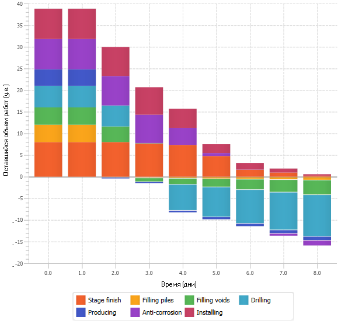

# РУКОВОДСТВО ПРОГРАММИСТА

# ОБЩИЕ СВЕДЕНИЯ

Компонент адаптивной оптимизации выполнения производственных процессов с использованием вероятностных моделей и динамически изменяемой среды библиотеки алгоритмов сильного ИИ (далее компонент) разработан в соответствии с мероприятием М1 "Разработка и испытания экспериментального образца библиотеки алгоритмов сильного ИИ в части оптимизации выполнения производственных процессов на основе интеллектуальных технологий с использованием вероятностных моделей и динамически изменяемой среды" программы ИЦИИ «Сильный ИИ в промышленности» в рамках федерального проекта «Искусственный интеллект».

Компонент предназначен для адаптивной оптимизации выполнения производственных процессов на основе интеллектуальных технологий и мультиагентной имитационной среды в части обеспечения адаптации имитационной среды к различным уровням абстракции и детализации выполнения алгоритмов за счет сочетания когнитивного анализа параметров производственной среды и тенденций в производственных процессах.

Модуль когнитивного моделирования и поиска оптимального изменения параметров модели разработан на языке программирования Python (поддерживаемая версия 3.11) с использованием следующих библиотек:

- numpy;
- itertools;
- keras.models;
- scipy;
- sys;
- json;
- pathlib;
- time;
- copy;
- pandas.

Модуль агентного моделирования разработан на языке программирования С++.

Компонент размещен в репозитории [cogmapoptimizer](../../cogmapoptimizer).

Для использования компонента необходимы:

- интерпретатор языка программирования Python (версия 3.11 и выше);
- среда разработки PyCharm (желательна, не обязательна);
- CUDA SDK;
- среда агентного моделирования FLAME GPU.

# ФУНКЦИОНАЛЬНОЕ НАЗНАЧЕНИЕ

## Назначение программного компонента

Компонент реализует функции сильного ИИ в части алгоритмов адаптивной оптимизации выполнения производственных процессов с использованием вероятностных моделей и динамически изменяемой среды на основе интеллектуальных технологий и мультиагентной имитационной среды в части обеспечения адаптации имитационной среды к различным уровням абстракции и детализации выполнения алгоритмов за счет сочетания когнитивного анализа параметров производственной среды и тенденций в производственных процессах.

Необходимая функциональность реализуется в виде следующих алгоритмов:

- алгоритм поиска оптимального изменения параметров нечеткой вероятностной когнитивной карты (НВКК);
- алгоритм мультиагентного моделирования.

## Область применения

Компонент предназначен для применения в СППР при работе со сложными техническими системами, процесс работы которых может быть описан при помощи НВКК.

## Функциональные условия применения

Функциональные ограничения на применение компонента:

- входные данные - только в формате JSON;
- число вершин графа когнитивной карты - $N ≤ 32$;
- число дуг графа когнитивной карты - $M ≤ 992 (M ≤ N(N-1))$.

Во исходной НВКК обрабатывается только первый сценарий, описанный во
входном файле, общее число сценариев не ограничено (в пределах
ограничений объема файла входных данных).

## Технические условия применения

Для применения компонента должны быть соблюдены следующие условия:

- ОС Ubuntu 18.04 (при применении только когнитивного моделирования - возможно иcпользование ОС Windows 10);
- Python (версия не ниже 3.11);
- PyCharm (желательно, не обязательно);
- FLAME GPU;
- CUDA SDK (версии не ниже 10.0).

Требования к техническим средствам приведены в табл. 1.

Т а б л и ц а  1 - Минимальные требования к техническим средствам

|      Характеристика       |                  Значение                   |
| ------------------------- | ------------------------------------------- |
| Тип компьютера            | рабочая станция                             |
| Кол-во CPU х кол-во ядер  | 1х8                                         |
| Тактовая частота CPU, ГГц | 2,8                                         |
| Кол-во GPU x кол-во ядер  | 1х4352                                      |
| Тактовая частота GPU, ГГц | 1,6                                         |
| Память, Гб                | ОЗУ - не менее 32, видеопамять - не менее 8 |
| Дисковая память, Тб       | не менее 1                                  |

# ОПИСАНИЕ ПРИКЛАДНЫХ ЗАДАЧ

## Классы решаемых задач

Компонент предназначен для решения задачи адаптивной оптимизации выполнения производственных процессов на основе интеллектуальных технологий с использованием когнитивного анализа параметров
производственной среды и тенденций в производственных процессах, поддающихся описанию с помощью НВКК.

Целью адаптивной оптимизации является достижение состояния, в котором весовые коэффициенты целевых вершин когнитивной карты будут находиться в допустимых диапазонах. Под целевыми вершинами когнитивной карты могут подразумеваться различные объекты производственной среды, это зависит от характера решаемой прикладной задачи.

Для обеспечения этого возможны следующие варианты воздействия на систему:

1. изменение системы методом введения дополнительных вершин;
2. изменение системы методом модификации существующих между вершинами связей;
3. гибридные варианты, объединяющие в себе два предыдущих варианта.

Первые два варианта воздействия не столь эффективны как третий и подходят для проверки работы компонента (см. раздел 6). Третий (гибридный) вариант дает больше степеней свободы манипулировании когнитивной картой. Поэтому в качестве решения прикладной задачи будет рассматриваться именно он.

## Пример решения практической задачи в области строительства

### Начальные данные

#### Легенда

Необходима постройка некоего объекта (на примере строительства объекта типа "Общежитие"). Имеется проект указанного строительного объекта, составной частью которого является план-график строительных работ - список работ по видам, с указанием их длительности и последовательности выполнения.

В процессе строительства могут возникать различные задержки связанные с массой различных факторов:

- внутренние (например, квалификация наемных работников, профессионализм руководства, пунктуальность поставщиков и т.п.);
- внешние (например, погодные условия в виде осадков или температуры окружающей среды).

Указанные факторы могут в значительной степени влиять на процесс строительства. В частности, непрофессионализм привлеченного персонала (как рабочих, так и руководства) может привести к сдвигу сроков каждого из этапов строительно-монтажных работ "вправо" и к срыву общих сроков строительства. Аналогичным образом на выдерживание сроков строительства влияют и внешние факторы. Например, при строительстве в условиях Крайнего Севера на работы по бурению, забиванию свай, копке котлованов очень сильно зависят от температуры грунта - такие работы невозможно проводить в зимний период без дополнительных трудозатрат (прогрев грунта, строительство временных укрытий, взрывные работы и т.п.).

Задача: с помощью воздействия на имеющиеся концепты, описывающие факторы, влияющие на процесс строительства, и связи между ними, добиться получения план-графика строительно-монтажных работ, соответствующего начальным ожиданиям заказчика (то есть - изначальному проекту) или же превосходящих его.

#### Начальные когнитивные карты

В силу того, что когнитивная карта, которая могла бы описать полный процесс строительства (включающий в себя десятки работ и не меньшее количество внешних и внутренних факторов даже для такого простого объекта строительства как "Общежитие"), получается чрезмерно сложной. В качестве выхода можно использовать принцип декомпозиции: когнитивное моделирование может быть разделено на несколько этапов. В качестве примера будут рассмотрены две когнитивные карты:

- Пример 1 - Общие работы, разбитые на большие этапы (подготовка фундамента, установка [блок-боксов](http://azm.kz/solutions/block-boxes/), обустройство дополнительных конструкций, внутренняя и внешняя отделка, проводка инженерных коммуникаций).
- Пример 2 - Частные работы, разбитые на этапы более подробно. В качестве примера частной работы рассматривается этап обустройства свайного фундамента (бурильные работы, производство подготовка и установка свай, а так же их дальнейшая подготовка к эксплуатации в качестве основания для возводимого строения).

На когнитивной карте общих работ (рис. 1) приняты следующие обозначения:

Этапы строительства:

- Base - обустройство фундамента;
- Block-boxes - установка блок-боксов;
- Add. constructions - обустройство дополнительных конструкций;
- Exterior finishing - внешняя отделка;
- Interior decoration - внутренняя отделка;
- Arrangement of utilities - проводка инженерных коммуникаций.

Внутренние факторы:

- Suppliers - поставщики строительных материалов;
- Management - руководство стройки.
  
Внешние факторы:

- Temperature - температурный режим;
- Precipitation - осадки.

Специальные вершины когнитивной карты:

- Project start - начало строительно-монтажных работ;
- Project finish - окончание проекта.


Рисунок 1

Аналогичные обозначения приняты и для когнитивной карты, описывающей этап обустройства фундамента (рис. 2):

Этапы строительства:

- Producing - производство свай;
- Anti-corrosion - антикоррозионная защита боковой поверхности металлических свай;
- Drilling - бурение лидерных скважин;
- Installing - установка (погружение) свай;
- Filling voids - заполнение пазух лидерных скважин;
- Filling piles - заполнение внутренней полости свай.

Внутренние факторы:

- Drill workers - рабочие-бурильщики;
- Other employees - прочие работники.


Рисунок 2

### Когнитивное моделирование

#### Нечеткие вероятностные когнитивные карты

Нечеткие вероятностные когнитивные карты представляют собой разновидность когнитивных карт, в которых значения весовых коэффициентов для вершин и ребер предлагается выражать в виде дискретных случайных величин. Такой подход предназначен для реализации механизмов работы с параметрами когнитивной модели, которые задаются набором мнений экспертов, который, в свою очередь, выражается в виде массива числовых значений (весов) и частот (вероятностей) появления этих значений.

Для модификации нечетких когнитивных карт с целью осуществления работы с дискретными случайными величинами, вводятся следующие изменения в их математический аппарат:

1. Нечеткие величины весовых коэффициентов ребер орграфа когнитивной карты, нормированные на интервал $[-1;+1]$, заменяются случайными дискретными величинами с заданными характеристическими распределениями;
2. Весовые коэффициенты концептов когнитивной карты (вершины графа) – заменяются аналогичным образом;
3. Допускается (в случае необходимости) использование произвольных шкал посредством нормирования не на интервал $[-1;+1]$, а на интервал $[-X;+X]$ (где $X$ – условно произвольная величина, определяемая предметной областью, в которой используются рассматриваемые алгоритмы ИИ).

Структура данных для хранения значений дискретных случайных величин предлагается простой: дискретные случайные величины описывается в виде списка известной длины, каждый элемент которого представляет собой пару «значение - вероятность». «Значение» является в общем случае вещественным числом (в частных случаях, при необходимости, может быть представлено в виде целочисленного значения). «Вероятность» является положительным вещественным числом таким, что сумма всех «вероятностей» в списке строго равна 1 (с поправкой на доступную точность хранения чисел на используемой вычислительной системе).

#### Общие принципы моделирования

В обоих приведенных примерах моделирование сводится к тому, что в начальном узле (Project start) задается начальный вес (соответствующий начальному объему работ) и начальное воздействие (соответствующее условной скорости выполнения этих работ). Далее, в процессе моделирования, на каждом шаге воздействие распространяется по карте, затрагивая все ее вершины, которые соответствуют тем или иным видам строительно-монтажных работ. Эти вершины так же имеют свои весовые коэффициенты - эквиваленты объемов требуемых трудозатрат.

Помимо основного воздействия на когнитивную карту со стороны начальной вершины, на карту оказывают влияние вершины, ассоциированные с внешними и внутренними факторами - какие-то из них оказывают положительное влияние (например, влияние руководства на часть работников, если они находятся, предположим, в дружеских или родственных отношениях), какие-то - отрицательное (например, низкие температуры снижают темпы работ по бурению скважин для свайного фундамента).

Моделирование считается завершенным, если объем работ, которые осталось выполнить в вершин Project finish (окончание строительного проекта) снижается до нуля.

### Решения, полученные человеком

Итогами создания модели, описывающей техпроцессы строительства, и проведения когнитивного моделирования являются так называемые "диаграммы сгорания задач" (burndown charts). На рисунке 3 приведён результат когнитивного моделирования в виде диаграммы сгорания задач для план-графика общих работ (Пример 1). На рисунке 4 приведены результат когнитивного моделирования в виде диаграммы сгорания задач для план-графика частного этапа работ (обустройство фундамента, пример 2). Для примера 1 по оси абсцисс расположено время строительства, выраженное в неделях, для примера 2 - в днях. Ось ординат в обоих примерах отображает объем оставшихся работ в условных единицах.


Рисунок 3



Рисунок 4

Как видно из представленных графиков, длительность работ и по общему план-графику работ, представленному на рис. 5, и по план-графику частного этапа, представленному на рис. 6, совпадают с запланированными в соответствии с проектом строительства. Это подтверждает верность подбора весовых коэффициентов как для вершин, так и для ребер, а так же (в целом) адекватность предложенной модели.


Рисунок 5


Рисунок 6

### Решения, полученные ИИ

Целевыми вершинами графов когнитивной карты выбираются вершины, ассоциированные с окончанием работ (Project finish для первого примера и Stage finish - для второго). Цель обработки созданных когнитивных карт - выбор способа (или способов) минимизации времени достижения минимального значения весов указанных вершин, что будет соответствовать завершению работ.

Вершины когнитивных карт, которые описывают внутренние факторы, описываются как множество входных, управляющих воздействий. А вершины, описывающие внешние факторы - множество наблюдаемых, но неуправляемых возмущающих воздействий среды.

Подробное описание дано в документе [Описание программы](program-description.md) "3. Описание логической структуры", подраздел "3.2 Алгоритмы компонента" (алгоритм "Поиск оптимального изменения параметров когнитивной карты"). 

В итоге проведения когнитивного моделирования были получены следующие результаты.

*Примечание* На полученных когнитивных картах отображены веса вершин и ребер, отличные от изначальных. Это объясняется тем, что рекомендации, получаемые на основе нечетких вероятностных когнитивных карт не должны быть вероятностными (как бы это парадоксально не звучало). Рекомендация, выдаваемая экспертно-советующей системой на должна выглядеть как совет "Для достижения результата, с вероятностью N произведите действие A, а с вероятностью 1-N - не производите его". Поэтому, в качестве рекомендаций берется средневзвешенное значение дискретных случайных величин: оно так или иначе учитывает мнение всех экспертов, привлеченных к созданию модели, и при этом не огрубляет итоговые результаты моделирования, являясь максимально приближенными к реальности. 

#### Пример 1 (план-график общих работ)

Для примера 1 (план-график общих работ) был сгенерирован набор предлагаемых решений, наиболее эффективным из которых были признан следующий (см. рис. 7).


Рисунок 7

На полученной когнитивной карте алгоритм предложил удалить ребро графа между вершинами F и E. *Интерпретация: в изначальной модели предполагалась обратная связь, показывавшая, что работы по прокладке инженерных коммуникаций внутри строения замедляют производство внутренней отделки: обычная история на стройке, когда после прокладки коммуникаций приходится переделывать поврежденную отделку. Фактически, алгоритм предложил избавиться от этого фактора, то есть производить монтаж коммуникаций максимально аккуратно.*

Так же в полученной когнитивной карте изменены (уменьшены на 15-17%) веса ребер между вершинами E-F и F-Finish. *Интерпретация: после того, как негативное влияние от процесса прокладки инженерных коммуникаций устранено, потребуется меньше трудозатрат на производство внутренней отделки, что в свою очередь снизит затраты на достижение цели - окончания строительно-монтажных работ.*

Дополнительно изменяется (увеличивается на 25%) вес ребра D-Finish. *Интерпретация: Снижение трудозатрат на прокладке инженерных коммуникаций и внутренней отделке позволяет высвободить людские ресурсы и направить их на другой фронт работ - внешнюю отделку строящегося здания*.

#### Оценка полученного ИИ решения для примера 1

В результате когнитивного моделирования получена аналогичная человеческому решению диаграмма сгорания задач (рис. 8), однако с существенным сокращением сроков проведения работ (в 2,3 раза).


Рисунок 8

#### Пример 2 (план-график частного этапа работ)

Для примера 2 (план-график частного этапа работ) так же был сгенерирован набор решений, максимально эффективный из которых приведен на рис. 9.


Рисунок 9

На полученной когнитивной карте алгоритм предложил внести три существенных изменения.

Во-первых, предлагается ввести дополнительное ребро - от вершины Finish в вершине 5. *Интерпретация: с учетом негативного влияния этапа 5 (заполнение пазух лидерных скважин) на этап 6 (заполнение внутренней полости свай), что выражается в задержках тогда, когда работа выполнена с ненадлежащим качеством и свая не фиксируется в скважине, что мешает заполнению ее бетоном из-за необходимости доделки или переделки работы, предположим, вводится дополнительный контроль качества работ на этапе 5.*

Во-вторых, с учетом только что сказанного, коренным образом меняется вес ребра 5-6 - с отрицательного на положительный. _Интерпретация: при существенном повышении качества работ на этапе 5, это начинает помогать, а не мешать работам на этапе 6._

В-третьих, изменяются пропорции весовых коэффициентов на ребрах 6-Finish и 5-Finish. _Интерпретация: с учетом того, что работы на этапе 5 начинают производиться более качественно и эффективно, это дает возможность перебросить часть людских ресурсов на более трудоемкий участок работ - на этап 6 (бетонирование свай)._

#### Оценка полученного ИИ решения для примера 2

Когнитивное моделирование дает результаты, подтверждаемые диаграммой сгорания задач (рис. 10). В данном случае получено сокращение сроков проведения работ - примерно на 25%.


Рисунок 10

### Сравнение решений

Сравнивая решения, предложенные человеком и ИИ (рис. 3, 4, 8, 10), можно убедиться в том, что решение ИИ более эффективно - достигается существенное сокращение сроков проведение строительно-монтажных работ, причем как большом, так и в малом масштабе.

### Экспериментальные исследования

С целью проведения экспериментальных исследований разработанных алгоритмов и проверки их программной реализации были разработаны контрольные примеры:

- оптимизация [общего плана-графика стротельства](../examples/Example2/data/Example2-GeneralPlan_rnd.zip),
- оптимизация [частного плана-графика строительного этапа](../examples/Example2/data/Example2-ParticularPlan_rnd.zip).

Сравнивая [решения, предложенные человеком и ИИ для контрольных примеров](../examples/Example2/data/ControlExampleResults.zip), можно убедиться в том, что решение ИИ более эффективно.

# ХАРАКТЕРИСТИКИ ПРОГРАММЫ

## Режимы работы ключевых алгоритмов

Особые режимы работы алгоритмов не предусмотрены.

В качестве варьируемых параметров алгоритмов могут использоваться: количество отслеживаемых вершины, масштаб когнитивной карты (число
вершин и ребер графа), количество простых структуры, количество шагов моделирования и др.

Влияние параметров на работу алгоритма описано в табл. 2.

Т а б л и ц а  2 - Влияние параметров на работу алгоритма

  |                                 Параметр                                 |                    Зависимость времени от параметра                     | Влияние на общее время обработки |
  | ------------------------------------------------------------------------ | ----------------------------------------------------------------------- | -------------------------------- |
  | Количество шагов моделирования                                           | Линейная в части непосредственно импульсного моделирования.             | Значительное                     |
  | Количество вершин когнитивной карты + количество ребер когнитивной карты | Линейная в части определения структурной устойчивости когнитивной карты | Значительное                     |
  | Количество простых структур                                              | Линейная, при одинаковой сложности структур                             | Среднее                          |
  | Количество отслеживаемых вершин                                          | Линейная в части поиска проблемных вершин.                              | Незначительное                   |
  | Количество проблемных вершин (из отслеживаемых)                          | Линейная в части обработки простых структур.                            | Среднее                          |

## Порядок оценки качества алгоритмов 

Процедура априорной оценки качества работы алгоритмов сильного ИИ выполняется следующим образом:

1. создается оценочная группа для проведения априорной оценки качества работы алгоритмов сильного ИИ, состоящая из разработчиков алгоритмов и сторонних оценщиков;
2. проводится проверка алгоритмов на предмет обнаружения логических ошибок, несоответствий с декларируемым математическим базисом алгоритмов, неоднозначностей в описании алгоритмов и т. п. Оценка проводится по шкале от 1 («множественные ошибки/несоответствия») до 5 («ошибок/несоответствий нет»), допустимым значением является отметка «5». Результат проверки по данному пункту - подтверждение (или опровержение) работоспособности алгоритмов в принципе;
3. проводится теоретическая огрубленная проверка математического аппарата алгоритмов с целью определения уровня устойчивости алгоритмов. Оценка проводится по шкале от 1 до 5, допустимым значением являются отметки «4» («незначительная зависимость от изменений входных данных») и «5» («отсутствие зависимости от изменений входных данных»). Результат проверки по данному пункту - предварительная оценка устойчивости оцениваемых алгоритмов;
4. проводится теоретический огрубленный анализ математического аппарата алгоритмов с целью определения вычислительной сложности и, соответственно, скорость работы алгоритмов. Оценка проводится по шкале от 1 («очень высокая сложность») до 5 («очень низкая сложность»), допустимых значений нет, однако, более желательны отметки максимально приближенные к отметке «5». Результат проверки по данному пункту - предварительная оценка скорости работы оцениваемых алгоритмов;
5. проводится теоретическая огрубленная проверка алгоритмов, моделирующая их работу на заранее созданном контрольном примере, в результате которой полученный результат сравнивается с результатом, ожидаемым в контрольном примере. Оценка проводится по шкале от 1 до 5, допустимым значением являются отметки «3» (результат незначительно уступает результату контрольного примера), «4» (результат соответствует результату контрольного примера) или «5» (результат превосходит результат контрольного примера). Результат проверки по данному пункту - предварительная оценка качества получаемого при помощи алгоритмов решения;
6. проводится расчет интегральной оценки алгоритмов по формуле $P =∑ ((∑P_{ij}) × w_i)$, где $P_{ij}$ - оценка $i$-го члена оценочной группы по $j$‑ой оцениваемой характеристике алгоритмов из пп. 2-5, $w_i$ - весовой коэффициент оценки $i$‑го члена оценочной группы из диапазона ${0<{w_i}≤1}$ (коэффициенты подбираются таким образом, чтобы общий эффект от их применения делал суммарное мнение разработчиков и сторонних оценщиков равнозначным независимо от числа оценщиков в каждой из этих групп, что позволит нивелировать эффект личных и/или групповых симпатий/антипатий, т. е. $∑w_{разработчиков} = ∑w_{оценщиков} = 0,5$. При этом внутри группы коэффициенты не обязательно должны быть равными - они могут разниться, например, в зависимости от вклада разработчика в процесс разработки алгоритмов или же квалификации стороннего оценщика); интегральная оценка может лежать в диапазоне 4-20 баллов, допустимым значением является интегральная оценка ≥13 баллов (с учетом допустимых минимумов по каждому из пунктов оценки).

В случае если хотя бы по одной из оценочных характеристик (пп. 2-5) получается неудовлетворительная оценка, интегральная оценка (п. 6) не рассчитывается и принимается равной 0, то есть величине, заведомо меньшей, чем заявленный допустимый диапазон от 4 до 20 баллов. В этом случае алгоритмы должны быть отправлены на доработку/переработку с целью исправления обнаруженных ошибок, неточностей и упущений.

Процедура проведения апостериорной оценки качества работы алгоритмов сильного ИИ выполняется следующим образом:

1. создается оценочная группа для проведения апостериорной оценки качества работы алгоритмов, состоящая из сторонних оценщиков, при
участии разработчиков алгоритмов, выступающих в роли консультантов, обеспечивающих процесс;
2. проводится практическая проверка алгоритмов с целью определения уровня устойчивости алгоритмов; оценка проводится по шкале от 1 до 5,
допустимым значением являются отметки «4» («незначительная зависимость от изменений входных данных») и «5» («отсутствие зависимости от
изменений входных данных»). Результат проверки по данному пункту - практическая оценка устойчивости оцениваемых алгоритмов;
3. проводится практическая оценка скорости работы алгоритмов. Оценка проводится по шкале от 1 до 5, допустимых значений нет, однако, более
желательны отметки максимально приближенные к отметке «5» (чем выше скорость выработки решения - тем лучше). Результат проверки по данному
пункту - практическая оценка скорости работы оцениваемых алгоритмов;
4. проводится практическая проверка алгоритмов, в результате которой полученные результаты сравнивается с результатами, ожидаемыми в
контрольном примере (примерах). Оценка проводится по шкале от 1 до 5, допустимым значением являются отметки «3» («результат незначительно
уступает результату контрольного примера»), «4» («результат соответствует результату контрольного примера») или «5» («результат
превосходит результат контрольного примера»). Результат проверки по данному пункту - практическая оценка качества получаемого при помощи
алгоритмов решения;
5. проводится расчет агрегированной оценки алгоритмов по формуле $P = ∑P_i$, где $P_i$ - оценка алгоритмов по $i$‑ой оцениваемой характеристике алгоритмов из пп. 2-4. Интегральная оценка может лежать в диапазоне 3-15 баллов, допустимым значением является интегральная оценка ≥8 баллов (с учетом допустимых минимумов по каждому из пунктов оценки).

Для каждого из пунктов оценки (пп. 2-4) процедуры апостериорной оценки работы алгоритмов сильного ИИ допускается как единичные испытания, так и серии испытаний. В последнем случае для каждой из оцениваемых характеристик работы алгоритмов проводится $N$ испытаний ($N≥2$), после чего за оценку по рассматриваемой характеристике принимается среднее арифметическое полученных по всем испытаниям серии значений. В случае необходимости дополнительно проводится вычисление статистических величин, характеризующих серию испытаний (математическое ожидание, дисперсия, среднеквадратичное отклонение, размах и т. п.).

Для автоматизации проверки работы алгоритма было разработано приложение на основе компонента библиотеки сильного ИИ (находится в репозитории проекта: `cogmap/main.py`). На вход этого приложения подается когнитивная карта и файл групп вершин (согласно подраздела 7.1 «Входные данные»). Команда для выполнения:

`main.py <input.cmj> <input.xyz_cmj> <N>,`

где `<input.cmj>` - входной файл когнитивной карты, `<input.xyz_cmj>` - входной файл групп вершин `<N>` - число шагов когнитивного
моделирования.

После выполнения программы результирующие файлы когнитивных карт помещаются в директорию с входной когнитивной картой в поддиректории с
именем `«added_%d»`, где `%d` - число добавленных в исходную когнитивную карту вершин. Файлы именуются на основе названия исходного файла
когнитивной карты: `базовая_часть_имени>.out%d.cmj`, где `%d` - порядковый номер решения согласно качеству решения (в соответствии с п.
12 алгоритма, см. подраздел 3.2 документа [«Описание программы»](program-description.md)).

Для проверки результатов, полученных на этапе когнитивного моделирования, запускается модуль агентного моделирования с полученными
файлами в качестве входных данных. Запуск выполняется следующим образом:

`./complete.sh <директория_с_результатами> <путь_к_файлу_групп_вершин> <директория_с_отчетов_по_агентному_моделированию> <директория_с_итерациями>`

Соответствующий скрипт автоматизации расположен в репозитории [cognitive/complete.sh](../cognitive/complete.sh).

Результаты агентного моделирования представляются согласно подразделу 7.2 «Выходные данные».

Для N шагов моделирования, для каждой из наблюдаемых вершин (попавших изначально в проблемные), если среди итераций на которых значение попадает в допустимый диапазон есть N+1, это означает, что когнитивная карта корректно модифицирована и воздействия подобраны правильно.

# ОБРАЩЕНИЕ К ПРОГРАММЕ

## Точки входа в программу

Ниже приведено описание ключевых классов компонента.

**Класс CogMap** - описывает когнитивную карту.

Функции:

`__init__(self, vertices=[], edges=[])` - конструктор. Аргументы:

- `vertices` - массив вершин;
- `edged` - массив ребер.

`is_stable(self)` - возвращает `True`, если когнитивная карта стабильна (объединяет проверку структурной устойчивости и устойчивости к возмущениям).

`fill_from_json(self, data, data_xyz)` - заполняет данные когнитивной карты из данных в формате JSON. Аргументы:

- `data` - описание когнитивной карты;
- `data_xyz` - описание групп вершин когнитивной карты.

`vertex_idx_by_id(self, id)` - возвращает индекс вершины по ее идентификатору `id`.

`rebuild_indexes(self)` - перестраивает таблицы индексов вершины и ребер когнитивной карты.

`rebuild_matrix(self)` - перестраивает матрицу смежности согласно массивам вершин и ребер.

`add_vertex(self, v)` - добавляет вершину `v`.

`add_edge(self, e)` - добавляет ребро `e`.

`rem_vertex(self, id)` - удаляет вершину c идентификатором `id`.

`rem_edge(self, id)` - удаляет ребро с идентификатором `id`.

`rem_edge_by_vertices(self, v1_id, v2_id)` - удаляет ребро. Аргументы:

- `v1_id` - идентификатор вершины 1;
- `v2_id` - идентификатор вершины 2.

`pulse_calc(self, qq, vvq, st, log_values: bool = False)` - анализ тенденций развития ситуаций на когнитивной модели - импульсное
моделирование. Аргументы:

- `qq` - величины импульсов;
- `vvq` - индексы вершин импульсов;
- `st` - число шагов моделирования;
- `log_values` - если `True`, то при импульсном моделировании будет формироваться лог со значениями вершин на каждом шаге.

`eig_vals_calc(self, ar)` - определения устойчивости системы к возмущениям. Аргумент - матрица смежности `ar`.

`def simplex_calc(self, v), def cycles_calc(self, ar)` - определения структурной устойчивости. Аргумент - матрица смежности `ar`.

`syl(self, ar, vc)` - расчет симплекса для одной вершины. Аргументы:

- `ar` - матрица смежности;
- `vc` - индекс вершины.

`sy(self, ar)` - выдает симплициальные комплексы соответствующего порядка и q‑связность между ними, размерность q-связности - это количество вершин с которыми она связана минус 1 т.к. наличие всего одной связи говорит о нулевом порядке связности.

`get_composition(self, s1, vk, vs, use)` - определение композиции выбранной простой структуры; возвращает экземпляр `CogMap` с обновленными списками вершин и ребер. Аргументы:

- `s1` - матрица кусочка который мы добавляем в систему, отрезок, треугольник, квадрат, часы и т.п.;
- `vk` - это список вершин исходной матрицы `k1` на которые присоединяется дополнение;
- `vs` - это список вершин исходной матрицы кусочка `s1` которые используются для присоединения;
- `use` - флаг метода дополнения исходной матрицы, 0 или 1 - регулирует поведение объединения ребер при их наличии.

`comboV(self, k1, s1, vk, vs, use)` - определение композиции выбранной простой структуры, возвращает матрицу смежности. Аргументы:

- `k1` - это исходная матрица графа, текущее состояние системы;
- `s1` - матрица кусочка который мы добавляем в систему, отрезок, треугольник, квадрат, часы и т.п.;
- `vk` - это список вершин исходной матрицы `k1` на которые присоединяется дополнение;
- `vs` - это список вершин исходной матрицы кусочка `s1` которые для присоединения;
- `use` - флаг метода дополнения исходной матрицы, 0 или 1 - регулирует поведение объединения ребер при их наличии.

`pulse_model(self, N, impulses=None, log_values: bool = False)` - анализ тенденций развития ситуаций на когнитивной модели - импульсное моделирование, возвращает значения вершин. Аргументы:

- `N` - число шагов моделирования;
- `impulses` - импульсы (если не указаны - заполняются исходя из данных когнитивной карты, полученных их файла при загрузке);
- `log_values` - если `True`, то при импульсном моделировании будет формироваться лог со значениями вершин на каждом шаге;

`get_compositions(self, s, vertex: Vertex)` - возвращает список всех композиций заданной вершины и ее окружения с простой структурой. Аргументы:

- `vertex` - исходная вершина;
- `s` - матрица смежности простой структуры.

**Класс Optimizer** - оптимизатор.

Функции:

`get_simple_structs(self)` - возвращает список доступных простых структур.

`find_impact(self, cogmap: cm.CogMap, V: list[cm.Vertex], N: int, impactgen: ig.ImpactGenerator, initial_impulses: list[float]=None, log_values: bool = False)` - подбирает воздействие для исправления состояния. Аргументы:

- `cogmap` - когнитивная карта;
- `V` - список вершин для воздействия;
- `N` - число шагов импульсного моделирования;
- `impactgen` - генератор воздействий;
- `initial_impulses` - начальные воздействия (для поиска);
- `log_values` - если `True`, то при импульсном моделировании будет формироваться лог со значениями вершин на каждом шаге.

`mix_solutions(self, base_cogmap: cm.CogMap, solutions: list[SolutionData])` - формирует композицию решений. Аргументы:

- `base_cogmap` - базовая когнитивная карта,
- `solutions` - список решений.

`build_compositions(self, base_cogmap: cm.CogMap, partial_solutions: list[SolutionData]) - формирует список композиций решений. Аргументы:

- `base_cogmap` - базовая когнитивная карта;
- `partial_solutions` - список частных решений.

`process_simple_structs(self, cogmap: cm.CogMap, s, vertex: cm.Vertex, N: int, impactgen: ig.ImpactGenerator, old_v_bad, old_max_y_er)` - формирует решения на основе композиций с заданной простой структурой. Аргументы:

- `cogmap` - когнитивная карта;
- `s` - простая структура;
- `vertex` - целевая вершина;
- `N` - число шагов импульсного моделирования;
- `impactgen` - генератор воздействий;
- `old_v_bad` - начальный список "плохих" вершин;
- `old_max_y_er` - начальной значение отклонения "плохих" вершин.

`find_optimal_changes(self, base_cogmap: cm.CogMap, N: int, simple_structs: list[list[float]], impactgen: ig.ImpactGenerator)` - ищет оптимальное изменение когнитивной карты для приведения значений целевых вершин в заданные пределы. Аргументы:

- `base_cogmap` - базовая когнитивная карта;
- `N` - число шагов импульсного моделирования;
- `simple_structs` - список простых структур.

**Класс ImpactGenerator** - генератор воздействий.

Функции:

`add_impact(self, impact: ImpactData`) - добавляет воздействие в ретроспективу воздействий. Аргумент - данные о воздействии `impact`.

`get_impact(self, cogmap, V: list[cm.Vertex])` - возвращает воздействие для заданной когнитивной карты и вершин. Аргументы:

- `cogmap` - когнитивная карта;
- `V` - список вершин.

**Класс Report** - генератор отчетов.

Функции:

`__init__(self, data)` - конструктор. Аргументы -  данные для отчета `data`.

`build_report(self)` - формирует отчет в формате JSON.

`save_to_file(self, filename)` - записывает отчет в файл `filename`.

**Класс ProbVal** – класс описания элемента (единичного значения) дискретной случайной величины (ДСВ)

Функции:

`__init__(self, val=0.0, prob=0.0)` - конструктор. Аргументы:

- `val` - значение;
- `prob` - вероятность.

**Класс ProbA** - класс для работы с вероятностной арифметикой.

Функции:

`__init__(self)` - конструктор, задает значения `COMPARE_RANGE`, `MAX_ELEMENTS` и `BUILD_SCALAR`.

`__str__(self)` - возвращает строковое представление ДСВ.

`append_value(self, value=0.0, prob=0.0)` - добавляет элемент ДСВ.

`build_scalar()` - возвращает скалярную величину, полученную из ДСВ (основываясь на значении `BUILD_SCALAR`).

`max_prob()` - возвращает значение ДСВ с максимальной вероятностью.

`min_prob()` - возвращает значение ДСВ с минимальной вероятностью.

`max2_prob()` - возвращает второе по величине значение ДСВ с максимальной вероятностью.

`min2_prob()` - возвращает второе по величине значение ДСВ с минимальной вероятностью.

`check_probs(self)` - проверяет элементов ДСВ на корректность (возвращает 0 в случае корректного описания, т.е. сумма вероятностей равна 1, возвращает отрицательное значение, равное разности суммы вероятностей и 1, если сумма вероятностей меньше 1, возвращает положительное значение, равное разности суммы вероятностей и 1, если сумма вероятностей больше 1),

`reduce(self, newSize = -1)` - уменьшает число элементов ДСВ до `newSize` (если число элементов не задано в его качестве используется значение MAX_ELEMENTS).

`__add__(self, rnd)` - возвращает сумму двух ДСВ.

`__sub__(self, rnd)` - возвращает разность двух ДСВ.

`__mul__(self, rnd)` - возвращает произведение двух ДСВ.

`__truediv__(self, rnd)` - возвращает частное двух ДСВ.

`__gt__(self, max)` - возвращает результат сравнения ДСВ с числом («больше»), если сумма вероятностей элементов, которые больше, чем число, превышает значение `COMPARE_RANGE` - возвращает `True`, иначе - `False`.

`__ge__(self, max)` - возвращает результат сравнения ДСВ с числом («больше или равно»), аналогично `__gt__`.

`__lt__(self, min)` - возвращает результат сравнения ДСВ с числом («меньше»), аналогично `__gt__`.

`__le__(self, min)` - возвращает результат сравнения ДСВ с числом («меньше или равно»), аналогично `__gt__`.

`__ne__(self, val)` - возвращает результат сравнения ДСВ («не равно») (если ведется сравнение с типом `float`, то возвращает `True` при
неравенстве числа со средневзвешенным значением ДСВ и `False` - в противном случае. Если ведется сравнение с другим ДСВ - возвращает `True`
при несовпадении хотя бы одного значения элементов ДСВ или их количества и `False` - в противном случае. В остальных случаях - возвращает `None`),

`abs(self)` - модуль ДСВ (возвращает ДСВ, значения элементов которого взяты по модулю).

`avg(self)` - возвращает средневзвешенное значение ДСВ (пропорционально вероятностям значений элементов ДСВ).

`max(self, rnd_arr)` - из списка ДСВ возвращает то, которое имеет максимальное по результатам применения сравнения «больше» (`__gt__`).

`min(self, rnd_arr)` - из списка ДСВ возвращает то, которое имеет максимальное по результатам применения сравнения «меньше» (`__lt__`).

`COMPARE_RANGE` - диапазон сравнения ДСВ для операций сравнения.

`MAX_ELEMENTS` - максимальное число элементов в описании ДСВ для операций над ДСВ.

Пример использования указанных классов находится в репозитории проекта [cogmap/main.py](../cogmap).

## Базовые функции 

Загрузка когнитивной карты:

```python
with open(cogmap_json_path, "r") as config_file: 
    cogmap_json = config_file.read()
with open(cogmap_xyz_json_path, "r") as config_xyz_file:
     cogmap_xyz_json = config_xyz_file.read()
base _cogmap = cm.CogMap()
base_cogmap.fill_from_json(cogmap_json, cogmap_xyz_json)
```
Вызов функции поиска оптимальных изменений когнитивной карты:

```python
optimizer = Optimizer()
res, data = optimizer.find_optimal_changes(base_cogmap, N, simple_structs, impactgen)
```

где `base_cogmap` - базовая когнитивная карта,
 
`N` - число шагов импульсного моделирования,

`simple_structs` - список простых структур (массив матриц смежности),

`impactgen` - экземпляр ImpactGenerator.

Вызов функции генерации отчетов:

```python
if res == -1:
    print("Problems not found")
    exit(0)
if res == 0:
    print("Solutions not found")
    exit(0)
i = 0
print("Built %d composition(s)" % len(data))
print("Building reports...")
for d in data:
    r = report.Report(d)
    result_filename = cogmap_json_path + ".out%d.cmj"%i
    i = i + 1
    r.save_to_file(result_filename)
```
Если необходимо разделить задачу поиска оптимального решения на несколько процессов (с целью распараллеливания процесса решения задачи),
то для этого можно использовать разные поднаборы простых структур для разных экземпляров: 

```python
cogmap_json_path = sys.argv[1]
cogmap_xyz_json_path = sys.argv[2]
N = int(sys.argv[3])
instance_no = int(sys.argv[4]) # номер экземпляра 0...x
instance_count = int(sys.argv[5]) # число экземпляров
optimizer = Optimizer()
simple_structs = optimizer.get_simple_structs()
impactgen = ig.ImpactGenerator()
res, data = optimizer.find_optimal_changes(base_cogmap, N,
simple_structs[instance_no::instance_count], impactgen)
```
Генерация исходного кода модели:

`./cognitive --project test.cmj group.cmj_xyz`

Генерация нулевой итерации модели:

`./cognitive --generate test.cmj group.cmj_xyz`

Сборка модели в среде FLAME GPU:

`./cognitive --make test.cmj group.cmj_xyz`

Запуск модели в среде FLAME GPU:

`./cognitive --run test.cmj group.cmj_xyz`

Анализ полученных итерационных данных:

`./cognitive --analize test.cmj group.cmj_xyz`

Если необходимо разделить задачу поиска оптимального решения на несколько процессов, то для этого можно использовать следующий скрипт,
позволяющий проводить параллельную обработку данных, полученных в результате работы модуля когнитивного моделирования:

```bash
#!/bin/bash
for dir in `find $1 -type d `
do
  if [[ $dir != \$1 ]]
  then
    ls $dir | while read name ;
    do
      ./cognitive --project "$dir"/"$name" $2
      ./cognitive --generate "$dir"/"$name" $2
      ./cognitive --make "$dir"/"$name" $2
      ./cognitive --run "$dir"/"$name" $2
      ./cognitive --analize "$dir"/"$name" $2
      cp -a $4"result.txt" $3"$name""result.txt"
    done
  fi
done
```

Входные данные скрипта: путь к каталогу с подкататлогами, путь к файлу группы, путь к каталогу с результатом, путь к папке с итерациями моделирования.

# ПРОВЕРКА ПРОГРАММЫ

Для проверки программы используется контрольные примеры, описанные ранее. Суть проверки заключается в видоизменении исходного примера и
дальнейшее сравнение результатов, которые получены человеком с тем, что было получено ИИ при использовании разработанных алгоритмов. Методика
изменения указанных примеров приводится далее (в качестве образца взят контрольный пример №1).

## Модульные и интеграционные тесты

Описания тестов для модуля когнитивного моделирования приведены в табл. 3.

Т а б л и ц а  3 - Описания тестов для модуля когнитивного моделирования.

|                                        Предмет тестирования                                         |                Сценарий                 |                                                                          Результат                                                                           |
| --------------------------------------------------------------------------------------------------- | --------------------------------------- | ------------------------------------------------------------------------------------------------------------------------------------------------------------ |
| Добавление ребра                                                                                    | `TestCogMap::test_add_edge`             | Число вершин и матрица смежности соответствуют предустановленным значениям. Выводимое сообщение «PASSED»                                                     |
| Добавление вершины                                                                                  | `TestCogMap::test_add_vertex`           | Число вершин и матрица смежности соответствуют предустановленным значениям. Выводимое сообщение «PASSED»                                                     |
| Наложение на когнитивную карту простой структуры                                                    | `TestCogMap::test_combo_v`              | Результирующая матрица смежности соответствует предустановленному значению. Выводимое сообщение «PASSED»                                                     |
| Расчет циклов когнитивной карты                                                                     | `TestCogMap::test_cycles_calc`          | Результат соответствует предустановленному значению. Выводимое сообщение «PASSED»                                                                            |
| Расчет собственных чисел матрицы смежности когнитивной карты                                        | `TestCogMap::test_eig_vals_calc`        | Результат соответствует предустановленному значению. Выводимое сообщение «PASSED»                                                                            |
| Формирование композиции когнитивной карты и простой структуры                                       | `TestCogMap::test_get_composition`      | Результирующая матрица смежности соответствует предустановленному значению. Выводимое сообщение «PASSED»                                                     |
| Импульсное моделирование (статическая версия)                                                       | `TestCogMap::test_pulse_calc`           | Значения вершин после моделирования соответствуют предустановленным значениям. Выводимое сообщение «PASSED»                                                  |
| Импульсное моделирование                                                                            | `TestCogMap::test_pulse_model`          | Значения отклонения проблемных вершин и список проблемных вершин после моделирования соответствуют предустановленным значениям. Выводимое сообщение «PASSED» |
| Перестроение матрицы смежности                                                                      | `TestCogMap::test_rebuild_matrix`       | Результирующая матрица смежности соответствует предустановленному значению. Выводимое сообщение «PASSED»                                                     |
| Удаление ребра по идентификатору                                                                    | `TestCogMap::test_rem_edge`             | Число вершин и матрица смежности соответствуют предустановленным значениям. Выводимое сообщение «PASSED»                                                     |
| Удаление ребра по идентификаторам вершин                                                            | `TestCogMap::test_rem_edge_by_vertices` | Число вершин и матрица смежности соответствуют предустановленным значениям. Выводимое сообщение «PASSED»                                                     |
| Удаление вершины                                                                                    | `TestCogMap::test_rem_vertex`           | Число вершин и матрица смежности соответствуют предустановленным значениям. Выводимое сообщение «PASSED»                                                     |
| Расчет симплициального комплекса                                                                    | `TestCogMap::test_simplex_calc`         | Симплициальный комплекс соответствует предустановленному значению. Выводимое сообщение «PASSED»                                                              |
| Расчет симплициального комплекса (статическая версия)                                               | `TestCogMap::test_sy`                   | Симплициальный комплекс соответствует предустановленному значению. Выводимое сообщение «PASSED»                                                              |
| Расчет симплициального комплекса для одной вершины                                                  | `TestCogMap::test_sy1`                  | Симплициальный комплекс соответствует предустановленному значению. Выводимое сообщение «PASSED»                                                              |
| Получение индекса вершины по ее идентификатору                                                      | `TestCogMap::test_vertex_idx_by_id`     | Результат соответствует предустановленному значению. Выводимое сообщение «PASSED»                                                                            |
| ДСВ. Добавление пары «значение-вероятность» в описание величины.                                    | `TestProbA::test_proba_append_value`    | Генерируется ДСВ, запоминаемые значения соответствуют генерируемым. Выводимое сообщение «PASSED»                                                             |
| ДСВ. Проверка корректности суммарной вероятности.                                                   | `TestProbA::test_proba_check_probs`     | Суммарные значения вероятностией значений ДСВ соответствуют ожидаемым. Выводимое сообщение «PASSED»                                                          |
| ДСВ. Проверка редуцирования ДСВ.                                                                    | `TestProbA::test_proba_check_reduce`    | Число элементов в описании ДСВ изменяется ожидаемым образом. Выводимое сообщение «PASSED»                                                                    |
| ДСВ. Проверка операций ДСВ-арифметики.                                                              | `TestProbA::test_proba_check_maths`     | Результаты арифметических операций соответствуют ожидаемым. Выводимое сообщение «PASSED»                                                                     |
| ДСВ. Проверка операций сравнений для ДСВ-переменных.                                                | `TestProbA::test_proba_check_compares`  | Результаты операций сравнение соответствуют ожидаемым. Выводимое сообщение «PASSED»                                                                          |
| ДСВ. Проверка дополнительного функционала для работы с ДСВ-переменными (min, max, среднее и проч.). | `TestProbA::test_proba_check_addons`    | Результаты работы функций для обработки ДВС соответствуют ожидаемым. Выводимое сообщение «PASSED»                                                            |
| ДСВ. Построение скалярной величины из ДСВ.                                                          | `TestProbA::test_proba_build_scalar`    | Результаты построения скалярной величины из ДСВ различными методами соответствуют ожидаемым. Выводимое сообщение «PASSED»                                    |

Описания тестов для модуля агентного моделирования приведены в табл. 4.

Т а б л и ц а  4 - Описания тестов для модуля агентного моделирования.

|                                    Предмет тестирования                                    |                                                     Сценарий                                                      |                                                                         Результат                                                                          |
| ------------------------------------------------------------------------------------------ | ----------------------------------------------------------------------------------------------------------------- | ---------------------------------------------------------------------------------------------------------------------------------------------------------- |
| Глобальный указатель на объект класса Модель                                               | Проверяется корректность выделения памяти для глобального объекта класса работы с генерацией модели               | Глобальный объект существует, указатель на него не нулевой. Выводимое сообщение *«passed, TModel:: getInstance() != NULL»*                                 |
| Число вершин в заранее подготовленном файле входных данных                                 | Проверяется корректность разбора количества вершин во входных данных                                              | Число вершин равно заданному количеству из подготовленного входного файла тестирования. Выводимое сообщение *«passed, unit-test.cmj vertices count == 17»* |
| Число ребер в заранее подготовленном файле входных данных                                  | Проверяется корректность разбора количества ребер во входных данных                                               | Число ребер равно заданному количеству из подготовленного входного файла тестирования. Выводимое сообщение *«passed, unit-test.cmj edges count == 57»*     |
| Идентификатор вершины в заранее подготовленном файле входных данных                        | Проверяется корректность разбора параметров вершин, в данном случае идентификатора вершины                        | Идентификатор соответствует заданному. Выводимое сообщение *«passed, unit-test.cmj vertices[0] id == 1655712545685»*                                       |
| Наименование вершины в заранее подготовленном файле входных данных                         | Проверяется корректность разбора параметров вершин, в данном случае наименования вершины                          | Имя соответствует заданному. Выводимое сообщение *«passed, unit-test.cmj vertices[0] name == K1»*                                                          |
| Значение в вершине в заранее подготовленном файле входных данных                           | Проверяется корректность разбора параметров вершин, в данном случае значения вершины                              | Значение соответствует предустановленному значению. Выводимое сообщение *«passed, unit-test.cmj vertices[0] (value - 1.90) < 0.0000001»*                   |
| Параметр роста в вершине в заранее подготовленном файле входных данных                     | Проверяется корректность разбора параметров вершин, в данном случае параметра роста вершины                       | Значение соответствует предустановленному значению. Выводимое сообщение *«passed, unit-test.cmj vertices[0] (growth - 0.1) < 0.0000001»*                   |
| Параметр идентификатора ребра в заранее подготовленном файле входных данных                | Проверяется корректность разбора параметров ребра, в данном случае параметра идентификатора ребра                 | Значение соответствует предустановленному значению. Выводимое сообщение *«passed, unit-test.cmj edges[0] id == 1655712630647»*                             |
| Параметр идентификатора первой вершины ребра в заранее подготовленном файле входных данных | Проверяется корректность разбора параметров ребра, в данном случае параметра идентификатора первой вершины ребра. | Значение соответствует предустановленному значению. Выводимое сообщение *«passed, unit-test.cmj edges[0] v1 == 1655712545685»*                             |
| Параметр идентификатора второй вершины ребра в заранее подготовленном файле входных данных | Проверяется корректность разбора параметров ребра, в данном случае параметра идентификатора второй вершины ребра. | Значение соответствует предустановленному значению. Выводимое сообщение *«passed, unit-test.cmj edges[0] v2 == 1655712594662»*                             |
| Параметр веса ребра в заранее подготовленном файле входных данных                          | Проверяется корректность разбора параметров ребра, в данном случае параметра веса ребра.                          | Значение соответствует предустановленному значению. Выводимое сообщение *«passed, unit-test.cmj edges[0] (weight - 0.1) < 0.0000001»*                      |

## Контрольные примеры

Проверка программы осуществляется с использованием контрольных примеров, находящихся в репозитории проекта папке `examples`.

Для каждого примера на выходе получается соответствующий набор файлов (отчетов) с вариантами решения поставленной задачи .

Оценка качества решения поставленной задачи зависит от рассматриваемой предметной области (различающейся для каждого из примеров). Конкретные эталонные значения для оценки решения не
устанавливаются, они зависят от мнения эксперта, который привлекается для решения задачи (примера), заключающегося в получении им того или иного решения. Решение эксперта является эталоном, с которым и сравнивается решение, полученное алгоритмом. Для обоих примеров критерием правильности полученных решений и работоспособности программы признается получение показателей в целевых вершинах графа когнитивной карты (интерпретация этих показателей зависит от конкретного примера) не хуже или, по крайней мере, не принципиально хуже, нежели в решении эксперта.

# ВХОДНЫЕ И ВЫХОДНЫЕ ДАННЫЕ

## Входные данные 

Когнитивная карта описывается с помощью файлов `*.cmj` в формате JSON.

Когнитивная карта описывается с помощью файлов `*.cmj` в формате JSON. В когнитивной карте приводится описание массива рёбер (`Edges`) когнитивной карты и массива вершин (`Vertices`) когнитивной карты. Формат описания массива рёбер приведен в табл. 5, формат описания массива вершин - в табл. 6.

Т а б л и ц а  5 - Формат описания массива рёбер (`Edges`) когнитивной карты

|   Свойство   |                         Описание                          |                   Ограничения                    |
| ------------ | --------------------------------------------------------- | ------------------------------------------------ |
| `weight-[i]` | весовой коэффициент, значение, нумерация `i` - с нуля)    | вещественное число                               |
| `prob-[i]`   | весовой коэффициент, вероятность, нумерация `i` - с нуля) | вещественное число, суммарно по всем `i` - 1.000 |
| `id`         | идентификатор ребра                                       | уникальное целое положительное число             |
| `v1, v2`     | вершины, которые соединяет ребро                          | идентификаторы существующих (описанных) вершин   |
| `shortName`  | наименование ребра                                        | строка                                           |

Т а б л и ц а  6 - Формат описания массива вершин (`Vertices`) когнитивной карты

|  Свойство   |                     Описание                     |                   Ограничения                    |
| ----------- | ------------------------------------------------ | ------------------------------------------------ |
| `fullName`  | полное имя вершины                               | строка                                           |
| `value-[i]` | вес вершины, значение, нумерация `i` - с нуля    | вещественное число                               |
| `prob-[i]`  | вес вершины, вероятность, нумерация `i` - с нуля | вещественное число, суммарно по всем `i` - 1.000 |
| `growth`    | начальный импульс вершины)                       | вещественное число                               |

Примеры файлов когнитивных карт находятся в репозитории в папке `examples`

Каждая вершина когнитивной карты относится к одной из групп - $X$, $Y$ или $Z$. Отнесение вершины когнитивной карты к соответствующей группе описывается с помощью файлов групп `*.cmj_xyz` в формате JSON. Описание формата групп (`Groups`) приведено в табл. 7.

Т а б л и ц а  7 - Формат описания групп (`Groups`) когнитивной карты

| Свойство |                 Описание                  |            Ограничения            |
| -------- | ----------------------------------------- | --------------------------------- |
| `id`     | идентификатор вершины                     | идентификатор существующих вершин |
| `type`   | тип группы вершины                        | символ «X», «Y» или «Z»           |
| `min`    | минимальное значение для вершин группы Y  | вещественное число                |
| `max`    | максимальное значение для вершин группы Y | вещественное число                |


Примеры файлов групп вершин находятся в репозитории в папке `examples`.

Входными данными модуля агентного моделирования являются файл когнитивной карты и файл групп, описанные выше, а также файл начальной итерации в xml-формате `0.xml`. Общая структура файла начальной итерации представлена ниже:

```xml
<states>
<itno>0</itno>
<xagent>
    <id>1</id>
    .....
</xagent>
<xagent>
    <id>2</id>
    .....
</xagent>
.....
</states>
```

Файл итерации представляет собой xml-файл, содержащий номер итерации (тег `itno`) и описания состояний агентов (теги `xagent`). Состояние агента описывается с помощью свойств, приведенных в табл. 4.

Входными данными модуля агентного моделирования являются файл когнитивной карты и файл групп, описанные выше, а также файл начальной итерации в xml-формате `0.xml`. Общая структура файла начальной итерации представлена ниже:

```xml
<states>
<itno>0</itno>
<xagent>
    <id>1</id>
    .....
</xagent>
<xagent>
    <id>2</id>
    .....
</xagent>
.....
</states>
```

Файл итерации представляет собой xml-файл, содержащий номер итерации (тег `itno`) и описания состояний агентов (теги `xagent`). Состояние агента описывается с помощью свойств, приведенных в табл. 8.

Т а б л и ц а  8 - Описание свойства агента (`xagent`) в файле начальной итерации модуля агентного моделирования

|  Свойство   |                                   Описание                                   |                                        Ограничения                                        |
| ----------- | ---------------------------------------------------------------------------- | ----------------------------------------------------------------------------------------- |
| `id`        | идентификатор агента                                                         | уникальное целое положительное число и ноль                                               |
| `token`     | уникальное имя вершины                                                       | уникальное целое число                                                                    |
| `value`     | значение в вершине                                                           | вещественное число                                                                        |
| `previuos`  | значение в вершине на предыдущем шаге итерации                               | вещественное число                                                                        |
| `max_lags`  | максимальная задержка                                                        | положительное целое число                                                                 |
| `edges`     | коэффициенты смежных вершин                                                  | массив отношений между вершинами, 0 - нет смежности, вещественное значение - коэффициент  |
| `min`       | минимальное допустимое значение                                              | вещественное число                                                                        |
| `max`       | максимально допустимое значение                                              | вещественное число                                                                        |
| `need_test` | необходимость отслеживание значения вершины                                  | 0 - вершина не отслеживается, 1 - вершина отслеживается                                   |
| `correct`   | корректность вершины; формируется системой моделирования на следующих этапах | 0 - значение в вершине не попадает в заданный диапазон,  1 - значение попадает в диапазон |

## Выходные данные

Выходными данными модуля когнитивного моделирования являются cmj-файлы отчетов в формате JSON. Описание данных файла отчета в целом аналогично описанию данных когнитивной карты и приведено в табл. 9).


Т а б л и ц а  9 - Описание формата данных файла отчета.

| Наименование данных  |                                    Описание данных                                    |        Ограничения        |
| -------------------- | ------------------------------------------------------------------------------------- | ------------------------- |
| `ModelingResults`    | резюме по результатам моделирования                                                   |                           |
| `added_new_vertices` | число добавленные вершин                                                              | целое число               |
| `bad_vertices`       | список идентификаторов, оставшихся после применения этой композиции проблемных вершин | список                    |
| `y_max_er`           | отклонение оставшихся проблемных вершин от номинальных значений                       | вещественное число        |
| `target_vertices`    | список целевых вершин                                                                 | список                    |
| `id`                 | идентификатор целевой вершины                                                         | целое число               |
| `fullName`           | имя целевой вершины                                                                   | строка                    |
| `Vertices`           | список вершин полученной когнитивной карты                                            | аналогично входным данным |
| `Edges`              | список ребер полученной когнитивной карты                                             | аналогично входным данным |
| `Scenarios`          | список сценариев моделирования                                                        | список                    |
| `impulses`           | список импульсов (воздействий)                                                        | список                    |
| `val`                | значение импульса                                                                     | вещественное число        |
| `v`                  | идентификатор вершины                                                                 | целое число               |
| `step`               | шаг моделирования, на котором применяется импульс                                     | целое число               |


Примеры файлов отчетов находятся в репозитории в папке `example`.

Выходные данные модуля агентного моделирования представляют собой xml-файлы, в целом аналогичные файлу начальной итерации. В ходе агентного моделирования после каждой итерации моделирования формируется соответствующий файл итерации: после итерации1 - файл `1.xml`, после итерации 2 - файл `2.xml` и т.д. Единственное отличие заключается в отсутствии поля `<token>`, обеспечивающего привязку вершины когнитивной карты к идентификатору агента.

# СООБЩЕНИЯ

## Сообщения модуля когнитивного моделирования

### Информационные сообщения

Модуль когнитивного моделирования формирует следующие информационные сообщения:

- `Mixed %d+ compositions` - после формировании части (>50) новых композиций частных решений;
- `Found %d composition(s)` - при нахождении композиций в процессе обработки простой структуры;
- `Found %d problem vertice(s)` - при нахождении проблемных вершин;
- `Processing simple structure %d for vertex id %d` - при начале обработки простой структуры №... для вершины с ИД..;
- `Found %d solution(s) Building compositions...`  - после перебора всех проблемных вершин и простых структур, перед формированием композиций решений;
- `Modeling compositions...` - при старте когнитивного моделирования для всех итоговых композиций. Формирование списка композиций на основе результатов моделирования.

### Сообщения об ошибках и исключениях

Модуль когнитивного моделирования формирует следующие сообщения об ошибках:

- `Duplicated vertex id` - при попытке добавить вершину с уже занятым идентификатором;
- `Duplicated edge id` - при попытке добавить ребро с уже занятым идентификатором;
- `Invalid vertex id` - при попытке удалить вершину с неизвестным идентификатором;
- `Invalid edge id` - при попытке удалить ребро с неизвестным идентификатором;
- `Merging vertices should be same dimension` - при попытке совместить несовпадающее число вершин когнитивной карты и простой структуры.

## Сообщения модуля агентного моделирования

Модуль агентного моделирования формирует следующие сообщения:

- `Error! Can\'t load configuration file. Set default value.` - выводится в случае, когда программа не может открыть конфигурационный файл config.txt с входными параметрами генерации модели;
- `Error! Can\'t load configuration impulse lags file` - выводится в случае, когда программа не может открыть конфигурационный файл impulse-lag.txt с входными параметрами временных задержек модели;
- `Can\'t find vertice (v1) for edge id=%ld` - выводится в случае построения связей для ребер, когда в описании ребра идентификатор первой вершины не корректен. Выводится заданное значение идентификатора ребра;
- `Can\'t find vertice (v2) for edge id=%ld` - выводится в случае построения связей для ребер, когда в описании ребра идентификатор второй вершины не корректен. Выводится заданное значение идентификатора ребра;
- `Vertice name NOT SET!` - выводится в случае отсутствия в входных данных заданного имени вершины;
- `Edge shortname NOT SET` - выводится при отсутствии во входных данных заданного имени ребра;
- `Can't find %s file` - выводится в случае ошибки при открытие входного файла данных когнитивной карты или файла отслеживаемых вершин. Выводится имя файла;
- `Can't read %s file` - выводится в случае ошибки при чтении входного файла данных когнитивной карты или файла отслеживаемых вершин. Выводится имя файла;
- `Can't create file %s` - выводится в случае ошибки создания файла проекта модели FLAME GPU. Выводится имя файла;
- `Can't open dir %s` - выводится в случае ошибки при открытии каталога с итерационными файлами результата моделирования. Выводится путь к каталогу;
- `!!! Model make : ERROR (%d)` - выводится в случае не успешного выполнения скрипта сбора проекта модели FLAME GPU. Выводится полученный код возврата;
- `!!! Model make : ОК` - выводится в случае успешного выполнения скрипта сбора проекта модели FLAME GPU;
- `!!! Model run : ERROR (%d)` - выводится в случае не успешного выполнения скрипта запуска проекта модели FLAME GPU. Выводится полученный код возврата;
- `!!! Model run : OK` - выводится в случае успешного выполнения скрипта запуска проекта модели FLAME GPU. 
 
При некорректных входных аргументах или при задании ключа `--help` модуль агентного моделирования выводит сообщение 

```bash
Syntax: \n\
    %s --help - this help\n\
    %s --project filename.json group.json - generate FLAME projects\n\
    %s --generate filename.json group.json - generate start iteration\n\
    %s --make filename.json group.json - compile project\n\
    %s --run filename.json group.json - run model
```
