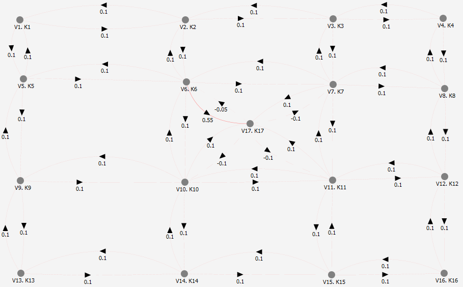
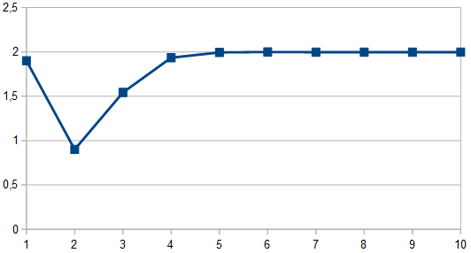

# Test case #1

## 1 Initial data

### 1.1 Legend

There is an oil field in the center of which a production well is situated. There are some exploration wells around the production well.

During oil production, a situation may arise when the production rate exceeds the well's flow rate. This can lead to both a stop in production and breakdowns of pumping equipment. The wells are connected to each other due to the porosity of the oil-bearing formation. By influencing wells (for example, pumping water as ballast) or connecting them (for example, using hydraulic fracturing), it is possible to influence the flow of oil between wells.

Objective: by influencing existing wells and connections between them, to achieve deficit-free oil production in a producing well.

### 1.2 Initial cognitive map

The initial example is taken from the work of 2022 in order to confirm the results obtained in the current year. A field of size 4x4 (Fig. 1) is described by vertices K1—K16 evenly distributed on the plane. The resource extraction point K17 (production well) is located in the geometric center of the field. The connections between the vertices are bidirectional and have a absolute weight of 0.1 (positive weights for points K1-K16, and opposite signs for the resource extraction point).

_Fig. 1 — Initial view of the simulated system_

[Initial cognitive map file](Example 1 - 1 Init.cmj)

The simulation result is presented in Fig. 2.

_Fig. 2 — Result of modeling the life cycle of the initial system (volume of resource at the resource extraction point K17)_

During the modeling process, the volume of resource at the point of extraction during the first 4-5 steps of modeling stabilizes around the +0.12 mark. This is a good result, since it shows that in the long term there is no depletion of the resource, which would reduce the efficiency of the system in question.

A negative result of the modeling is that at the 2nd step of the modeling a resource deficit is created, which can be interpreted approximately as a situation of the form “replenishment of the resource at the point of its extraction does not have time to be carried out due to the flow of resources from neighboring regions due to the high intensity of extraction.”

In reality, the volume of the resource, naturally, would not be negative - this can be interpreted as a local time decrease in the rate of resource extraction from the space under consideration, or as a temporary suspension of resource extraction. In any case, such a situation movement is unacceptable or, at least, undesirable.

## 2 Human solution

In order to get rid of the short-term resource shortage that arises during the modeling process, it is necessary to make changes to the structure of the system that will affect its behavior.

The most obvious way to get rid of resource scarcity is to reduce the rate of its extraction. However, this leads to a decrease in efficiency, which, in its essence, is not much different from the situation when the system does not change and we accept its inefficiency. This method will not be considered further.

Let's consider two more ways to increase the efficiency of resource extraction in the simulated system:
1 creation of an additional vertex,
2 modification of connections at the extration point.

If an additional vertex is created near the point of resource extraction, connected to it by links with a sufficiently high throughput, then there is a possibility that the flow of resource from such an additional source will be able to compensate for the deficit caused by excessively intensive extraction.

This is a fairly obvious statement. Therefore, the actual task is to determine how “wide” such a connection between the vertices should be.

As modeling shows, the introduction of an additional vertex (K18) (Fig. 3) with a connection that ensures a very fast flow of resource (0.7 instead of 0.1) can really improve the situation (Fig. 4).

_Fig. 3 — Modified system with an additional vertex (K18)_

_Fig. 4 — Result of modeling the life cycle of a modified system with one additional vertex_

During the modeling process, no resource deficit is observed; its volume stabilizes over time at around +0.78.

[File with human solution](Example 1 - 2 Human.cmj)

## 3 AI solution (2022)

During of processing the initial cognitive map using adaptive optimization algorithms for the execution of production processes based on intelligent technologies using cognitive analysis of the parameters of the production environment and trends in production processes in the oil and gas industry, a set of options for influencing the system was obtained in order to solve the problem of avoiding reaching a deficit state of the extraction point resource from the field of the space under consideration.

These options can be divided into three conditional classes:

1 changing the system by introducing additional vertices,

2 changing the system by modifying existing connections between vertices,

3 hybrid options that combine the two previous classes.

This options for influencing the system have shown their performance in the process of modeling “space'n'resource” systems.

Let's consider the most effective of them (Fig. 5).

_Fig. 5 — Solving the problem using an adaptive optimization algorithm for the execution of production processes based on cognitive analysis of the parameters of the production environment_

As you can see in the presented image, no additional vertices were introduced into the system - the AI made do with modifying existing ones and creating several new arcs on the graph.

The solution proposed by the AI can be interpreted as follows. Modification of existing connections between verticies (wells) represents either an increase in the porosity of the oil-bearing formation (hydraulic fracturing) or a decrease in it (injection of cement grouting slurries). The presence of a new connection (V10-V7), no matter how paradoxical it may be, can even be considered as laying a pipeline pumping an oil emulsion from one well to another (in the event that hydraulic fracturing is not possible).

As a result of applying the solution recommended by the AI, an effective solution to the problem is obtained (Fig. 6) - the weight value for vertex K17 stabilizes over time around the 1.8 mark (that is not much lower than the initial values), the resource deficit is not even one of the modeling steps is also not observed.

[File with the solution obtained by the AI](Example 1 - 3 Old results ai.cmj)

_Fig. 6 — Result of modeling the life cycle of a system modified according to the recommendation of the AI_

## 4 Solution obtained by the new version of AI algorithms (2023)

In order to confirm the performance of new AI algorithms, a cognitive model of the subject area under study was created similar to that described above. The parameters of the cognitive map (the weights of vertices and edges) are described in the form of discrete random variables: the main (most probable value) value is taken from the old model, additional (less probable) values imitate the pluralism of opinions of experts involved in evaluating the model, introducing some “noise”, which tilts the value up and down and creates a distribution of the random variable.

Otherwise, the resulting cognitive map is similar to the initial map presented above (Fig. 7).

[Cognitive map for the new version of the AI algorithm](Example 1 - 4 Rnd.zip)
[Modeling result for the new version of the AI algorithm](Example 1 - 5 Rnd results ai.cmj)

_Fig. 7 — Result of modeling the life cycle of a system modified according to the recommendation of the AI_

As a result of the simulation, in general, results were obtained that were somewhat better than the results obtained using the previous version of AI algorithms: the solution also turns out to be effective - the weight value for the target vertex (K17) stabilizes around value of 1.98 , which is even slightly higher then initial value; resource shortage is also not observed at any of the modeling steps.

_Fig. 8 — Result of modeling the life cycle of a system modified according to the recommendation of a new version of the AI

## 5 Solutions comparing 

Comparing the solutions proposed by humans and two versions of AI algorithms (Fig. 4, 6 and 8), one can be convinced that:
- the AI solution is more effective than the solution proposed by a human (there is no “failure” with the cessation or significant limitation of production at the 2nd modeling step, and the process also stabilizes more quickly),
- the solution of the new AI algorithm is slightly more effective than the solution proposed by the previous version of AI (allows it to slightly exceed the initial indicators).
  

## 6 Experimental studies

In order to conduct experimental studies of the developed new AI algorithms and test their software implementation, a [corresponding version of the test case] (Example 1.zip) was developed.

By comparing solutions proposed by humans and AI, one can be convinced that AI solutions are more effective, and the new version of the algorithms is slightly superior to the previous one.

