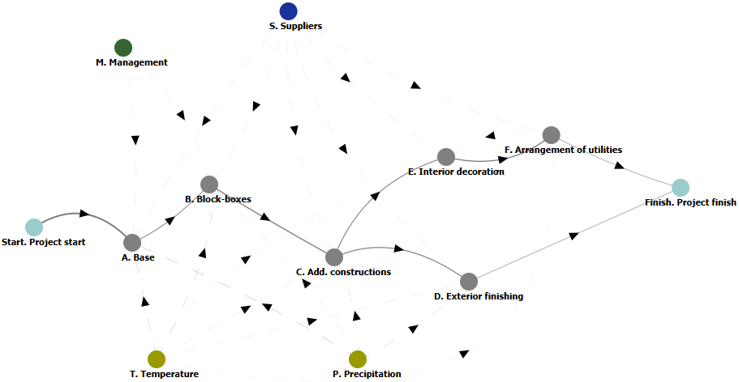
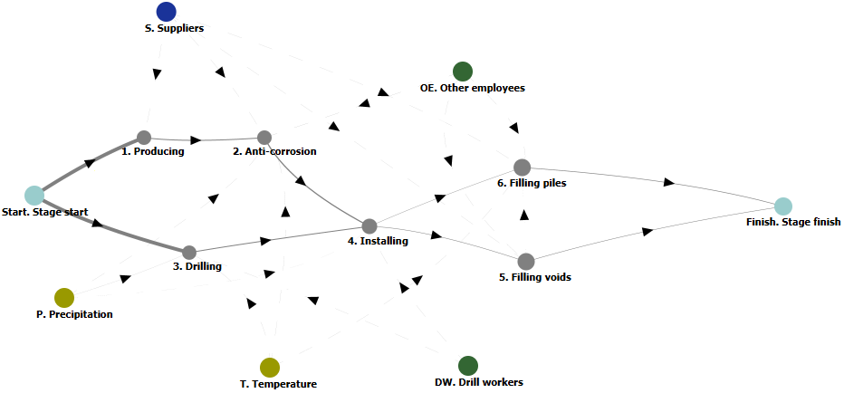
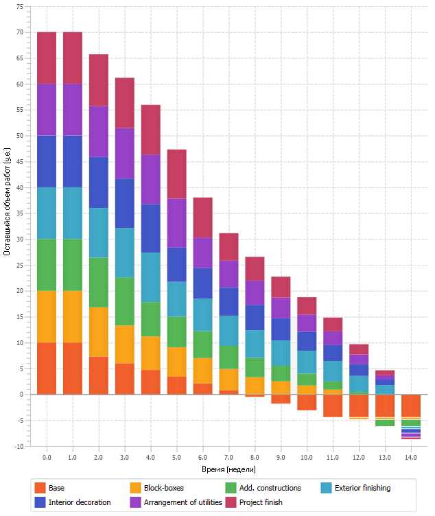
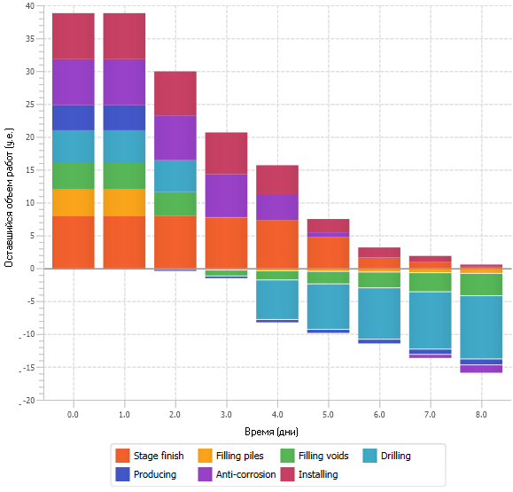
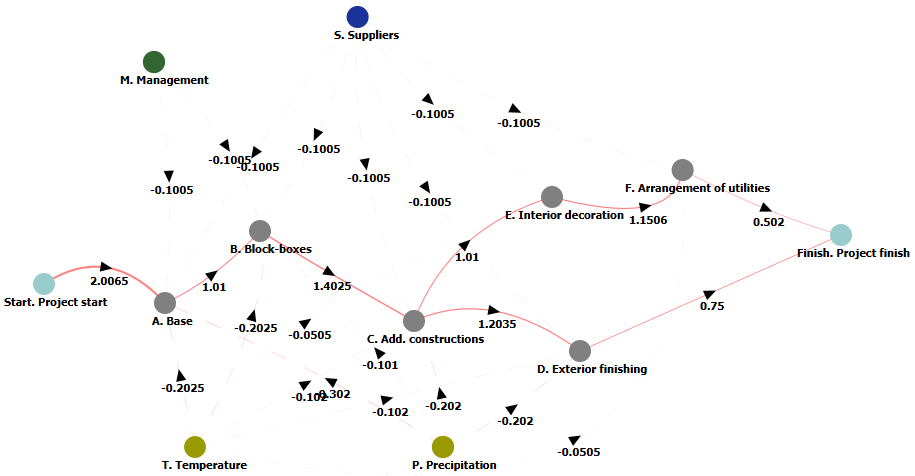
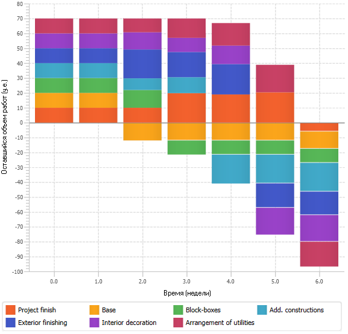
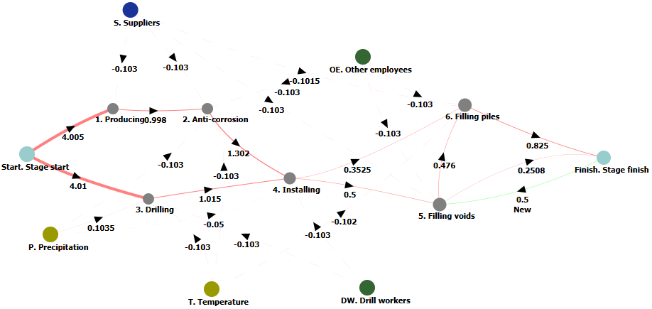
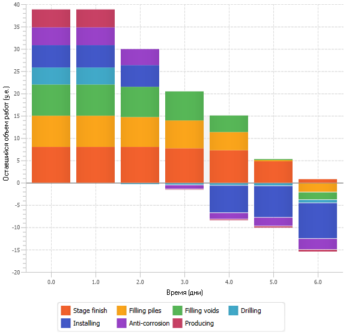

# Test case

## 1 Initial data

### 1.1 Legend

It is necessary to build a certain object (using the example of the construction of an object like “Dormitory”). There is a project for the specified construction project, an integral part of which is the construction work schedule - a list of works by type, indicating their duration and sequence of execution.

During the construction process, various delays may occur due to a variety of factors:
+ internal (for example, qualifications of employees, professionalism of management, punctuality of suppliers, etc.),
+ external (for example, weather conditions in the form of precipitation or ambient temperature).
  

These factors can significantly influence the construction process. In particular, the lack of professionalism of the involved personnel (both workers and management) can lead to a shift in the timing of each of the stages of construction and installation work “to the right” and to the failure of the overall construction deadlines. External factors also influence meeting construction deadlines in a similar way. For example, during construction in the Far North, works on drilling, driving piles, digging base pits is very dependent on the temperature of the soil - such work cannot be carried out in winter without additional labor costs (warming up the soil, building temporary shelters, explosive works, etc. ).

Objective: by influencing existing concepts that describe the factors influencing the construction process and the connections between them, to achieve a schedule of construction and installation work that meets or exceeds the initial expectations of the customer (that is, the original project).

### 1.2 Initial cognitive maps

Due to the fact that a cognitive map that could describe the complete construction process (including tens of works and no less number of external and internal factors even for such a simple construction project as a “Dormitory”) turns out to be overly complex. As a way out, you can use the principle of decomposition: cognitive modeling can be divided into several stages. As an example, two cognitive maps will be considered:

+ Example 2a - General work, divided into large stages (preparing the foundation, installing [block boxes or shipping containers](https://www.archdaily.com/886447/lot-ek-the-shipping-container-is-a-vehicle-to-invent-new-architecture), arrangement of additional structures, interior and exterior finishing, wiring of utilities ),
+ Example 2b - Particular work, divided into stages in more detail. As an example of particular work, the stage of arrangement of a pile foundation is considered (drilling work, production, preparation and installation of piles, as well as their further preparation for use as the basis for the structure being erected).
  

Construction stages:
+ Base - arrangement of the foundation,
+ Block-boxes - installation of block boxes,
+Add. constructions - arrangement of additional structures,
+ Exterior finishing - external finishing,
+ Interior decoration - interior decoration,
+ Arrangement of utilities - wiring of utilities.  

Internal factors:
+ Suppliers - suppliers of building materials,
+ Management - construction management.  

Internal factors:
+ Temperature - environment temperature,
+ Precipitation - precipitation.  

Special vertices of the cognitive map:
+ Project start - start of construction and installation works,
+ Project finish - end of the project.  

_Fig. 1 - Example 2a. Cognitive map of general works_

Similar notations are adopted for the cognitive map describing the stage of foundation arrangement (Fig. 2):

Construction stages:
+ Producing - production of piles,
+ Anti-corrosion - anti-corrosion protection of the side surface of metal piles,
+ Drilling - drilling of leading wells,
+ Installing - installation (immersion) of piles,
+ Filling voids - filling the sinuses of the leader wells,
+ Filling piles - filling the internal cavity of piles.  

Internal factors:
+ Drill workers - drillers,
+ Other employees - other employees.  

Fig. 2 — Example 2b. Cognitive map of a particular stage of work (arrangement of the foundation)_

## 2 Cognitive modeling

### 2.1 Fuzzy probabilistic cognitive maps

Fuzzy probabilistic cognitive maps are a type of cognitive maps in which the values of the weight coefficients for vertices and edges are proposed to be expressed as discrete random variables. This approach is intended to implement mechanisms for working with the parameters of a cognitive model, which are specified by a set of expert opinions, which, in turn, is expressed as an array of numerical values (weights) and frequencies (probabilities) of occurrence of these values.

To modify fuzzy cognitive maps in order to work with discrete random variables, the following changes are introduced into their mathematical apparatus:

1. Fuzzy values of the weight coefficients of the edges of the cognitive map digraph, normalized to the interval [-1;+1], are replaced by random discrete values with given characteristic distributions.
2. Weighting coefficients of the cognitive map concepts (vertices of the graph) are replaced in a similar way.
3. It is allowed (if necessary) to use arbitrary scales by normalizing not to the interval [-1;+1], but to the interval \[-X;+X\] (where X is a conditionally arbitrary value determined by the subject area in which the AI algorithms in question are used).  

The data structure for storing the values of discrete random variables is proposed to be simple: discrete random variables are described as a list of known length, each element of which is a “value - probability” pair. “Value” is generally a real number (in some cases, if necessary, it can be represented as an integer value). A “probability” is a positive real number such that the sum of all “probabilities” in the list is strictly equal to 1 (adjusted for the available accuracy of storing numbers on the computing system used).

### 2.2 General modeling principles

In both of the above examples, modeling comes down to the fact that in the initial node (Project start) the initial weight (corresponding to the initial volume of work) and the initial impact (corresponding to the conditional speed of performing this work) are specified. Further, during the modeling process, at each step the impact spreads across the map, affecting all its vertices that correspond to certain types of construction and installation works. These vertices also have their own weighting coefficients - equivalent to the volume of required labor costs.

In addition to the main impact on the cognitive map from the initial vertex, the map is influenced by vertices associated with external and internal factors - some of them have a positive impact (for example, the influence of management on some employees, if they are, say, in friendly or family relationships), some - negative (for example, low temperatures reduce the pace of work on drilling wells for a pile foundation).

The simulation is considered completed if the amount of work remaining to be completed at the top of the Project finish (end of the construction project) is reduced to zero.

### 2.3 Human Solutions

The results of creating a model describing the technical processes of construction and carrying out cognitive modeling are the so-called “burndown charts”, which are shown in Fig. 3-4. For first example, the abscissa shows the construction time expressed in weeks, for second one - in days. The y-axis in both examples displays the amount of remaining work in conventional units.

Fig. 3 — Example 2a. The result of cognitive modeling in the form of a task combustion diagram for a general work schedule_

Fig. 4 — Example 2b. The result of cognitive modeling in the form of a task combustion diagram for the schedule of a particular stage of work (laying out the foundation)_

As can be seen from the presented graphs, the duration of work both according to the [general schedule](Plan-General.png) and the [particular stage schedule](Plan-Particular.png) coincide with those planned in accordance with the construction project. This confirms the correctness of the selection of weighting coefficients for both vertices and edges, as well as (in general) the adequacy of the proposed model.

## 2.4 Solutions obtained by AI

The target vertices of the cognitive map graphs are the vertices associated with the completion of work (Project finish for the first example and Stage finish for the second). The purpose of processing the created cognitive maps is to select a method (or methods) to minimize the time to achieve the minimum value of the weights of the specified vertices, which will correspond to the completion of the work.

The vertices of cognitive maps, which describe internal factors, are described as a set of input, control influences. And the vertices that describe external factors are a set of observable, but uncontrollable disturbing influences of the environment.

As a result of cognitive modeling, the following results were obtained.

_Clarification._ The resulting cognitive maps display the weights of vertices and edges that are different from the original ones. This is explained by the fact that recommendations obtained on the basis of fuzzy probabilistic cognitive maps should not be probabilistic (no matter how paradoxical it may sound). A recommendation issued by an expert advisory system should not look like the advice “To achieve a result, with probability N, perform action A, and with probability 1-N, do not perform it.” Therefore, the weighted average of discrete random variables is taken as recommendations: it one way or another takes into account the opinion of all experts involved in creating the model, and at the same time does not coarse the final modeling results, being as close as possible to reality.

### 2.4.1 Example 2a (general work schedule)

For example 2a (general work schedule), a set of proposed solutions was generated, the most effective of which was considered the following (see Fig. 5).

Fig. 5 — Solution obtained by AI for example 2a (general work schedule)_

On the resulting cognitive map, the algorithm suggested deleting the graph edge between vertices F and E. _Interpretation: the original model assumed feedback showing that work on laying utilities inside the building slows down the production of interior decoration: a common story at a construction site, when after laying communications you have to redo damaged finish. In fact, the algorithm suggested getting rid of this factor, that is, installing communications as carefully as possible._

Also in the resulting cognitive map the weights of the edges between the vertices E-F and F-Finish were changed (reduced by 15-17%). _Interpretation: after the negative impact from the process of laying utilities has been eliminated, less labor will be required for the production of interior finishing, which in turn will reduce the costs of achieving the goal - completion of construction and installation work._

Additionally, the weight of the D-Finish rib changes (increases by 25%). _Interpretation: Reducing labor costs for laying utilities and interior decoration allows you to free up human resources and direct them to another area of work - the exterior decoration of a building under construction_.

### 2.4.2 Evaluation of the resulting AI solution for example 2a

As a result of cognitive modeling, a task burndown diagram similar to a human solution was obtained (Fig. 6), but with a significant reduction in work time (2.3 times).

_Fig. 6 - Example 2a. Problem burndown diagram for the solution obtained by AI_

### 2.4.3 Example 2b (schedule for a particular stage of work)

For example 2b (schedule for a particular stage of work), a set of solutions was also generated, the most effective of which is shown in Fig. 7.

_Fig. 7 — Solution obtained by AI for example 2b (schedule of a particular stage of work)_

The algorithm suggested making three significant changes to the resulting cognitive map.

Firstly, it is proposed to introduce an additional edge - from the Finish vertex to vertex 5. _Interpretation: taking into account the negative impact of stage 5 (filling the sinuses of the leader wells) on stage 6 (filling the internal cavity of the piles), which is expressed in delays when the work is completed with of inadequate quality and the pile is not fixed in the well, which prevents it from being filled with concrete due to the need to complete or redo the work, it is supposed additional quality control of the work is introduced at stage 5._

Secondly, taking into account what has just been said, the weight of edge 5-6 radically changes - from negative to positive. _Interpretation: with a significant increase in the quality of work at stage 5, this begins to help, and not hinder, work at stage 6._

Thirdly, the proportions of the weighting coefficients on the 6-Finish and 5-Finish edges change. _Interpretation: taking into account the fact that work at stage 5 begins to be carried out more efficiently and effectively, this makes it possible to transfer part of the human resources to a more labor-intensive area of work - to stage 6 (concreting piles)._

### 2.4.4 Evaluation of the resulting AI solution for example 2b

Cognitive modeling produces results supported by the task burndown chart (Fig. 8). In this case, a reduction in work time was obtained by approximately 25%.

_Fig. 8 — Example 2b. Problem burndown diagram for the solution obtained by AI_

## 3 Comparison of solutions

Comparing the solutions proposed by humans and AI (Fig. 3, 4, 6, 8), one can be convinced that the AI solution is more effective - a significant reduction in the time required for construction and installation work is achieved, both on a large and small scale.

## 4 Experimental studies

In order to conduct experimental studies of the developed algorithms and test their software implementation, test cases were developed:

- optimization ([general construction schedule](Example 2 - General plan_rnd.cmj)),
- optimization ([schedule of the particular construction stage](Example 2 - Particular plan_rnd.cmj)).

By comparing [human and AI solutions for test cases](Control example results.zip), you can verify that the AI solution is more effective.