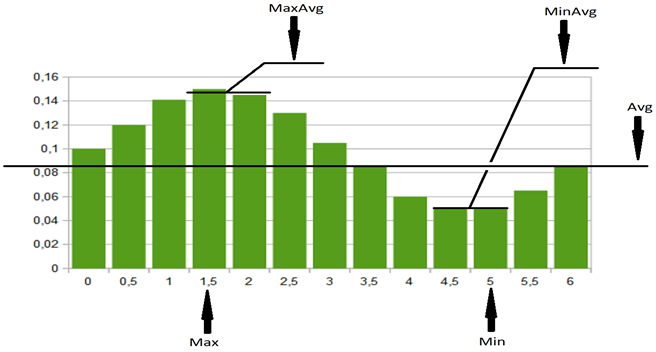
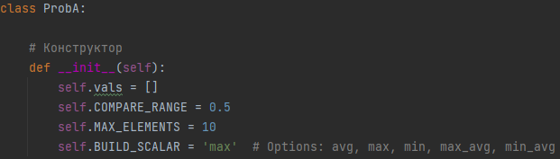
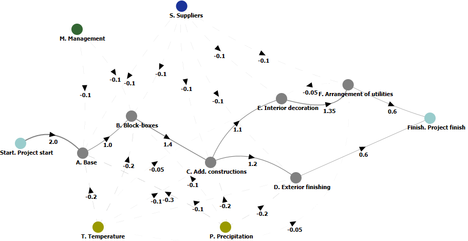
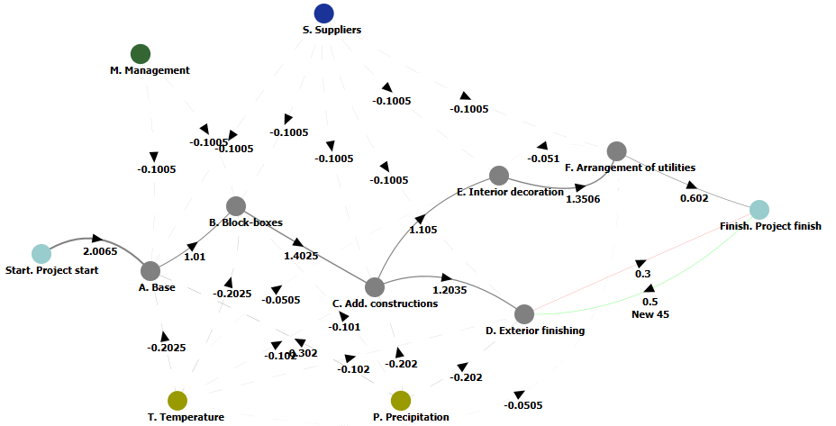
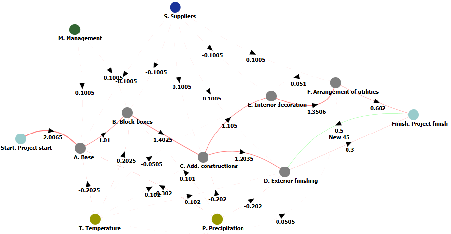
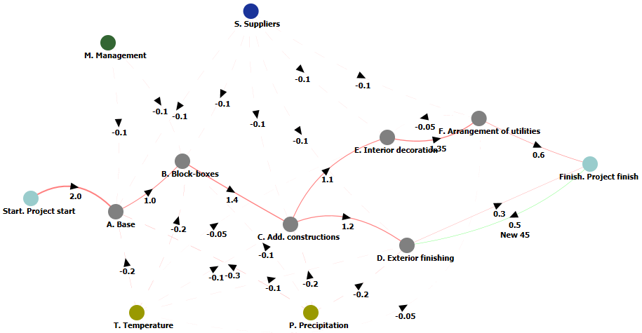
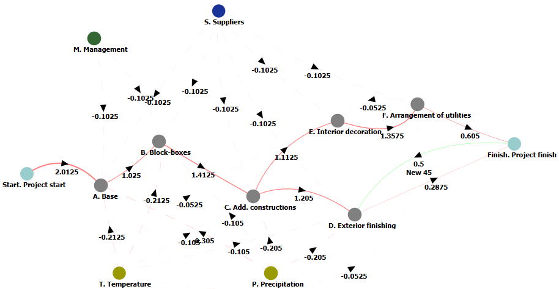

# Test Case #3

## 1 Initial data

### 1.1 Goals and objectives

In order to improve the quality of results obtained through the use of new AI algorithms, it is proposed to increase the flexibility of their use. Increasing flexibility involves using a set of strategies used to generate the final (end-user-oriented) data.

Exploring these strategies and demonstrating the corresponding results is the purpose of this test case.

Strategies mean the use of “filters” that make it possible to obtain an answer from the resulting fuzzy probabilistic cognitive map that is convenient for human perception (that is, a regular fuzzy cognitive map).

### 1.2 Strategies for generating final data

Obtaining finite data is the formation of a scalar quantity from a discrete random variable. This is because the proposed solution must be clear, understandable and unambiguously interpretable by humans.

The following strategies are proposed to generate the final data:
+ **Avg** - average value (for a discrete random variable, a weighted average value is calculated based on the weighting coefficients of the values, which are their probabilities; in fact, this is the expectation of the random variable in question),
+ **Max** - maximum (by “maximum” we mean the most probable value of a discrete random variable, that is, having the maximum probability in a given distribution),
+ **MaxAvg** - average maximum (arithmetic mean of values that have the two highest probabilities in a given distribution of a discrete random variable),
+ **Min** - minimum (by “minimum” we mean, accordingly, the least probable value of a discrete random variable, that is, having the minimum probability in a given distribution),
+ **MinAvg** - average minimum (arithmetic mean of values that have the two lowest probabilities in a given distribution of a discrete random variable).  

The use of these strategies is assumed as follows:
+ Average value (Avg). The strategy implements the behavior of a “cautious player”. In this case, the entire spectrum of data is taken into account, which, perhaps, does not give the most optimal solution, but the most probable (that is, the most “reliable”).
+ Maximums (Max and MaxAvg). Aggressive (“optimistic”) strategies that implement types of behavior close to the “all or nothing” principle. With this type of final data formation, an attempt is made to obtain the most profitable solution (with the Max strategy - the most profitable, with MaxAvg - as close as possible to it, but allowing for a certain degree of caution due to taking into account not one, but a pair of the “strongest” opinions). It is accepted that such a solution is less likely than when using the Avg strategy.
+ Minimums (Min and MinAvg). “Pessimistic” strategies that implement behavioral models aimed at obtaining the least likely scenarios. With this type of final data generation, an attempt is made to obtain a solution similar to the Max and MaxAvg strategies, but regarding the least probable cases.  

_Fig. 1 — Graphical interpretation of final data generation strategies_

_Fig. 2 — Source code of the experimental library responsible for choosing strategies_

## 2 Cognitive modeling

### 2.1 Initial cognitive map and experimental conditions

The basis is a cognitive map describing the general process of construction and installation work, taken from the previous example (Fig. 3).

_Fig. 3 — Initial cognitive map_

The following experiments are carried out for it:
+ Comparison of the cognitive map of the “old” format (with scalar values obtained by averaging the opinions of experts) and the cognitive map of the “new” format (with random discrete values obtained from the results of a survey of the expert group and “averaged” according to the Avg strategy).
+ Comparison of cognitive maps of the “new” format, built using the Avg and Max strategies.
+ Comparison of cognitive maps of the “new” format, built using the Max and MaxAvg strategies.

### 2.2 Experiment

The results of the experiments are shown in Fig. 3-8.

#### 2.2.1 Comparison of cognitive maps of the “old” and “new” format

_Fig. 4 — "Old" format map_

_Fig. 5 — Similar map of the "new" format_

#### 2.2.2 Comparison of cognitive maps built using the Avg and Max strategies

_Fig. 6 — Map built according to the Avg strategy_

_Fig. 7 — Map built using the Max strategy_

#### 2.2.3 Comparison of cognitive maps built using the Max and MaxAvg strategies

_Fig. 8 — Map built according to the Max strategy_

_Fig. 9 — Map built using the MaxAvg strategy_

### 2.3 Experimental results

[Experimental results](Example 3 - Results.zip) are given partially (the first 10 solutions). The results for the Min and MinAvg strategies are generally similar (adjusted for the extremum selection function used).

### 2.4 Evaluation of experimental results and conclusions

Analysis of the experimental results shows that:
+ The results for the “old” and “new” formats are identical. From this we can conclude that, in principle, the previous generation model is sufficient to implement the Avg strategy, if the user is not interested in the issue of preserving the range of expert opinions and agrees to the initially averaged “opinion of the average expert.”
+ The results of comparing the Avg, Max and MaxAvg strategies are comparable: structurally, the solutions proposed by the AI are equivalent. This is explained by the same initial conditions (the structure of the cognitive map, which is built on the same subject area). At the same time, the initial impulse effects in the modeling scenarios change, which leads to the fact that the required result (the same for all strategies) is achieved in different ways.
+ As a conclusion, we can assume that obtaining a structural diagram of a solution can, apparently, be carried out with fuzzy cognitive maps, which are less labor-intensive to process. And the clarification of the results (in accordance with various strategies) is already done with the help of fuzzy probabilistic cognitive maps.