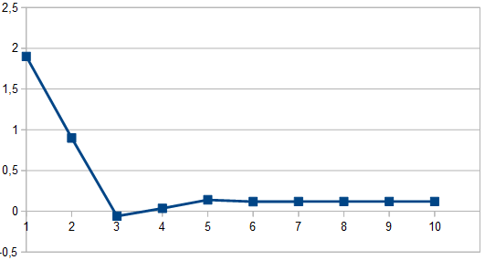
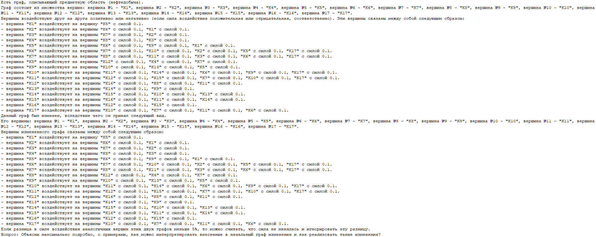

# Test case #1

## 1 Demonstration of the operability of the components of adaptive optimization of production processes using probabilistic models and a dynamically changing environment

This example is an experimental confirmation of the operability of the following component parts:

- Tools for visualizing probabilistic cognitive maps
- Tools for parallel processing of cognitive maps
- Tools for preparing concretizing AI queries for cognitive maps

The confirmation consists of checking the joint operation of all components of the complex: in preparing a cognitive map with visualization tools,
in comparing the options for calculating (optimizing) cognitive maps on a single-machine computing system and on a multi-machine version, as well as obtaining an interpretation of the obtained results by involving AI. The initial data for the example is the example used to confirm the concept of using probabilistic cognitive maps.

## 2 Initial data

### 2.1 Legend

There is an oil field in the center of which there is a production well. There are exploratory wells around the production well.

During oil production, a situation may arise when the production rate exceeds the well flow rate. This can lead to both production shutdowns and production equipment failures. The wells are interconnected due to the porosity of the oil-bearing formation. By influencing the wells (for example, by pumping ballast in the form of water) or the connection between them (for example, by using hydraulic fracturing), it is possible to influence the flow of oil between the wells.

Task: by influencing the existing wells and the connections between them, achieve deficit-free oil production in the production well.

### 2.2 Initial cognitive map

The initial example is taken from the 2022 works in order to confirm the results obtained in the current year.

To demonstrate the operation of the visualization toolkit of probabilistic cognitive maps, cognitive maps were recreated using it. The results of the toolkit operation are presented in Fig. 1.

_Fig. 1 — Demonstration of the work of the visualization toolkit for probabilistic cognitive maps_

A 4x4 field (Fig. 2) is described by vertices K1-K16 uniformly distributed on the plane. The resource extraction point K17 (production well) is located in the geometric center of the field. The connections between the vertices are bidirectional and have a weight modulus equal to 0.1 (positive weights for points K1-K16, opposite-sign for the resource extraction point).

_Fig. 2 — Initial view of the simulated system_

[File with the initial cognitive map](data/Example1-1Init.cmj)

The simulation result is shown in Fig. 3.

_Fig. 3 — Result of modeling the life cycle of the initial system (resource volume at the point of withdrawal K17)_

During the modeling process, the resource volume at the point of withdrawal stabilizes around the +0.12 mark during the first 4-5 modeling steps. This is a good result, since it shows that in the long term, the resource is not exhausted, which would reduce the efficiency of the system under consideration.

A negative result of modeling is that at the 2nd modeling step, a resource deficit is created, which can be interpreted approximately as a situation of the type "resource replenishment at the point of its withdrawal does not have time to be carried out due to the flow of resources from neighboring areas due to the high intensity of withdrawal."

In reality, the resource volume, of course, would not be negative - this can be interpreted as a local decrease in the rate of resource withdrawal from the space under consideration, or as a temporary suspension of resource withdrawal. In any case, such a development of the situation is unacceptable or, at least, undesirable.

## 3 Solution obtained by a person

In order to get rid of a short-term resource deficit that occurs during the modeling process, it is necessary to make changes to the system structure that will affect its behavior.

The most obvious way to get rid of a resource deficit is to reduce the rate of its extraction. However, this leads to a decrease in efficiency, which, in essence, is not much different from the situation when the system does not change and we put up with its inefficiency. This method will not be considered further.

Let us consider two more ways to increase the efficiency of resource extraction in the modeled system:
1 creating an additional vertex,
2 modifying the connections at the extraction point.

If an additional vertex is created near the resource extraction point, connected to it by connections with a sufficiently high throughput, then there is a possibility that the resource flow from such an additional source will be able to compensate for the deficit caused by excessively intensive extraction.

This is a fairly obvious statement. Therefore, the task itself is to determine how “wide” such a connection between vertices should be.

As the simulation shows, the introduction of an additional node (K18) (Fig. 4) with a connection that provides a very fast resource flow (0.7 instead of 0.1) can really improve the situation (Fig. 5).

_Fig. 4 — Modified system with an additional node (K18)_

_Fig. 5 — Result of modeling the life cycle of a modified system with one additional node_

During the simulation, no resource deficit is observed, its volume stabilizes over time at around +0.78.

[File with the solution obtained by a human](data/Example1-2Human.cmj)

## 4 Solution obtained by AI (2022)

In the process of processing the initial cognitive map using adaptive optimization algorithms for the execution of production processes based on intelligent technologies using cognitive analysis of the parameters of the production environment and trends in production processes in the oil and gas industry, a set of options for influencing the system was obtained in order to solve the problem of avoiding reaching a deficit state of the resource extraction point from the field of the space under consideration.

The specified options can be divided into three conditional classes:

1 changing the system by introducing additional nodes,

2 changing the system by modifying the existing connections between nodes,

3 hybrid options that combine the two previous classes.

The specified options for influencing the system have proven their effectiveness in the process of modeling "space-resource" systems.

Let's consider the most effective of them (Fig. 6).

_Fig. 6 — Solving the problem using an adaptive optimization algorithm for production processes based on cognitive analysis of production environment parameters_

As can be seen in the image, no additional nodes were introduced into the system - the AI got by with modifying the existing ones and creating several new arcs on the graph.

The solution proposed by the AI can be interpreted as follows. Modifying the existing connections between nodes (wells) represents either an increase in the porosity of the oil-bearing formation (hydraulic fracturing) or a decrease (pumping cement slurries). The presence of a new connection (V10-V7), as paradoxical as it may be, can even be considered as laying a pipeline that pumps oil emulsion from one well to another (in the event that hydraulic fracturing is not possible).

As a result of applying the solution recommended by the AI, an effective solution to the problem is obtained (see Fig. 7) — the weight value for the K17 vertex stabilizes over time around the 1.8 mark (that is, not much lower than the initial values), and resource deficit is not observed at any of the modeling steps.

[File with the solution obtained by the AI](data/Example1-3OldResultsAI.cmj)

_Fig. 7 — Result of modeling the life cycle of a system modified according to the AI recommendation_

## 5 Solution obtained by the new version of AI algorithms (2023)

In order to confirm the performance of the new AI algorithms, a cognitive model of the subject area under study similar to the one described was created. In it, the parameters of the cognitive map (weights of vertices and edges) are described as discrete random variables: the main (most probable value) value is taken from the old model, additional (less probable) values - imitate the pluralism of opinions of experts involved in assessing the model, introducing some "noise" that deviates the value up and down and creates a distribution of the random variable.

Otherwise, the resulting cognitive map is similar to the initial map presented above (Fig. 8).

[Cognitive map for the new version of the AI algorithm](data/Example1-4Rnd.zip)

[Simulation result for the new version of the AI algorithm](data/Example1-5RndResultsAI.cmj)

_Fig. 8 — Result of modeling the life cycle of the system modified according to the AI recommendation_

As a result of the modeling, the results obtained were, in general, somewhat better than the results obtained using the previous version of the AI algorithms: the solution also turns out to be effective — the weight value for the target vertex (K17) stabilizes around 1.98, which is even slightly higher than the initial value; resource deficit is also not observed at any of the modeling steps.

_Fig. 9 — Result of modeling the life cycle of the modified AI system based on the recommendation of the new version_

## 6 Comparison of solutions

By comparing the solutions proposed by a person and two versions of the AI algorithms (Fig. 5, 7 and 9), we can see that:
- the AI solution is more efficient than the solution proposed by a person (there is no "failure" with the cessation or significant limitation of production at the 2nd step of modeling, and there is also a faster stabilization of the process),
- the solution of the new AI algorithm is slightly more efficient than the solution proposed by the AI of the previous version (it allows to slightly exceed the initial indicators).
  

## 7 Experimental studies

In order to conduct experimental studies of the developed new AI algorithms and test their software implementation, [the corresponding version of the control example] (data/Example1.zip) was developed.

Comparing the solutions proposed by humans and AI, we can see that AI solutions are more efficient, and the new version of the algorithms is slightly superior to the previous one.

The use of parallel processing tools for cognitive maps reduces the time spent on processing cognitive maps several times:
- by about 45% using a two-machine computing system,
- by about 55% using a three-machine system.

## 8 Interpretation of results

To demonstrate the operability of the adaptive optimization component for the execution of production processes using probabilistic models and a dynamically changing environment, a tool for preparing concretizing AI queries for cognitive maps was used. As a result, a quick and understandable description of the solution and its possible interpretation was obtained.

Examples of an auto-generated query and an interpretation received from AI (Fig. 10, 11) are given below.

_Fig. 10 — An example of an auto-generated query obtained by the toolkit for preparing concretizing AI queries for cognitive maps and an AI-derived interpretation of the solution (general construction schedule)_

_Fig. 11 — An example of an auto-generated query obtained by the toolkit for preparing concretizing AI queries for cognitive maps and an AI-derived interpretation of the solution (particular construction stage schedule)_

## 9 Conclusions

Based on the results of comparing the processing in a single- and multi-machine version (without and with the use of the "Cognitive Maps Parallel Processing Toolkit" component), a correspondence of the results was found, proving the validity of using this approach. As expected, the time required for calculation decreases proportionally to the increase in computing power (adjusted for the discreteness of dividing the overall task into subtasks solved on distributed computing nodes).
