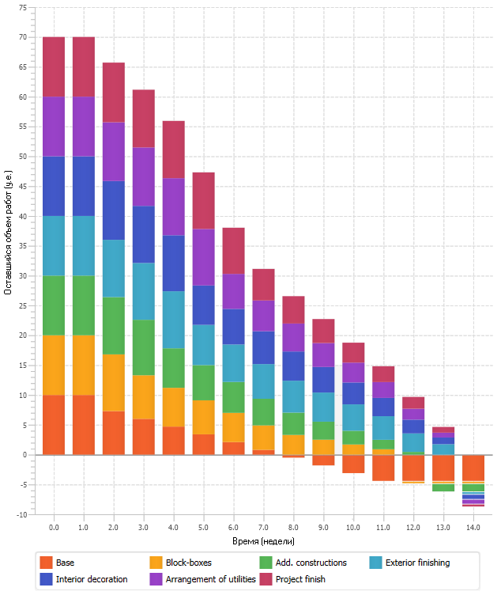
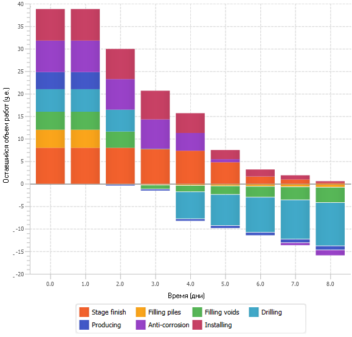
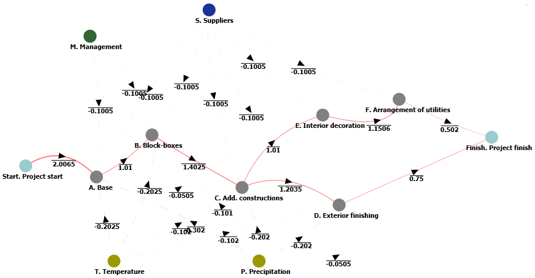

# Контрольный пример №2

## 1 Экспериментальное подтверждение работоспособности компонента "Инструментарий параллельной обработки когнитивных карт"

Данный пример является экспериментальным подтверждением работоспособности компонента "Инструментарий параллельной обработки когнитивных карт", которое заключается в сравнении вариантов обсчета (оптимизации) когнитивных карт на одномашинной вычислительной системе и на многомашинном варианте. В качестве данных для примера взят пример, использовавшийся ранее для подтверждения концепции использования вероятностных когнитивных карт. 

## 2 Начальные данные

### 2.1 Легенда

Необходима постройка некоего объекта (на примере строительства объекта типа "Общежитие"). Имеется проект указанного строительного объекта, составной частью которого является план-график строительных работ - список работ по видам, с указанием их длительности и последовательности выполнения.

В процессе строительства могут возникать различные задержки связанные с массой различных факторов:
+ внутренние (например, квалификация наемных работников, профессионализм руководства, пунктуальность поставщиков и т.п.),
+ внешние (например, погодные условия в виде осадков или температуры окружающей среды).
  

Указанные факторы могут в значительной степени влиять на процесс строительства. В частности, непрофессионализм привлеченного персонала (как рабочих, так и руководства) может привести к сдвигу сроков каждого из этапов строительно-монтажных работ "вправо" и к срыву общих сроков строительства. Аналогичным образом на выдерживание сроков строительства влияют и внешние факторы. Например, при строительстве в условиях Крайнего Севера на работы по бурению, забиванию свай, копке котлованов очень сильно зависят от температуры грунта - такие работы невозможно проводить в зимний период без дополнительных трудозатрат (прогрев грунта, строительство временных укрытий, взрывные работы и т.п.).

Задача: с помощью воздействия на имеющиеся концепты, описывающие факторы, влияющие на процесс строительства, и связи между ними, добиться получения план-графика строительно-монтажных работ, соответствующего начальным ожиданиям заказчика (то есть - изначальному проекту) или же превосходящих его.

### 2.2 Начальные когнитивные карты

В силу того, что когнитивная карта, которая могла бы описать полный процесс строительства (включающий в себя десятки работ и не меньшее количество внешних и внутренних факторов даже для такого простого объекта строительства как "Общежитие"), получается чрезмерно сложной. В качестве выхода можно использовать принцип декомпозиции: когнитивное моделирование может быть разделено на несколько этапов. В качестве примера будут рассмотрены две когнитивные карты:

+ Пример 2а - Общие работы, разбитые на большие этапы (подготовка фундамента, установка [блок-боксов](http://azm.kz/solutions/block-boxes/), обустройство дополнительных конструкций, внутренняя и внешняя отделка, проводка инженерных коммуникаций),
+ Пример 2б - Частные работы, разбитые на этапы более подробно. В качестве примера частной работы рассматривается этап обустройства свайного фундамента (бурильные работы, производство подготовка и установка свай, а так же их дальнейшая подготовка к эксплуатации в качестве основания для возводимого строения).
  

На когнитивной карте общих работ (рис. 1) приняты следующие обозначения:

Этапы строительства:
+ Base - обустройство фундамента,
+ Block-boxes - установка блок-боксов,
+ Add. constructions - обустройство дополнительных конструкций,
+ Exterior finishing - внешняя отделка,
+ Interior decoration - внутренняя отделка,
+ Arrangement of utilities - проводка инженерных коммуникаций.  

Внутренние факторы:
+ Suppliers - поставщики строительных материалов,
+ Management - руководство стройки.  

Внутренние факторы:
+ Temperature - температурный режим,
+ Precipitation - осадки.  

Специальные вершины когнитивной карты:
+ Project start - начало строительно-монтажных работ,
+ Project finish - окончание проекта.  

_Рис. 1 — Пример 2а. Когнитивная карта общих работ_

Аналогичные обозначения приняты и для когнитивной карты, описывающей этап обустройства фундамента (рис. 2):

Этапы строительства:
+ Producing - производство свай,
+ Anti-corrosion - антикоррозионная защита боковой поверхности металлических свай,
+ Drilling - бурение лидерных скважин,
+ Installing - установка (погружение) свай,
+ Filling voids - заполнение пазух лидерных скважин,
+ Filling piles - заполнение внутренней полости свай.  

Внутренние факторы:
+ Drill workers - рабочие-бурильщики,
+ Other employees - прочие работники.  

_Рис. 2 — Пример 2б. Когнитивная карта частного этапа работ (обустройство фундамента)_

## 3 Когнитивное моделирование

### 3.1 Нечеткие вероятностные когнитивные карты

Нечеткие вероятностные когнитивные карты представляют собой разновидность когнитивных карт, в которых значения весовых коэффициентов для вершин и ребер предлагается выражать в виде дискретных случайных величин. Такой подход предназначен для реализации механизмов работы с параметрами когнитивной модели, которые задаются набором мнений экспертов, который, в свою очередь, выражается в виде массива числовых значений (весов) и частот (вероятностей) появления этих значений.

Для модификации нечетких когнитивных карт с целью осуществления работы с дискретными случайными величинами, вводятся следующие изменения в их математический аппарат:

1. Нечеткие величины весовых коэффициентов ребер орграфа когнитивной карты, нормированные на интервал [-1;+1], заменяются случайными дискретными величинами с заданными характеристическими распределениями.
2. Весовые коэффициенты концептов когнитивной карты (вершины графа) – заменяются аналогичным образом.
3. Допускается (в случае необходимости) использование произвольных шкал посредством нормирования не на интервал [-1;+1], а на интервал \[-X;+X\] (где X – условно произвольная величина, определяемая предметной областью, в которой используются рассматриваемые алгоритмы ИИ).  

Структура данных для хранения значений дискретных случайных величин предлагается простой: дискретные случайные величины описывается в виде списка известной длины, каждый элемент которого представляет собой пару «значение - вероятность». «Значение» является в общем случае вещественным числом (в частных случаях, при необходимости, может быть представлено в виде целочисленного значения). «Вероятность» является положительным вещественным числом таким, что сумма всех «вероятностей» в списке строго равна 1 (с поправкой на доступную точность хранения чисел на используемой вычислительной системе).

### 3.2 Общие принципы моделирования

В обоих приведенных примерах моделирование сводится к тому, что в начальном узле (Project start) задается начальный вес (соответствующий начальному объему работ) и начальное воздействие (соответствующее условной скорости выполнения этих работ). Далее, в процессе моделирования, на каждом шаге воздействие распространяется по карте, затрагивая все ее вершины, которые соответствуют тем или иным видам строительно-монтажных работ. Эти вершины так же имеют свои весовые коэффициенты - эквиваленты объемов требуемых трудозатрат.

Помимо основного воздействия на когнитивную карту со стороны начальной вершины, на карту оказывают влияние вершины, ассоциированные с внешними и внутренними факторами - какие-то из них оказывают положительное влияние (например, влияние руководства на часть работников, если они находятся, предположим, в дружеских или родственных отношениях), какие-то - отрицательное (например, низкие температуры снижают темпы работ по бурению скважин для свайного фундамента).

Моделирование считается завершенным, если объем работ, которые осталось выполнить в вершин Project finish (окончание строительного проекта) снижается до нуля.

### 3.3 Решения, полученные человеком

Итогами создания модели, описывающей техпроцессы строительства, и проведения когнитивного моделирования являются так называемые "диаграммы сгорания задач" (burndown charts), которые приводятся на рис. 3-4. Для примера 2а по оси абсцисс расположено время строительства, выраженное в неделях, для примера 2б - в днях. Ось ординат в обоих примерах отображает объем оставшихся работ в условных единицах.

_Рис. 3 — Пример 2а. Результат когнитивного моделирования в виде диаграммы сгорания задач для план-графика общих работ_

_Рис. 4 — Пример 2б. Результат когнитивного моделирования в виде диаграммы сгорания задач для план-графика частного этапа работ (обустройство фундамента)_

Как видно из представленных графиков, длительность работ и по [общему план-графику](pics/yPlan-General.png), и по [план-графику частного этапа](pics/yPlan-Particular.png) совпадают с запланированными в соответствии с проектом строительства. Это подтверждает верность подбора весовых коэффициентов как для вершин, так и для ребер, а так же (в целом) адекватность предложенной модели.

## 3.4 Решения, полученные ИИ

Целевыми вершинами графов когнитивной карты выбираются вершины, ассоциированные с окончанием работ (Project finish для первого примера и Stage finish - для второго). Цель обработки созданных когнитивных карт - выбор способа (или способов) минимизации времени достижения минимального значения весов указанных вершин, что будет соответствовать завершению работ.

Вершины когнитивных карт, которые описывают внутренние факторы, описываются как множество входных, управляющих воздействий. А вершины, описывающие внешние факторы - множество наблюдаемых, но неуправляемых возмущающих воздействий среды.

Подробное описание дано в документе ["Описание программы", раздел "3. Описание логической структуры", подраздел "3.2 Алгоритмы компонента" (алгоритм "Поиск оптимального изменения параметров когнитивной карты")](../docs/program-description.md).

В итоге проведения когнитивного моделирования были получены следующие результаты.

_Уточнение._ На полученных когнитивных картах отображены веса вершин и ребер, отличные от изначальных. Это объясняется тем, что рекомендации, получаемые на основе нечетких вероятностных когнитивных карт не должны быть вероятностными (как бы это парадоксально не звучало). Рекомендация, выдаваемая экспертно-советующей системой на должна выглядеть как совет "Для достижения результата, с вероятностью N произведите действие A, а с вероятностью 1-N - не производите его". Поэтому, в качестве рекомендаций берется средневзвешенное значение дискретных случайных величин: оно так или иначе учитывает мнение всех экспертов, привлеченных к созданию модели, и при этом не огрубляет итоговые результаты моделирования, являясь максимально приближенными к реальности. 

### 3.4.1 Пример 2а (план-график общих работ)

Для примера 2а (план-график общих работ) был сгенерирован набор предлагаемых решений, наиболее эффективным из которых были признан следующий (см. рис. 5).

_Рис. 5 — Решение, полученное ИИ для примера 2а (план-график общих работ)_

На полученной когнитивной карте алгоритм предложил удалить ребро графа между вершинами F и E. _Интерпретация: в изначальной модели предполагалась обратная связь, показывавшая, что работы по прокладке инженерных коммуникаций внутри строения замедляют производство внутренней отделки: обычная история на стройке, когда после прокладки коммуникаций приходится переделывать поврежденную отделку. Фактически, алгоритм предложил избавиться от этого фактора, то есть производить монтаж коммуникаций максимально аккуратно._

Так же в полученной когнитивной карте изменены (уменьшены на 15-17%) веса ребер между вершинами E-F и F-Finish. _Интерпретация: после того, как негативное влияние от процесса прокладки инженерных коммуникаций устранено, потребуется меньше трудозатрат на производство внутренней отделки, что в свою очередь снизит затраты на достижение цели - окончания строительно-монтажных работ._

Дополнительно изменяется (увеличивается на 25%) вес ребра D-Finish. _Интерпретация: Снижение трудозатрат на прокладке инженерных коммуникаций и внутренней отделке позволяет высвободить людские ресурсы и направить их на другой фронт работ - внешнюю отделку строящегося здания_.

### 3.4.2 Оценка полученного ИИ решения для примера 2а

В результате когнитивного моделирования получена аналогичная человеческому решению диаграмма сгорания задач (рис. 6), однако с существенным сокращением сроков проведения работ (в 2,3 раза).

_Рис. 6 — Пример 2а. Диаграмма сгорания задач для решения, полученного ИИ_

### 3.4.3 Пример 2б (план-график частного этапа работ)

Для примера 2б (план-график частного этапа работ) так же был сгенерирован набор решений, максимально эффективный из которых приведен на рис. 7.

_Рис. 7 — Решение, полученное ИИ для примера 2б (план-график частного этапа работ)_

На полученной когнитивной карте алгоритм предложил внести три существенных изменения.

Во-первых, предлагается ввести дополнительное ребро - от вершины Finish в вершине 5. _Интерпретация: с учетом негативного влияния этапа 5 (заполнение пазух лидерных скважин) на этап 6 (заполнение внутренней полости свай), что выражается в задержках тогда, когда работа выполнена с ненадлежащим качеством и свая не фиксируется в скважине, что мешает заполнению ее бетоном из-за необходимости доделки или переделки работы, предположим, вводится дополнительный контроль качества работ на этапе 5._

Во-вторых, с учетом только что сказанного, коренным образом меняется вес ребра 5-6 - с отрицательного на положительный. _Интерпретация: при существенном повышении качества работ на этапе 5, это начинает помогать, а не мешать работам на этапе 6._

В-третьих, изменяются пропорции весовых коэффициентов на ребрах 6-Finish и 5-Finish. _Интерпретация: с учетом того, что работы на этапе 5 начинают производиться более качественно и эффективно, это дает возможность перебросить часть людских ресурсов на более трудоемкий участок работ - на этап 6 (бетонирование свай)._

### 3.4.4 Оценка полученного ИИ решения для примера 2б

Когнитивное моделирование дает результаты, подтверждаемые диаграммой сгорания задач (рис. 8). В данном случае получено сокращение сроков проведения работ - примерно на 25%.

_Рис. 8 — Пример 2б. Диаграмма сгорания задач для решения, полученного ИИ_

## 4 Сравнение решений

Сравнивая решения, предложенные человеком и ИИ (рис. 3, 4, 6, 8), можно убедиться в том, что решение ИИ более эффективно - достигается существенное сокращение сроков проведение строительно-монтажных работ, причем как большом, так и в малом масштабе.

## 5 Экспериментальные исследования

С целью проведения экспериментальных исследований разработанных алгоритмов и проверки их программной реализации были разработаны контрольные примеры:

- оптимизация ([общего плана-графика стротельства](data/Example2-GeneralPlan_rnd.zip)),
- оптимизация ([частного плана-графика строительного этапа](data/Example2-ParticularPlan_rnd.zip)).

Сравнивая [решения, предложенные человеком и ИИ для контрольных примеров](data/ControlExampleResults.zip), можно убедиться в том, что решение ИИ более эффективно.

## 6 Выводы

По итогам сравнения обработки в одно- и многомашинном варианте (без применения компонента "Инструментарий параллельной обработки когнитивных карт" и с его использованием) было выявлено полное соответствие результатов, что доказывает правомерность применения данного подхода. Как и было предположено, время, затарчиваемое на обсчет, уменьшается пропорционально увеличению вычислительных мощностей (с поправкой на дискретность дробления общей задачи на подзадачи, решаемые на распределенных вычислительных узлах).
