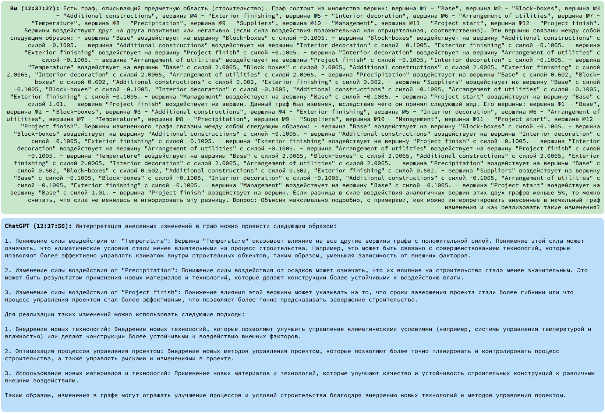
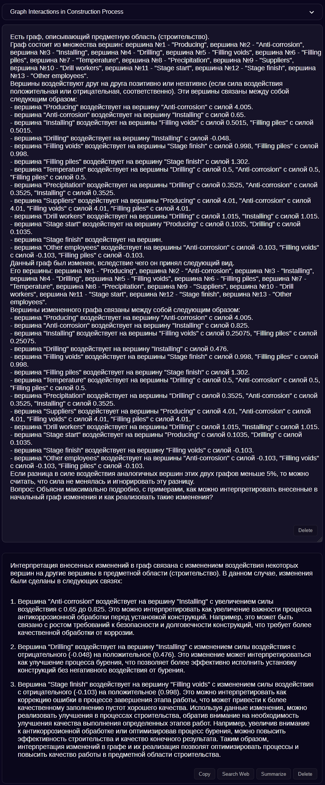

community
# Kontrol'nyy primer ¹2 ## 1 Demonstratsiya rabotosposobnosti komponent adaptivnoy optimizatsii vypolneniya proizvodstvennykh protsessov s ispol'zovaniyem veroyatnostnykh modeley i dinamicheski izmenyayemoy sredy Dannyy primer yavlyayetsya eksperimental'nym podtverzhdeniyem rabotosposobnosti sleduyushchikh sstavnykh chastey komponenta: - Instrumentariy vizualizatsii veroyatnostnykh kognitivnykh kart - Instrumentariy parallel'noy obrabotki kognitivnykh kart - Instrumentariy podgotovki konkretiziruyushchikh II-zaprosov dlya kognitivnykh kart Podtverzhdeniye zaklyuchayetsya v proverke sovmestnoy raboty vsekh sostavnykh chastey kompleksa: v podgotovke kogdnitivnoy karty so sredstvami vizualizatsii, v sravnenii variantov obscheta (optimizatsii) kognitivnykh kart na odnomashinnoy vychislitel'noy sisteme i na mnogomashinnom variante, a takzhe poluchenii interpritatsii poluchennykh rezul'tatov posredstvom privlecheniya II. V kachestve iskhodnykh dannykh dlya primera vzyat primer, ispol'zovavshiysya dlya podtverzhdeniya kontseptsii ispol'zovaniya veroyatnostnykh kognitivnykh kart. ## 2 Podgotovka kognitivnoy karty Kognitivnyye karty vossozdany pri pomoshchi instrumentariya vizualizatsii veroyatnostnykh kognitivnykh kart. Rezul'taty raboty instrumentariya ppredstavleny na ris 1, 2.  _Ris. 1 — Primer 2a. Kognitivnaya karta obshchikh rabot_  _Ris. 2 — Primer 2b. Kognitivnaya karta chastnogo etapa rabot (obustroystvo fundamenta)_ Otsenochno, trudozatraty na sozdaniye kart snizilis' na 40-50%%. Chislo oshibok, vyyavlyayemykh lish' na etape kognitivnogo modelirovaniya i/ili optimizatsii - na 80-90%%.
Åù¸
1 598 / 5 000
# Test case #2

## 1 Demonstration of the operability of the components of adaptive optimization of production processes using probabilistic models and a dynamically changing environment

This example is an experimental confirmation of the operability of the following component parts:

- Tools for visualizing probabilistic cognitive maps
- Tools for parallel processing of cognitive maps
- Tools for preparing concretizing AI queries for cognitive maps

The confirmation consists of checking the joint operation of all components of the complex: in preparing a cognitive map with visualization tools,
in comparing the options for calculating (optimizing) cognitive maps on a single-machine computing system and on a multi-machine version, as well as obtaining an interpretation of the obtained results by involving AI. The initial data for the example is the example used to confirm the concept of using probabilistic cognitive maps.

## 2 Preparing a cognitive map

Cognitive maps are recreated using the tools for visualizing probabilistic cognitive maps. The results of the toolkit operation are presented in Fig. 1, 2.

_Fig. 1 — Example 2a. Cognitive map of general works_

_Fig. 2 — Example 2b. Cognitive map of a particular stage of works (foundation arrangement)_

It is estimated that the labor costs for creating maps have decreased by 40-50%. The number of errors detected only at the stage of cognitive modeling and/or optimization has decreased by 80-90%.

## 3 Initial data

### 3.1 Legend

It is necessary to build a certain object (using the example of the construction of a "Dormitory" type object). There is a project for the said construction object, an integral part of which is a construction schedule - a list of works by type, indicating their duration and sequence of execution.

During the construction process, various delays may occur due to a variety of factors:
+ internal (for example, the qualifications of hired workers, the professionalism of management, the punctuality of suppliers, etc.),
+ external (for example, weather conditions in the form of precipitation or ambient temperature).
  

These factors can significantly affect the construction process. In particular, the unprofessionalism of the involved personnel (both workers and management) can lead to a shift in the timing of each stage of construction and installation work "to the right" and to the disruption of the overall construction deadlines. Similarly, external factors also affect the adherence to construction deadlines. For example, when constructing in the Far North, drilling, pile driving, and pit digging operations are highly dependent on soil temperature - such operations cannot be carried out in winter without additional labor costs (soil heating, temporary shelter construction, blasting operations, etc.).

Task: by influencing the existing concepts describing the factors influencing the construction process and the relationships between them, achieve a construction and installation work schedule that meets the customer's initial expectations (i.e., the original project) or exceeds them.

### 3.2 Initial cognitive maps

Due to the fact that a cognitive map that could describe the entire construction process (including dozens of operations and no fewer external and internal factors, even for such a simple construction project as a "Dormitory"), turns out to be excessively complex. As a solution, the decomposition principle can be used: cognitive modeling can be divided into several stages. As an example, two cognitive maps will be considered:

+ Example 2a - General works, divided into large stages (foundation preparation, installation of [block boxes](http://azm.kz/solutions/block-boxes/), arrangement of additional structures, interior and exterior finishing, installation of utilities),
+ Example 2b - Specific works, divided into stages in more detail. As an example of specific work, the stage of arrangement of a pile foundation is considered (drilling works, production, preparation and installation of piles, as well as their further preparation for operation as a base for the building being erected).
  

The following designations are accepted on the cognitive map of general works (Fig. 3):

Construction stages:
+ Base - foundation arrangement,
+ Block-boxes - installation of block-boxes,
+ Add. constructions - installation of additional structures,
+ Exterior finishing - exterior finishing,
+ Interior decoration - interior finishing,
+ Arrangement of utilities - installation of utility lines.  

Internal factors:
+ Suppliers - suppliers of building materials,
+ Management - construction management.  

Internal factors:
+ Temperature - temperature conditions,
+ Precipitation - precipitation.  

Special nodes of the cognitive map:
+ Project start - start of construction and installation works,
+ Project finish - end of the project.  

_Fig. 3 - Example 2a. Cognitive map of general works_

Similar notations are adopted for the cognitive map describing the stage of foundation arrangement (Fig. 4):

Construction stages:
+ Producing - pile production,
+ Anti-corrosion - anti-corrosion protection of the side surface of metal piles,
+ Drilling - drilling pilot holes,
+ Installing - installation (immersion) of piles,
+ Filling voids - filling the sinuses of the pilot holes,
+ Filling piles - filling the internal cavity of the piles.  

Internal factors:
+ Drill workers - drillers,
+ Other employees - other workers.  

_Fig. 4 - Example 2b. Cognitive map of a particular stage of work (foundation arrangement)_

## 4 Cognitive Modeling

### 4.1 Fuzzy Probabilistic Cognitive Maps

Fuzzy probabilistic cognitive maps are a type of cognitive maps in which the values of weight coefficients for nodes and edges are proposed to be expressed as discrete random variables. This approach is intended to implement mechanisms for working with the parameters of a cognitive model, which are specified by a set of expert opinions, which, in turn, is expressed as an array of numerical values (weights) and frequencies (probabilities) of the occurrence of these values.

To modify fuzzy cognitive maps for the purpose of working with discrete random variables, the following changes are introduced into their mathematical apparatus:

1. Fuzzy values of the weight coefficients of the edges of the oriented graph of the cognitive map, normalized to the interval [-1;+1], are replaced by random discrete variables with specified characteristic distributions.
2. Weight coefficients of concepts of the cognitive map (graph nodes) are replaced in a similar way.
3. It is allowed (if necessary) to use arbitrary scales by normalizing not to the interval [-1; +1], but to the interval \[-X; +X\] (where X is a conditionally arbitrary value determined by the subject area in which the AI algorithms under consideration are used).  

A simple data structure is proposed for storing the values of discrete random variables: discrete random variables are described as a list of known length, each element of which is a pair of "value - probability". "Value" is generally a real number (in special cases, if necessary, it can be represented as an integer value). "Probability" is a positive real number such that the sum of all "probabilities" in the list is strictly equal to 1 (adjusted for the available storage accuracy of numbers on the computing system used).

### 4.2 General principles of modeling

In both examples, modeling comes down to the fact that in the initial node (Project start) the initial weight (corresponding to the initial volume of work) and the initial impact (corresponding to the conditional speed of execution of this work) are specified. Then, in the process of modeling, at each step the impact is distributed across the map, affecting all its vertices that correspond to certain types of construction and installation work. These vertices also have their own weight coefficients - equivalents of the volumes of required labor costs.

In addition to the main impact on the cognitive map from the initial vertex, the map is influenced by vertices associated with external and internal factors - some of them have a positive effect (for example, the influence of management on some employees, if they are, say, in friendly or family relations), some - negative (for example, low temperatures reduce the pace of work on drilling wells for a pile foundation).

The simulation is considered complete if the amount of work remaining to be done at the Project finish vertex (end of the construction project) is reduced to zero.

During the simulation, a parallel processing toolkit for cognitive maps was used, which allowed the use of a distributed computing system (in configurations of 2 and 3 computing nodes).

### 4.3 Human-Generated Solutions

The results of creating a model describing the construction processes and conducting cognitive simulation are the so-called "burndown charts" shown in Fig. 5, 6. For example 2a, the abscissa shows the construction time expressed in weeks, for example 2b - in days. The ordinate axis in both examples displays the amount of work remaining in conventional units.

_Fig. 5 - Example 2a. Result of cognitive modeling in the form of a task burndown diagram for the general work schedule_

_Fig. 6 — Example 2b. Result of cognitive modeling in the form of a task burndown diagram for the schedule of a particular stage of work (foundation arrangement)_

As can be seen from the presented graphs, the duration of work for both the [general schedule](pics/yPlan-General.png) and the [particular stage schedule](pics/yPlan-Particular.png) coincide with those planned in accordance with the construction project. This confirms the correctness of the selection of weighting factors for both vertices and edges, as well as (in general) the adequacy of the proposed model.

## 4.4 Solutions obtained by AI

The target vertices of the cognitive map graphs are the vertices associated with the completion of the work (Project finish for the first example and Stage finish for the second). The purpose of processing the created cognitive maps is to select a method (or methods) to minimize the time to achieve the minimum value of the weights of the specified vertices, which will correspond to the completion of the work.

The vertices of the cognitive maps that describe internal factors are described as a set of input, control actions. And the vertices that describe external factors are a set of observable, but uncontrollable disturbing effects of the environment.

A detailed description is given in the document ["Program Description", section "3. Description of the Logical Structure", subsection "3.2 Component Algorithms" (the "Search for Optimal Change of Cognitive Map Parameters" algorithm)](../docs/program-description.md).

As a result of cognitive modeling, the following results were obtained.

_Clarification._ The resulting cognitive maps display weights of vertices and edges that differ from the original ones. This is explained by the fact that recommendations obtained on the basis of fuzzy probabilistic cognitive maps should not be probabilistic (as paradoxical as it may sound). A recommendation issued by an expert advisory system should not look like the advice "To achieve a result, with probability N, perform action A, and with probability 1-N, do not perform it." Therefore, the weighted average value of discrete random variables is taken as recommendations: it takes into account the opinion of all experts involved in creating the model in one way or another, and at the same time does not roughen the final results of modeling, being as close to reality as possible.

### 4.4.1 Example 2a (general work schedule)

For example 2a (general work schedule), a set of proposed solutions was generated, the most effective of which was recognized as the following (see Fig. 7).

_Fig. 7 — Solution obtained by AI for example 2a (general works schedule)_

In the resulting cognitive map, the algorithm suggested deleting the graph edge between vertices F and E. _Interpretation: the original model assumed feedback showing that work on laying utility lines inside the building slows down the production of interior finishing: a common story at a construction site, when after laying the lines, damaged finishing has to be redone. In fact, the algorithm suggested getting rid of this factor, that is, installing the lines as carefully as possible._

Also in the resulting cognitive map, the weights of the edges between vertices E-F and F-Finish were changed (reduced by 15-17%). _Interpretation: after the negative impact of the process of laying utility lines is eliminated, less labor will be required for interior finishing, which in turn will reduce the costs of achieving the goal - completion of construction and installation works._

Additionally, the weight of the D-Finish rib changes (increases by 25%). _Interpretation: Reducing labor costs for laying utility lines and interior finishing allows you to free up human resources and direct them to another front of work - the external finishing of the building under construction_.

### 4.4.2 Evaluation of the AI-obtained solution for example 2a

As a result of cognitive modeling, a task burndown diagram similar to the human solution was obtained (Fig. 8), but with a significant reduction in the work deadlines (by 2.3 times).

_Fig. 8 - Example 2a. Task burndown diagram for the solution obtained by the AI_

### 4.4.3 Example 2b (schedule of a particular stage of work)

For example 2b (schedule of a particular stage of work), a set of solutions was also generated, the most effective of which is shown in Fig. 9.

_Fig. 9 - Solution obtained by the AI for example 2b (schedule of a particular stage of work)_

On the resulting cognitive map, the algorithm proposed making three significant changes.

Firstly, it is proposed to introduce an additional edge - from the Finish vertex to vertex 5. _Interpretation: given the negative impact of stage 5 (filling the sinuses of the leader holes) on stage 6 (filling the internal cavity of the piles), which is expressed in delays when the work is performed with inadequate quality and the pile is not fixed in the hole, which prevents it from being filled with concrete due to the need to complete or redo the work, let's assume that additional quality control of the work is introduced at stage 5._

Secondly, given what has just been said, the weight of edge 5-6 changes radically - from negative to positive. _Interpretation: with a significant increase in the quality of work at stage 5, this begins to help, rather than interfere with the work at stage 6._

Thirdly, the proportions of the weight coefficients on the edges 6-Finish and 5-Finish change. _Interpretation: given that work at stage 5 is being carried out more efficiently and effectively, this makes it possible to transfer some of the human resources to a more labor-intensive section of work - stage 6 (concreting piles)._

### 4.4.4 Evaluation of the AI solution for example 2b

Cognitive modeling yields results confirmed by the task burndown diagram (Fig. 10). In this case, the work time was reduced by approximately 25%.

_Fig. 10 — Example 2b. Task burndown diagram for the solution obtained by AI_

## 5 Comparison of solutions

By comparing the solutions proposed by humans and AI (Fig. 5, 6, 8, 10), one can see that the AI solution is more effective - a significant reduction in the time required to complete construction and installation work is achieved, both on a large and small scale.

## 6 Experimental studies

To conduct experimental studies of the developed algorithms and to check their software implementation, the following test cases were developed:

- optimization ([of the general construction schedule](data/Example2-GeneralPlan_rnd.zip)),
- optimization ([of the particular construction stage schedule](data/Example2-ParticularPlan_rnd.zip)).

By comparing [the solutions proposed by humans and AI for the test cases](data/ControlExampleResults.zip), one can be convinced that the AI solution is more effective.

At the same time, the use of parallel processing tools for cognitive maps made it possible to reduce the processing time of cognitive maps several times: by about 40% using a two-machine computing system and by 50% using a three-machine system.

# 7 Interpretation of results

As part of demonstrating the operability of the adaptive optimization component for production processes using probabilistic models and a dynamically changing environment, a tool for preparing concretizing AI queries for cognitive maps was used. The goal is to quickly obtain a human-readable description of the solution (its possible interpretation).

Examples of an automatically generated query and an interpretation received from the AI (Fig. 11, 12) are given below.

_Fig. 11 — An example of an automatically generated query obtained by the tool for preparing concretizing AI queries for cognitive maps and an interpretation of the solution received from the AI (general construction schedule)_

_Fig. 12 — An example of an auto-generated query obtained by the toolkit for preparing concretizing AI queries for cognitive maps and obtained from the AI interpretation of the solution (particular schedule of the construction stage)_

## 8 Conclusions

Based on the results of comparing the processing in a single- and multi-machine version (without using the "Parallel Processing Toolkit for Cognitive Maps" component and with its use), a complete correspondence of the results was found, which proves the legitimacy of using this approach. As expected, the time spent on calculation decreases proportionally to the increase in computing power (adjusted for the discreteness of dividing the general task into subtasks solved on distributed computing nodes).

Using the toolkit for visualizing probabilistic cognitive maps and the toolkit for preparing concretizing AI queries for cognitive maps
also increases the productivity of the corresponding work.
