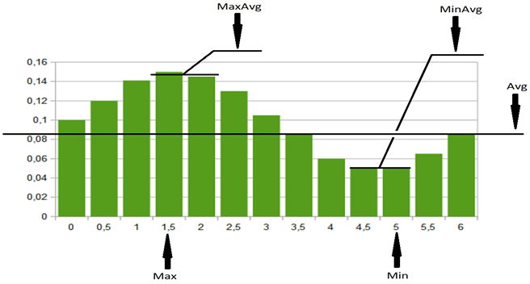
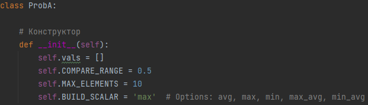
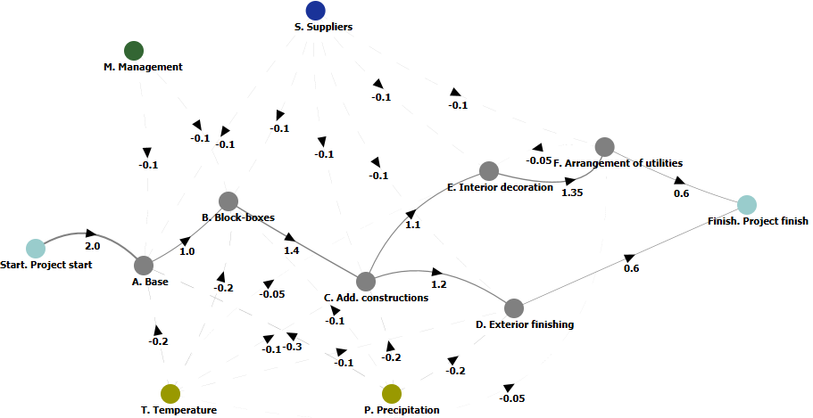
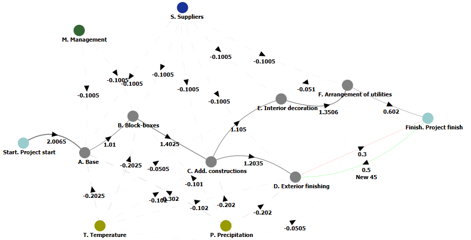
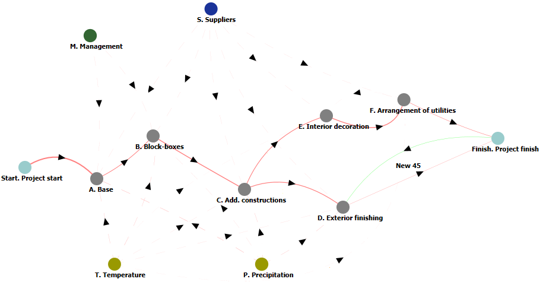
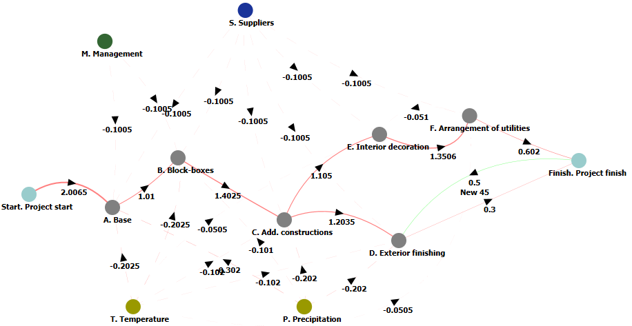
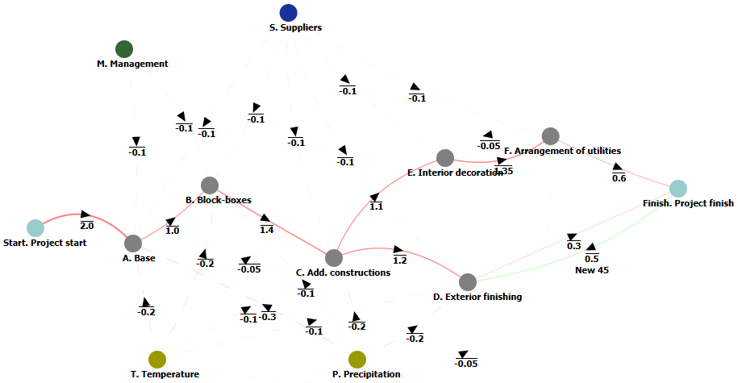
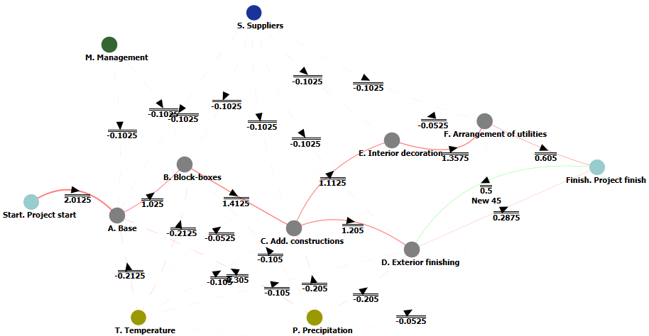

# Контрольный пример №3

## 1 Начальные данные

### 1.1 Цели и задачи

В целях повышения качества получаемых при помощи применения новых алгоритмов ИИ результатов предлагается увеличить гибкость их применения. Повышение гибкости предполагается за счет использования набора стратегий, применяемых для формирования конечных (ориентированных на конечного пользователя) данных.

Исследование указаннных стратегий и демонстрация соответствующих результатов является целью данного контрольного примера.

Под стратегиями подразумевается применение "фильтров", позволяющих получать из результирующей нечеткой вероятностной когнитивной карты ответ, удобный для восприятия человеком (то есть, обычную нечеткую когнитивную карту).

### 1.2 Стратегии формирования конечных данных

Получение конечных данных представляет собой формирование скалярной величины из дискретной случайной величины. Это связано с тем, что предлагаемое решение должно быть четким, ясным и однозначно интерпретируемым человеком.

Для формирования конечных данных предлагаются следующие стратегии:
+ **Avg** - среднее значение (для дискретной случайной величины рассчитывается средне-взвешенное значение, основанное на весовых коэффициентах значений, в роли которых выступают их вероятности; фактически - это матожидание рассматриваемой случайной величины),
+ **Max** - максимум (под "максимумом" подразумевается наиболее вероятное значение дискретной случайной величины, то есть обладающее максимальной вероятностью в заданном распределении),
+ **MaxAvg** - средний максимум (среднее арифметическое значений, обладающих двумя наибольшими вероятностями в заданном распределении дискретной случайной величины),
+ **Min** - минимум (под "минимумом" подразумевается, соответственно, наименее вероятное значение дискретной случайной величины, то есть обладающее минимальной вероятностью в заданном распределении),
+ **MinAvg** - средний минимум (среднее арифметическое значений, обладающих двумя наименьшими вероятностями в заданном распределении дискретной случайной величины).  

Использование данных стратегий предполагается следующим образом:
+ Среднее значение (Avg). Стратегия реализует поведение "осторожного игрока". При этом учитывается весь спектр данных, что дает, может быть, не самое оптимальное решение, зато - наиболее вероятное (то есть максимально "надежное").
+ Максимумы (Max и MaxAvg). Агрессивные ("оптимистические") стратегии, реализующие типы поведения близкие к принципу "все или ничего". При таком типе формирования конечных данных осуществляется попытка получить самое выгодное решение (при стратегии Max - самое выгодное, при MaxAvg - максимально приближенное к нему, но допускающее некоторую степень осторожности за счет учета не одного, а пары самых "сильных" мнений). При этом допускается тот факт, что такое решение менее вероятно, чем при использовании стратегии Avg.
+ Минимумы (Min и MinAvg). "Пессимистические" стратегии, реализующие модели поведения ориентированные на получение наименее вероятных сценариев. При данном типе формирования конечных данных осуществляется попытка получить решение, аналогично стратегиям Max и MaxAvg, но относительно наименее вероятных случаев.  

_Рис. 1 — Графическая интерпретация стратегий формирования конечных данных_

_Рис. 2 — Исходный код экспериментальной библиотеки, отвечающий за выбор стратегий_

## 2 Когнитивное моделирование

### 2.1 Начальная когнитивная карта и условия эксперимента

За основу взята когнитивная карта, описывающая общий процесс строительно-монтажных работ, взятая из предыдущего примера (рис. 3).

_Рис. 3 — Начальная когнитивная карта_

Для нее проводятся следующие эксперименты:
+ Сравнение когнитивной карты "старого" формата (со скалярными величинами, полученными усреднением мнения экспертов) и когнитивной карты "нового" формата (со случайными дискретными величинами, полученными по результатам опроса экспертной группы и "усредненными" по стратегии Avg).
+ Сравнение когнитивных карт "нового" формата, построенным по стратегиям Avg и Max.
+ Сравнение когнитивных карт "нового" формата, построенным по стратегиям Max и MaxAvg.

### 2.2 Эксперимент

Результаты проведенных экспериментов приаведены на рис. 3-8.

#### 2.2.1 Сравнение когнитивной карт "старого" и "нового" формата

_Рис. 4 — Карта "старого" формата_

_Рис. 5 — Аналогичная карта "нового" формата_

#### 2.2.2 Сравнение когнитивных карт построенным по стратегиям Avg и Max

_Рис. 6 — Карта построенная по стратегии Avg_

_Рис. 7 — Карта построенная по стратегии Max_

#### 2.2.3 Сравнение когнитивной карт построенным по стратегиям Max и MaxAvg

_Рис. 8 — Карта построенная по стратегии Max_

_Рис. 9 — Карта построенная по стратегии MaxAvg_

### 2.3 Результаты экспериментов

[Результаты экспериментов](Example3-Results.zip) приводятся частично (первые 10 решений). Результаты для стартегий Min и MinAvg в целом аналогичны (с поправкой на используемую функцию выбора экстремума).

### 2.4 Оценка результатов экспериментов и выводы

Анализ результатов экспериментов показывает что:
+ Результаты по "старому" и "новому" формату идентичны. Из этого можно сделать вывод о том, что, в принципе, для для реализации стратегии Avg достаточно и модели предыдущего поколения, если пользователя не интересует вопрос сохранения спектра мнений экспертов и он согласен на изначально усредненное "мнение среднестатистического эксперта".
+ Результаты по сравнению стартегий Avg, Max и MaxAvg являются сопоставимыми: структурно, решения, предлагаемые ИИ, являются эквивалентными. Это обясняется начальными одинаковыми условиями (структурой когнитивной карты, которая строится на одной и той же предметной области). При этом, изменяются начальные импульсные воздействия в сценариях моделирования, что приводит к тому, что требуемый результат (одинаковий для всех стратегий) достигается различными способами.
+ В качестве вывода можно предположить, что получение структурной схемы решения можно, по всей видимости, проводить с нечеткими когнитивными картами, кототрые менее трудоемки в обработке. А уточнение результатов (в соответствии с разлчными стратегиями) - уже при помощи нечетких вероятностных когнитивных карт.
